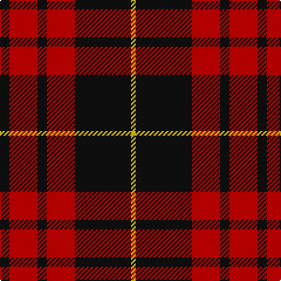

In pattern [KRKRKY](/patterns/krkrky/).

This was sourced from register-of-tartans.  It is a [6 stripes tartan](/stripes/stripes6/).

Original link https://www.tartanregister.gov.uk/tartanDetails.aspx?ref=2736

## Attestations

This cloth appears in 2 source records; the oldest owns this page.

- 01/01/1842 — MacQueen (register-of-tartans, [record](https://www.tartanregister.gov.uk/tartanDetails.aspx?ref=2736))
- pre 1842 — MacQueen (Clan) (tartans-authority, [record](http://www.tartansauthority.com/tartan-ferret/display/1209/))

## Thread count
K/8 R24 K8 R24 K48 Y/4

## Palette
Each colour and its ΔE from the base-6 reference it is a variant of.

| Colour | Shade | Base | ΔE (OKLab) |
|---|---|---|---|
| K | <code style="background-color:#101010;">#101010</code> `#101010` | K <code style="background-color:#000000;">#000000</code> | 0.17 |
| R | <code style="background-color:#C80000;">#C80000</code> `#C80000` | R <code style="background-color:#CC0000;">#CC0000</code> | 0.01 |
| Y | <code style="background-color:#E8C000;">#E8C000</code> `#E8C000` | Y <code style="background-color:#F2BF00;">#F2BF00</code> | 0.02 |

# Sample pattern

## Nearest tartans

The nearest existing variants by ΔTartan distance.

1. [MacQueen Clan Tartan Tartan Number: 1209. Earliest known date: 1842 The tartan of the Clan Revan, so called after Revan MacMulmor MacAngus MacQueen, who led kinsmen of the MacDonald bride for the 10th Chief of the Mackintoshes, to take protection from Clan Chattan. The sett was unnamed, as far as we know, before publication in the Vestiarium Scoticum (1842), but this source is unreliable. It has much in common with the Fraser and the Gunn tartans, both of which have four bold stripes, but the origin is more likely to have come from a combination of the MacDonald and the Mackintosh. Many MacQueens stayed in Skye, and the name there, is often spelt MacSween or MacSwan. The Skye stronghold was known as Garafadon. See products available Copyright © Blair Urquhart, Comrie, 2015](/setts/s6/k2r6k2r6k12y1x2~k101010-rc80000-ye8c000/) — ΔT 0.00
1. [Swanstrom (Personal)](/setts/s6/k8r1k8r11y1r1x4~k101010-rc80000-ye8c000/) — ΔT 0.28
1. [Bodog.com](/setts/s5/r3k25r25k10w3x2~k101010-rc80000-wc0c0c0/) — ΔT 0.71
1. [MacKeane (Clan?)](/setts/s7/r4k8r4k8r12k1y1x2~k101010-rc80000-ye8c000/) — ΔT 0.76
1. [Brodie (Clan)](/setts/s6/k2r16k8y1k8r2x4~k101010-rc80000-yd8b000/) — ΔT 0.81
1. [Munro Black & Red Clan Tartan Tartan Number: 1204. Earliest known date: 1842 The design comes from the Vestiarium Scoticum (1842). The authors, the Sobieski Stuart brothers, enjoyed a popular following among the Scottish gentry in the early Victorian era, and in the spirit of the times, added mystery, romance and some spurious historical documentation to the subject of tartan. Of the better known tartans, the book offers some minor variation, but in other cases it provides the only recorded version of many tartans in use today. See products available Copyright © Blair Urquhart, Comrie, 2015](/setts/s5/k18r4k18r32w3x2~k101010-rc80000-we0e0e0/) — ΔT 0.85
1. [MacIver](/setts/s5/k16r2k2r12w1x2~k101010-rdc0000-we0e0e0/) — ΔT 0.86
1. [Munro (Black and Red)](/setts/s5/k18r4k18r32w3x2~k101010-rc80000-wfcfcfc/) — ΔT 0.88
1. [MacDonald of Ardnamurchan (Clan?)](/setts/s7/r4k8r4k8r12k1y2x4~k101010-rc80000-ye8c000/) — ΔT 0.93
1. [MacKeane (MacIan) Clan Tartan Tartan Number: 1608. Earliest known date: 1842 The design comes from the Vestiarium Scoticum (1842). The authors, the Sobieski Stuart brothers, enjoyed a popular following among the Scottish gentry in the early Victorian era, and in the spirit of the times, added mystery, romance and some spurious historical documentation to the subject of tartan. Of the better known tartans, the book offers some minor variation, but in other cases it provides the only recorded version of many tartans in use today. See products available Copyright © Blair Urquhart, Comrie, 2015](/setts/s7/r4k8r4k8r12k1y2x2~k101010-rc80000-ye8c000/) — ΔT 0.93

## Neighbour map

Every grey dot is one of 15726 variants placed by the first two principal components of the ΔTartan feature space (44% of its variance). Red is this tartan; blue dots are its nearest — click one to open its page.

<svg viewBox="0 0 640 380" role="img" style="max-width:100%;height:auto;border:1px solid #e0e0e0;border-radius:4px;display:block" xmlns="http://www.w3.org/2000/svg"><image href="/nn/cloud.v1.png" width="640" height="380"/><a href="/setts/s6/k2r6k2r6k12y1x2~k101010-rc80000-ye8c000/"><circle cx="341.7" cy="222.5" r="4" fill="#3465a4"><title>MacQueen Clan Tartan Tartan Number: 1209. Earliest known date: 1842 The tartan of the Clan Revan, so called after Revan MacMulmor MacAngus MacQueen, who led kinsmen of the MacDonald bride for the 10th Chief of the Mackintoshes, to take protection from Clan Chattan. The sett was unnamed, as far as we know, before publication in the Vestiarium Scoticum (1842), but this source is unreliable. It has much in common with the Fraser and the Gunn tartans, both of which have four bold stripes, but the origin is more likely to have come from a combination of the MacDonald and the Mackintosh. Many MacQueens stayed in Skye, and the name there, is often spelt MacSween or MacSwan. The Skye stronghold was known as Garafadon. See products available Copyright © Blair Urquhart, Comrie, 2015</title></circle></a><a href="/setts/s6/k8r1k8r11y1r1x4~k101010-rc80000-ye8c000/"><circle cx="335.7" cy="220.5" r="4" fill="#3465a4"><title>Swanstrom (Personal)</title></circle></a><a href="/setts/s5/r3k25r25k10w3x2~k101010-rc80000-wc0c0c0/"><circle cx="316.6" cy="243.3" r="4" fill="#3465a4"><title>Bodog.com</title></circle></a><a href="/setts/s7/r4k8r4k8r12k1y1x2~k101010-rc80000-ye8c000/"><circle cx="327.5" cy="219.9" r="4" fill="#3465a4"><title>MacKeane (Clan?)</title></circle></a><a href="/setts/s6/k2r16k8y1k8r2x4~k101010-rc80000-yd8b000/"><circle cx="340.6" cy="204.2" r="4" fill="#3465a4"><title>Brodie (Clan)</title></circle></a><a href="/setts/s5/k18r4k18r32w3x2~k101010-rc80000-we0e0e0/"><circle cx="304.1" cy="235.1" r="4" fill="#3465a4"><title>Munro Black &amp; Red Clan Tartan Tartan Number: 1204. Earliest known date: 1842 The design comes from the Vestiarium Scoticum (1842). The authors, the Sobieski Stuart brothers, enjoyed a popular following among the Scottish gentry in the early Victorian era, and in the spirit of the times, added mystery, romance and some spurious historical documentation to the subject of tartan. Of the better known tartans, the book offers some minor variation, but in other cases it provides the only recorded version of many tartans in use today. See products available Copyright © Blair Urquhart, Comrie, 2015</title></circle></a><a href="/setts/s5/k16r2k2r12w1x2~k101010-rdc0000-we0e0e0/"><circle cx="359.6" cy="202.3" r="4" fill="#3465a4"><title>MacIver</title></circle></a><a href="/setts/s5/k18r4k18r32w3x2~k101010-rc80000-wfcfcfc/"><circle cx="301.0" cy="233.8" r="4" fill="#3465a4"><title>Munro (Black and Red)</title></circle></a><a href="/setts/s7/r4k8r4k8r12k1y2x4~k101010-rc80000-ye8c000/"><circle cx="305.6" cy="221.5" r="4" fill="#3465a4"><title>MacDonald of Ardnamurchan (Clan?)</title></circle></a><a href="/setts/s7/r4k8r4k8r12k1y2x2~k101010-rc80000-ye8c000/"><circle cx="305.6" cy="221.5" r="4" fill="#3465a4"><title>MacKeane (MacIan) Clan Tartan Tartan Number: 1608. Earliest known date: 1842 The design comes from the Vestiarium Scoticum (1842). The authors, the Sobieski Stuart brothers, enjoyed a popular following among the Scottish gentry in the early Victorian era, and in the spirit of the times, added mystery, romance and some spurious historical documentation to the subject of tartan. Of the better known tartans, the book offers some minor variation, but in other cases it provides the only recorded version of many tartans in use today. See products available Copyright © Blair Urquhart, Comrie, 2015</title></circle></a><circle cx="341.7" cy="222.5" r="5" fill="#c00000"/></svg>

ID: /setts/s6/k2r6k2r6k12y1x4~k101010-rc80000-ye8c000/
