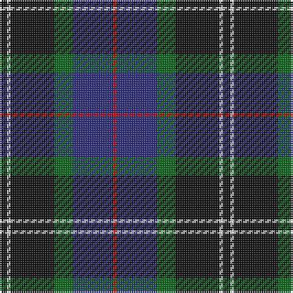

This page is one **sett** — a single exact thread-count. It belongs to the [tartan](/tartans/k2w1k12g5db11r1/)
(the same proportion at any scale), whose colour order is pattern [KWKGBR](/stripes/kwkgbr/).

Sourced from tartans-authority.  It is a [6 stripe tartan](/stripes/stripes6/).

Original link http://www.tartansauthority.com/tartan-ferret/display/8168/

## Register references

External register numbers recorded for this tartan.

- Scottish Register of Tartans: [8168](https://www.tartanregister.gov.uk/tartanDetails?ref=8168)
- Scottish Tartans Authority (ITI): 8168

## Thread count
K/4 LN2 K24 G10 DB22 R/2

## Palette

Palette: <strong>Tartan Register</strong>
<table><thead><tr><th>Colour</th><th>Threads</th><th>Shade</th><th>Base</th><th>OKLCh</th></tr></thead><tbody><tr><td>K/</td><td style="text-align:right;font-variant-numeric:tabular-nums">4</td><td><code style="background-color:#101010;">#101010</code> <small style="color:#888">#101010</small></td><td>K <code style="background-color:#000000;">#000000</code></td><td><small style="color:#888">oklch(17.3% 0.000 89.9)</small></td></tr><tr><td>LN</td><td style="text-align:right;font-variant-numeric:tabular-nums">2</td><td><code style="background-color:#E0E0E0;">#E0E0E0</code> <small style="color:#888">#E0E0E0</small></td><td>W <code style="background-color:#F7F7F7;">#F7F7F7</code></td><td><small style="color:#888">oklch(90.7% 0.000 89.9)</small></td></tr><tr><td>K</td><td style="text-align:right;font-variant-numeric:tabular-nums">24</td><td><code style="background-color:#101010;">#101010</code> <small style="color:#888">#101010</small></td><td>K <code style="background-color:#000000;">#000000</code></td><td><small style="color:#888">oklch(17.3% 0.000 89.9)</small></td></tr><tr><td>G</td><td style="text-align:right;font-variant-numeric:tabular-nums">10</td><td><code style="background-color:#006818;">#006818</code> <small style="color:#888">#006818</small></td><td>G <code style="background-color:#006100;">#006100</code></td><td><small style="color:#888">oklch(45.0% 0.142 145.0)</small></td></tr><tr><td>DB</td><td style="text-align:right;font-variant-numeric:tabular-nums">22</td><td><code style="background-color:#2C2C80;">#2C2C80</code> <small style="color:#888">#2C2C80</small></td><td>B <code style="background-color:#2A418A;">#2A418A</code></td><td><small style="color:#888">oklch(35.0% 0.138 276.6)</small></td></tr><tr><td>R/</td><td style="text-align:right;font-variant-numeric:tabular-nums">2</td><td><code style="background-color:#C80000;">#C80000</code> <small style="color:#888">#C80000</small></td><td>R <code style="background-color:#CC0000;">#CC0000</code></td><td><small style="color:#888">oklch(52.3% 0.215 29.2)</small></td></tr></tbody></table>

# Sample pattern

## Nearest tartans

The nearest existing variants by ΔTartan distance, with this tartan at the top so the swatches line up against it.

ΔTartan

Tartan

Sett

—

<a href="/ttd/edit/#slug=k2w1k12g5db11r1~x2">New England (Fashion)</a> <a class="nn-out" href="/setts/s6/k2w1k12g5db11r1~x2/" title="open its dictionary page">↗</a>

0.67

<a href="/ttd/edit/#slug=dg5db2dg9dbi19dr9ly2~x2">Lyle and Scott</a> <a class="nn-out" href="/setts/s6/dg5db2dg9dbi19dr9ly2~x2/" title="open its dictionary page">↗</a>

0.74

<a href="/ttd/edit/#slug=db22w2k10g11r3g4~x2">Paterson Blue (Personal)</a> <a class="nn-out" href="/setts/s6/db22w2k10g11r3g4~x2/" title="open its dictionary page">↗</a>

0.76

<a href="/ttd/edit/#slug=k6g15w2db22r2k4~x2">Leslie, Hebridean</a> <a class="nn-out" href="/setts/s6/k6g15w2db22r2k4~x2/" title="open its dictionary page">↗</a>

0.78

<a href="/ttd/edit/#slug=db12k4g4dp1g4k1w1~x4">Alexander - 2000 (Name)</a> <a class="nn-out" href="/setts/s7/db12k4g4dp1g4k1w1~x4/" title="open its dictionary page">↗</a>

0.80

<a href="/ttd/edit/#slug=r2db23k14dg16k2w2~x2">MacPhail Hunting</a> <a class="nn-out" href="/setts/s6/r2db23k14dg16k2w2~x2/" title="open its dictionary page">↗</a>

0.88

<a href="/ttd/edit/#slug=db12k4g4r1g4k1lo1~x4">MacLaren</a> <a class="nn-out" href="/setts/s7/db12k4g4r1g4k1lo1~x4/" title="open its dictionary page">↗</a>

0.88

<a href="/ttd/edit/#slug=r1k1g7k5db10k1ly1~x2">MacLeod Small Clan Tartan Tartan Number: 15833. Earliest known date: See products available Copyright © Blair Urquhart, Comrie, 2015</a> <a class="nn-out" href="/setts/s7/r1k1g7k5db10k1ly1~x2/" title="open its dictionary page">↗</a>

0.94

<a href="/ttd/edit/#slug=k7r3g30db28lb3~x2">Highlander Highland Laddie</a> <a class="nn-out" href="/setts/s5/k7r3g30db28lb3~x2/" title="open its dictionary page">↗</a>

0.99

<a href="/ttd/edit/#slug=db5k10db48k72w12dg48r5">Colquhoun (Clan)</a> <a class="nn-out" href="/setts/s7/db5k10db48k72w12dg48r5/" title="open its dictionary page">↗</a>

1.00

<a href="/ttd/edit/#slug=db31b4db5k19g20lo4~x2">Midlothian</a> <a class="nn-out" href="/setts/s6/db31b4db5k19g20lo4~x2/" title="open its dictionary page">↗</a>

## Neighbour map

Every grey dot is one of 14359 variants placed by the first two principal components of the ΔTartan feature space (44% of its variance). Red is this tartan; blue dots are its nearest — click one to open its page.

<svg viewBox="0 0 640 380" role="img" style="max-width:100%;height:auto;border:1px solid #e0e0e0;border-radius:4px;display:block" xmlns="http://www.w3.org/2000/svg"><image href="/nn/cloud.v1.png" width="640" height="380"/><a href="/setts/s6/dg5db2dg9dbi19dr9ly2~x2/"><circle cx="202.9" cy="222.8" r="4" fill="#3465a4"><title>Lyle and Scott</title></circle></a><a href="/setts/s6/db22w2k10g11r3g4~x2/"><circle cx="203.8" cy="205.9" r="4" fill="#3465a4"><title>Paterson Blue (Personal)</title></circle></a><a href="/setts/s6/k6g15w2db22r2k4~x2/"><circle cx="214.4" cy="198.6" r="4" fill="#3465a4"><title>Leslie, Hebridean</title></circle></a><a href="/setts/s7/db12k4g4dp1g4k1w1~x4/"><circle cx="223.0" cy="187.0" r="4" fill="#3465a4"><title>Alexander - 2000 (Name)</title></circle></a><a href="/setts/s6/r2db23k14dg16k2w2~x2/"><circle cx="214.9" cy="210.8" r="4" fill="#3465a4"><title>MacPhail Hunting</title></circle></a><a href="/setts/s7/db12k4g4r1g4k1lo1~x4/"><circle cx="236.6" cy="187.8" r="4" fill="#3465a4"><title>MacLaren</title></circle></a><a href="/setts/s7/r1k1g7k5db10k1ly1~x2/"><circle cx="196.2" cy="195.4" r="4" fill="#3465a4"><title>MacLeod Small Clan Tartan Tartan Number: 15833. Earliest known date: See products available Copyright © Blair Urquhart, Comrie, 2015</title></circle></a><a href="/setts/s5/k7r3g30db28lb3~x2/"><circle cx="222.2" cy="214.8" r="4" fill="#3465a4"><title>Highlander Highland Laddie</title></circle></a><a href="/setts/s7/db5k10db48k72w12dg48r5/"><circle cx="207.4" cy="182.8" r="4" fill="#3465a4"><title>Colquhoun (Clan)</title></circle></a><a href="/setts/s6/db31b4db5k19g20lo4~x2/"><circle cx="191.1" cy="227.9" r="4" fill="#3465a4"><title>Midlothian</title></circle></a><circle cx="238.3" cy="204.6" r="5" fill="#c00000"/></svg>

ID: /setts/s6/k2w1k12g5db11r1~x2/
