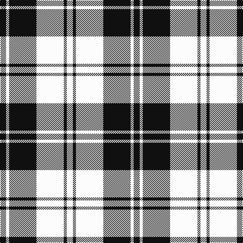

In pattern [KWKWKW](/stripes/kwkwkw/).

This was sourced from register-of-tartans.  It is a [6 stripe tartan](/stripes/stripes6/).

Original link https://www.tartanregister.gov.uk/tartanDetails.aspx?ref=1122

## Also known as

This cloth is also recorded under:

- Erskine BW or Ramsay
- Erskine Black & White
- Erskine, or Ramsay

## Attestations

This cloth appears in 4 source records; the oldest owns this page.

- 01/01/1980 — Erskine (Black and White) (register-of-tartans, [record](https://www.tartanregister.gov.uk/tartanDetails.aspx?ref=1122))
- 1980 — Erskine Black & White (Clan) (tartans-authority, [record](http://www.tartansauthority.com/tartan-ferret/display/1246/))
- undated — Erskine, or Ramsay (weddslist, [record](http://www.weddslist.com/cgi-bin/tartans/pg.pl?source=sts))
- undated — Erskine BW or Ramsay Clan Tartan Tartan Number: 1246. Earliest known date: pre 2003 Possibly a dress tartan based on the sett recorded in the Vestiarium Scoticum in 1842. The tartan is manufactured by Dalgliesh of Selkirk. See products available Copyright © Blair Urquhart, Comrie, 2015 (house-of-tartan, [record](http://www.house-of-tartan.scotland.net/house/TartanViewjs.asp?colr=Def&tnam=1246))

## Register references

External register numbers recorded for this tartan.

- Scottish Register of Tartans: [1122](https://www.tartanregister.gov.uk/tartanDetails.aspx?ref=1122)
- Scottish Tartans Authority (ITI): 1246
- Scottish Tartans World Register: 1246

## Thread count
K/12 W6 K54 W54 K6 W/12

## Palette
Each colour and the base-6 reference it is a variant of.

| Colour | Shade | Base |
|---|---|---|
| K | <code style="background-color:#101010;">#101010</code> `oklch(17.3% 0.000 89.9)` <small>#101010</small> | K <code style="background-color:#000000;">#000000</code> |
| W | <code style="background-color:#FCFCFC;">#FCFCFC</code> `oklch(99.1% 0.000 89.9)` <small>#FCFCFC</small> | W <code style="background-color:#F7F7F7;">#F7F7F7</code> |

# Sample pattern

## Nearest tartans

The nearest existing variants by ΔTartan distance.

1. [Erskine BW MINI Design Tartan Tartan Number: 12466. Earliest known date: Generated for display purposes. Reduced copy of the original 1246 Erskine BW. See products available Copyright © Blair Urquhart, Comrie, 2015](/setts/s6/k2w1k9w9k1w2~x3/) — ΔT 0.37
1. [Valley Forge (Artefact)](/setts/s6/lb5k4lb32k32lb5k4~x2/) — ΔT 0.90
1. [Cairn (Marton Mills)](/setts/s5/k2w1k8w8k1~x8/) — ΔT 0.91
1. [MacPhee (Black and White)](/setts/s4/k22w3k3w22~x2/) — ΔT 0.99
1. [MacMugen](/setts/s6/dt3w16dt4w3dt12w2~x3/) — ΔT 0.99
1. [Scott (Abbreviated)](/setts/s7/w2k1w6k6w2k1w1~x2/) — ΔT 1.01
1. [MacLeod, Black & White](/setts/s5/w8k1w8k12w1~x2/) — ΔT 1.13
1. [Forbes Dress (Clans Originaux)](/setts/s7/w6b3w20k2w3k25w3~x2/) — ΔT 1.19
1. [MacLeod Black & White](/setts/s5/w14k2w14k19w2~x2/) — ΔT 1.26
1. [MacFie of Colonsay Dress (Fashion?)](/setts/s9/w2k11w2k2w16k2w2k11lo2~x4/) — ΔT 1.28

## Neighbour map

Every grey dot is one of 14299 variants placed by the first two principal components of the ΔTartan feature space (44% of its variance). Red is this tartan; blue dots are its nearest — click one to open its page.

<svg viewBox="0 0 640 380" role="img" style="max-width:100%;height:auto;border:1px solid #e0e0e0;border-radius:4px;display:block" xmlns="http://www.w3.org/2000/svg"><image href="/nn/cloud.v1.png" width="640" height="380"/><a href="/setts/s6/k2w1k9w9k1w2~x3/"><circle cx="299.2" cy="217.4" r="4" fill="#3465a4"><title>Erskine BW MINI Design Tartan Tartan Number: 12466. Earliest known date: Generated for display purposes. Reduced copy of the original 1246 Erskine BW. See products available Copyright © Blair Urquhart, Comrie, 2015</title></circle></a><a href="/setts/s6/lb5k4lb32k32lb5k4~x2/"><circle cx="304.6" cy="219.1" r="4" fill="#3465a4"><title>Valley Forge (Artefact)</title></circle></a><a href="/setts/s5/k2w1k8w8k1~x8/"><circle cx="312.6" cy="237.3" r="4" fill="#3465a4"><title>Cairn (Marton Mills)</title></circle></a><a href="/setts/s4/k22w3k3w22~x2/"><circle cx="284.4" cy="248.4" r="4" fill="#3465a4"><title>MacPhee (Black and White)</title></circle></a><a href="/setts/s6/dt3w16dt4w3dt12w2~x3/"><circle cx="294.2" cy="226.2" r="4" fill="#3465a4"><title>MacMugen</title></circle></a><a href="/setts/s7/w2k1w6k6w2k1w1~x2/"><circle cx="299.8" cy="231.1" r="4" fill="#3465a4"><title>Scott (Abbreviated)</title></circle></a><a href="/setts/s5/w8k1w8k12w1~x2/"><circle cx="320.2" cy="229.4" r="4" fill="#3465a4"><title>MacLeod, Black &amp; White</title></circle></a><a href="/setts/s7/w6b3w20k2w3k25w3~x2/"><circle cx="282.1" cy="169.7" r="4" fill="#3465a4"><title>Forbes Dress (Clans Originaux)</title></circle></a><a href="/setts/s5/w14k2w14k19w2~x2/"><circle cx="313.1" cy="233.7" r="4" fill="#3465a4"><title>MacLeod Black &amp; White</title></circle></a><a href="/setts/s9/w2k11w2k2w16k2w2k11lo2~x4/"><circle cx="263.7" cy="182.0" r="4" fill="#3465a4"><title>MacFie of Colonsay Dress (Fashion?)</title></circle></a><circle cx="294.5" cy="213.5" r="5" fill="#c00000"/></svg>

ID: /setts/s6/k2w1k9w9k1w2~x6/
