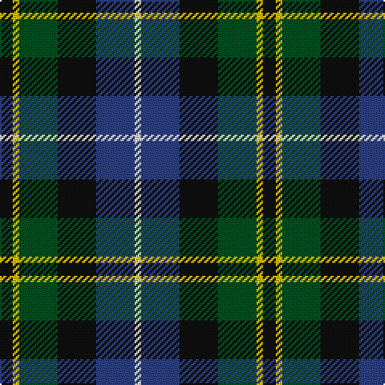

In pattern [KYGKBW](/patterns/kygkbw/).

This was sourced from register-of-tartans.  It is a [6 stripes tartan](/stripes/stripes6/).

Original link https://www.tartanregister.gov.uk/tartanDetails.aspx?ref=1059

## Thread count
K/8 Y4 G24 K24 B24 LN/4

## Palette
Each colour and its ΔE from the base-6 reference it is a variant of.

| Colour | Shade | Base | ΔE (OKLab) |
|---|---|---|---|
| B | <code style="background-color:#2C4084;">#2C4084</code> `#2C4084` | B <code style="background-color:#2A418A;">#2A418A</code> | 0.01 |
| G | <code style="background-color:#005020;">#005020</code> `#005020` | G <code style="background-color:#006100;">#006100</code> | 0.07 |
| K | <code style="background-color:#101010;">#101010</code> `#101010` | K <code style="background-color:#000000;">#000000</code> | 0.17 |
| LN | <code style="background-color:#E0E0E0;">#E0E0E0</code> `#E0E0E0` | W <code style="background-color:#F7F7F7;">#F7F7F7</code> | 0.07 |
| Y | <code style="background-color:#E8C000;">#E8C000</code> `#E8C000` | Y <code style="background-color:#F2BF00;">#F2BF00</code> | 0.02 |

# Sample pattern

## Nearest tartans

The nearest existing variants by ΔTartan distance.

1. [Dyce Family Tartan Tartan Number: 1266. Earliest known date: 1880 From Ross-Craven research. Black guards on the white. See products available Copyright © Blair Urquhart, Comrie, 2015](/setts/s6/k2y1g6k6b6w1x4~b2c2c80-g006818-k101010-we0e0e0-ye8c000/) — ΔT 0.35
1. [Birse Family Tartan Tartan Number: 1087. Earliest known date: 1930-50 This sample comes from the MacGregor-Hastie collection which forms the basis of the cloth archive of the Scottish Tartans Society. Some of the samples, including this one, were unmarked. One can assume that the sample dates between 1930 and 1950. See products available Copyright © Blair Urquhart, Comrie, 2015](/setts/s6/k4g16k14y3b16r4x2~b2c2c80-g006818-k101010-rc80000-ye8c000/) — ΔT 0.58
1. [Wellington](/setts/s6/b1r1b6k6g6w1x2~b2c4084-g005020-k101010-rdc0000-we0e0e0/) — ΔT 0.61
1. [Davidson of Tulloch #2](/setts/s5/r1b6k3g6w1x4~b2c4084-g005020-k101010-rdc0000-we0e0e0/) — ΔT 0.62
1. [Davidson of Tulloch (Clan)](/setts/s5/r1b7k7g7w1x6~b2c2c80-g006818-k101010-rc8002c-we0e0e0/) — ΔT 0.66
1. [Leslie Hunting Clan Tartan Tartan Number: 1113. Earliest known date: 1810-15 Said to have been worn by George 14th Earl of Rothes who died in 1841. This sett is shown by Smibert (1850) and by W & A Smith (1850) but without the definition of 'Hunting'. This sett is very similar to Duncan, the difference lies in the broad black present in the Leslie Hunting which is green in the Duncan See products available Copyright © Blair Urquhart, Comrie, 2015](/setts/s6/r2b8k8w1g8k1x2~b2c2c80-g006818-k101010-rc80000-we0e0e0/) — ΔT 0.69
1. [Scottish Odyssey Commemorative Tartan Tartan Number: 4071. Earliest known date: 01/01/2002 The Scottish Odyssey tartan from Lochcarron is a 'celebration of the wonderful experiences to be gained' from a visit to Scotland and some of the most spectacularly contrasting landscapes to be seen in Europe. See products available Copyright © Blair Urquhart, Comrie, 2015](/setts/s7/k7b11k3b11g11ga22b3x2~b2c4084-g663300-ga008800-k000000/) — ΔT 0.73
1. [Hogarth of Firhill](/setts/s7/b2g6y1k6ba6k1ba1x2~b5c8ca8-ba2c2c80-g006818-k101010-ye8c000/) — ΔT 0.73
1. [Hogarth of Firhill (Clan)](/setts/s7/b4g14y2k14ba14k2ba3x2~b5c8ca8-ba2c2c80-g006818-k101010-ye8c000/) — ΔT 0.75
1. [MacLean, Donald (Personal)](/setts/s7/g16w3g3k10b12r2b3x2~b1c0070-g006818-k101010-r880000-wa8ace8/) — ΔT 0.76

## Neighbour map

Every grey dot is one of 15726 variants placed by the first two principal components of the ΔTartan feature space (44% of its variance). Red is this tartan; blue dots are its nearest — click one to open its page.

<svg viewBox="0 0 640 380" role="img" style="max-width:100%;height:auto;border:1px solid #e0e0e0;border-radius:4px;display:block" xmlns="http://www.w3.org/2000/svg"><image href="/nn/cloud.v1.png" width="640" height="380"/><a href="/setts/s6/k2y1g6k6b6w1x4~b2c2c80-g006818-k101010-we0e0e0-ye8c000/"><circle cx="122.6" cy="231.7" r="4" fill="#3465a4"><title>Dyce Family Tartan Tartan Number: 1266. Earliest known date: 1880 From Ross-Craven research. Black guards on the white. See products available Copyright © Blair Urquhart, Comrie, 2015</title></circle></a><a href="/setts/s6/k4g16k14y3b16r4x2~b2c2c80-g006818-k101010-rc80000-ye8c000/"><circle cx="104.1" cy="239.3" r="4" fill="#3465a4"><title>Birse Family Tartan Tartan Number: 1087. Earliest known date: 1930-50 This sample comes from the MacGregor-Hastie collection which forms the basis of the cloth archive of the Scottish Tartans Society. Some of the samples, including this one, were unmarked. One can assume that the sample dates between 1930 and 1950. See products available Copyright © Blair Urquhart, Comrie, 2015</title></circle></a><a href="/setts/s6/b1r1b6k6g6w1x2~b2c4084-g005020-k101010-rdc0000-we0e0e0/"><circle cx="138.8" cy="231.7" r="4" fill="#3465a4"><title>Wellington</title></circle></a><a href="/setts/s5/r1b6k3g6w1x4~b2c4084-g005020-k101010-rdc0000-we0e0e0/"><circle cx="143.4" cy="243.2" r="4" fill="#3465a4"><title>Davidson of Tulloch #2</title></circle></a><a href="/setts/s5/r1b7k7g7w1x6~b2c2c80-g006818-k101010-rc8002c-we0e0e0/"><circle cx="123.0" cy="238.1" r="4" fill="#3465a4"><title>Davidson of Tulloch (Clan)</title></circle></a><a href="/setts/s6/r2b8k8w1g8k1x2~b2c2c80-g006818-k101010-rc80000-we0e0e0/"><circle cx="135.7" cy="216.9" r="4" fill="#3465a4"><title>Leslie Hunting Clan Tartan Tartan Number: 1113. Earliest known date: 1810-15 Said to have been worn by George 14th Earl of Rothes who died in 1841. This sett is shown by Smibert (1850) and by W &amp; A Smith (1850) but without the definition of 'Hunting'. This sett is very similar to Duncan, the difference lies in the broad black present in the Leslie Hunting which is green in the Duncan See products available Copyright © Blair Urquhart, Comrie, 2015</title></circle></a><a href="/setts/s7/k7b11k3b11g11ga22b3x2~b2c4084-g663300-ga008800-k000000/"><circle cx="124.3" cy="221.1" r="4" fill="#3465a4"><title>Scottish Odyssey Commemorative Tartan Tartan Number: 4071. Earliest known date: 01/01/2002 The Scottish Odyssey tartan from Lochcarron is a 'celebration of the wonderful experiences to be gained' from a visit to Scotland and some of the most spectacularly contrasting landscapes to be seen in Europe. See products available Copyright © Blair Urquhart, Comrie, 2015</title></circle></a><a href="/setts/s7/b2g6y1k6ba6k1ba1x2~b5c8ca8-ba2c2c80-g006818-k101010-ye8c000/"><circle cx="112.3" cy="221.2" r="4" fill="#3465a4"><title>Hogarth of Firhill</title></circle></a><a href="/setts/s7/b4g14y2k14ba14k2ba3x2~b5c8ca8-ba2c2c80-g006818-k101010-ye8c000/"><circle cx="131.1" cy="216.1" r="4" fill="#3465a4"><title>Hogarth of Firhill (Clan)</title></circle></a><a href="/setts/s7/g16w3g3k10b12r2b3x2~b1c0070-g006818-k101010-r880000-wa8ace8/"><circle cx="160.7" cy="211.6" r="4" fill="#3465a4"><title>MacLean, Donald (Personal)</title></circle></a><circle cx="131.9" cy="235.8" r="5" fill="#c00000"/></svg>

ID: /setts/s6/k2y1g6k6b6w1x4~b2c4084-g005020-k101010-we0e0e0-ye8c000/
