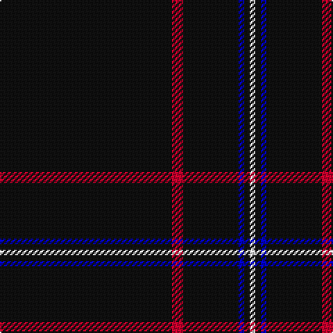

In pattern [KRKBKW](/patterns/krkbkw/).

This was sourced from register-of-tartans.  It is a [6 stripes tartan](/stripes/stripes6/).

Original link https://www.tartanregister.gov.uk/tartanDetails.aspx?ref=11058

## Thread count
K/124 R8 K40 B4 K4 W/4

## Palette
Each colour and its ΔE from the base-6 reference it is a variant of.

| Colour | Shade | Base | ΔE (OKLab) |
|---|---|---|---|
| B | <code style="background-color:#0000CD;">#0000CD</code> `#0000CD` | B <code style="background-color:#2A418A;">#2A418A</code> | 0.14 |
| K | <code style="background-color:#101010;">#101010</code> `#101010` | K <code style="background-color:#000000;">#000000</code> | 0.17 |
| R | <code style="background-color:#C8002C;">#C8002C</code> `#C8002C` | R <code style="background-color:#CC0000;">#CC0000</code> | 0.03 |
| W | <code style="background-color:#FFFFFF;">#FFFFFF</code> `#FFFFFF` | W <code style="background-color:#F7F7F7;">#F7F7F7</code> | 0.02 |

# Sample pattern

## Nearest tartans

The nearest existing variants by ΔTartan distance.

1. [NewGeneration Alchemy (NGA) Inc](/setts/s6/k31r2k10b1k1w1x4~b2c2c80-k101010-rc80000-wfcfcfc/) — ΔT 0.19
1. [Chafyn House (School)](/setts/s7/k72r3k11b9k11r3k37~b2888c4-k101010-rc80000/) — ΔT 1.36
1. [Auld Bernensis](/setts/s8/k62r3k3y3k3r3k9ra5x2~k101010-rc80000-ra888888-yd09800/) — ΔT 1.62
1. [Dunnotar (School)](/setts/s4/k72w3k11b9~b2c2c80-k101010-we0e0e0/) — ΔT 1.63
1. [Lochaber (Hesketh)](/setts/s7/k8y3k120y3k40b2k4x2~b5c8ca8-k101010-ye8c000/) — ΔT 1.63
1. [McHattie (Personal)](/setts/s5/k45b2r4y1w1x2~b202060-k101010-rc80000-we0e0e0-ye8c000/) — ΔT 1.69
1. [Wallington (Corporate?)](/setts/s4/k60b3k9g7~b2888c4-g289c18-k101010/) — ΔT 1.69
1. [Fettes (Personal)](/setts/s5/k50b3ba2r3w1x4~b004878-baa060bc-k101010-rc80000-we0e0e0/) — ΔT 1.72
1. [Fettes Personal Tartan Tartan Number: 7565. Earliest known date: 2008 Designed online for four kilts by Fiona Fettes. See products available Copyright © Blair Urquhart, Comrie, 2015](/setts/s5/k50b3w2r3wa1x2~b003c64-k101010-rc80000-wc49cd8-wae0e0e0/) — ΔT 1.74
1. [McHattie (Personal)](/setts/s5/k45b2r4y1w1x2~b1474b4-k101010-rc80000-we0e0e0-ye8c000/) — ΔT 1.75

## Neighbour map

Every grey dot is one of 15726 variants placed by the first two principal components of the ΔTartan feature space (44% of its variance). Red is this tartan; blue dots are its nearest — click one to open its page.

<svg viewBox="0 0 640 380" role="img" style="max-width:100%;height:auto;border:1px solid #e0e0e0;border-radius:4px;display:block" xmlns="http://www.w3.org/2000/svg"><image href="/nn/cloud.v1.png" width="640" height="380"/><a href="/setts/s6/k31r2k10b1k1w1x4~b2c2c80-k101010-rc80000-wfcfcfc/"><circle cx="626.0" cy="179.2" r="4" fill="#3465a4"><title>NewGeneration Alchemy (NGA) Inc</title></circle></a><a href="/setts/s7/k72r3k11b9k11r3k37~b2888c4-k101010-rc80000/"><circle cx="626.0" cy="217.3" r="4" fill="#3465a4"><title>Chafyn House (School)</title></circle></a><a href="/setts/s8/k62r3k3y3k3r3k9ra5x2~k101010-rc80000-ra888888-yd09800/"><circle cx="597.8" cy="156.7" r="4" fill="#3465a4"><title>Auld Bernensis</title></circle></a><a href="/setts/s4/k72w3k11b9~b2c2c80-k101010-we0e0e0/"><circle cx="626.0" cy="236.5" r="4" fill="#3465a4"><title>Dunnotar (School)</title></circle></a><a href="/setts/s7/k8y3k120y3k40b2k4x2~b5c8ca8-k101010-ye8c000/"><circle cx="626.0" cy="174.4" r="4" fill="#3465a4"><title>Lochaber (Hesketh)</title></circle></a><a href="/setts/s5/k45b2r4y1w1x2~b202060-k101010-rc80000-we0e0e0-ye8c000/"><circle cx="619.7" cy="137.5" r="4" fill="#3465a4"><title>McHattie (Personal)</title></circle></a><a href="/setts/s4/k60b3k9g7~b2888c4-g289c18-k101010/"><circle cx="626.0" cy="236.5" r="4" fill="#3465a4"><title>Wallington (Corporate?)</title></circle></a><a href="/setts/s5/k50b3ba2r3w1x4~b004878-baa060bc-k101010-rc80000-we0e0e0/"><circle cx="626.0" cy="138.2" r="4" fill="#3465a4"><title>Fettes (Personal)</title></circle></a><a href="/setts/s5/k50b3w2r3wa1x2~b003c64-k101010-rc80000-wc49cd8-wae0e0e0/"><circle cx="622.7" cy="135.3" r="4" fill="#3465a4"><title>Fettes Personal Tartan Tartan Number: 7565. Earliest known date: 2008 Designed online for four kilts by Fiona Fettes. See products available Copyright © Blair Urquhart, Comrie, 2015</title></circle></a><a href="/setts/s5/k45b2r4y1w1x2~b1474b4-k101010-rc80000-we0e0e0-ye8c000/"><circle cx="611.2" cy="134.2" r="4" fill="#3465a4"><title>McHattie (Personal)</title></circle></a><circle cx="626.0" cy="177.5" r="5" fill="#c00000"/></svg>

ID: /setts/s6/k31r2k10b1k1w1x4~b0000cd-k101010-rc8002c-wffffff/
