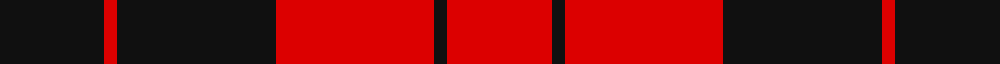

In pattern [KRKRKR](/stripes/krkrkr/).

This was sourced from register-of-tartans.  It is a [6 stripe tartan](/stripes/stripes6/).

Original link https://www.tartanregister.gov.uk/tartanDetails.aspx?ref=1121

## Attestations

This cloth appears in 2 source records; the oldest owns this page.

- undated — Erskine (Paton) (register-of-tartans, [record](https://www.tartanregister.gov.uk/tartanDetails.aspx?ref=1121))
- undated — Erskine (weddslist, [record](http://www.weddslist.com/cgi-bin/tartans/pg.pl?source=sts))

## Register references

External register numbers recorded for this tartan.

- Scottish Register of Tartans: [1121](https://www.tartanregister.gov.uk/tartanDetails.aspx?ref=1121)
- Scottish Tartans World Register: 1187

## Thread count
K/62 R8 K94 R94 K8 R/62

## Palette
Each colour and the base-6 reference it is a variant of.

| Colour | Shade | Base |
|---|---|---|
| K | <code style="background-color:#101010;">#101010</code> `oklch(17.3% 0.000 89.9)` <small>#101010</small> | K <code style="background-color:#000000;">#000000</code> |
| R | <code style="background-color:#DC0000;">#DC0000</code> `oklch(56.2% 0.230 29.2)` <small>#DC0000</small> | R <code style="background-color:#CC0000;">#CC0000</code> |

# Sample pattern

## Nearest tartans

The nearest existing variants by ΔTartan distance.

1. [MacLeod Black & Red](/setts/s5/r8k1r8k12r1~x2/) — ΔT 0.81
1. [MacKeane (Clan?)](/setts/s7/r4k8r4k8r12k1ly1~x2/) — ΔT 0.98
1. [MacFarlane Red & Black (Artefact)](/setts/s4/k30r17k3~x4/) — ΔT 1.00
1. [MacDonald of Ardnamurchan (Clan?)](/setts/s7/r4k8r4k8r12k1ly2~x4/) — ΔT 1.02
1. [MacLeod of Raasay (Highland Society of London)](/setts/s5/k13r2k13r19k2~x2/) — ΔT 1.05
1. [Erskine, Black & Red (Clan)](/setts/s6/k6r3k28r28k3r6~x2/) — ΔT 1.07
1. [Munro (Black and Red)](/setts/s5/k18r4k18r32w3~x2/) — ΔT 1.09
1. [Campbell of Armaddie](/setts/s5/r4k1r12k12r2~x2/) — ΔT 1.20
1. [MacLeod #2](/setts/s8/k12r3k2r16k8r12k2r3~x2/) — ΔT 1.21
1. [MacQueen](/setts/s6/k2r6k2r6k12ly1~x4/) — ΔT 1.23

## Neighbour map

Every grey dot is one of 14299 variants placed by the first two principal components of the ΔTartan feature space (44% of its variance). Red is this tartan; blue dots are its nearest — click one to open its page.

<svg viewBox="0 0 640 380" role="img" style="max-width:100%;height:auto;border:1px solid #e0e0e0;border-radius:4px;display:block" xmlns="http://www.w3.org/2000/svg"><image href="/nn/cloud.v1.png" width="640" height="380"/><a href="/setts/s5/r8k1r8k12r1~x2/"><circle cx="376.2" cy="236.1" r="4" fill="#3465a4"><title>MacLeod Black &amp; Red</title></circle></a><a href="/setts/s7/r4k8r4k8r12k1ly1~x2/"><circle cx="327.8" cy="213.9" r="4" fill="#3465a4"><title>MacKeane (Clan?)</title></circle></a><a href="/setts/s4/k30r17k3~x4/"><circle cx="344.1" cy="277.1" r="4" fill="#3465a4"><title>MacFarlane Red &amp; Black (Artefact)</title></circle></a><a href="/setts/s7/r4k8r4k8r12k1ly2~x4/"><circle cx="306.0" cy="215.4" r="4" fill="#3465a4"><title>MacDonald of Ardnamurchan (Clan?)</title></circle></a><a href="/setts/s5/k13r2k13r19k2~x2/"><circle cx="373.7" cy="261.7" r="4" fill="#3465a4"><title>MacLeod of Raasay (Highland Society of London)</title></circle></a><a href="/setts/s6/k6r3k28r28k3r6~x2/"><circle cx="361.6" cy="231.6" r="4" fill="#3465a4"><title>Erskine, Black &amp; Red (Clan)</title></circle></a><a href="/setts/s5/k18r4k18r32w3~x2/"><circle cx="301.7" cy="227.1" r="4" fill="#3465a4"><title>Munro (Black and Red)</title></circle></a><a href="/setts/s5/r4k1r12k12r2~x2/"><circle cx="373.8" cy="229.8" r="4" fill="#3465a4"><title>Campbell of Armaddie</title></circle></a><a href="/setts/s8/k12r3k2r16k8r12k2r3~x2/"><circle cx="360.0" cy="231.1" r="4" fill="#3465a4"><title>MacLeod #2</title></circle></a><a href="/setts/s6/k2r6k2r6k12ly1~x4/"><circle cx="342.4" cy="216.7" r="4" fill="#3465a4"><title>MacQueen</title></circle></a><circle cx="338.6" cy="239.7" r="5" fill="#c00000"/></svg>

ID: /setts/s6/k31r4k47r47k4r31~x2/
