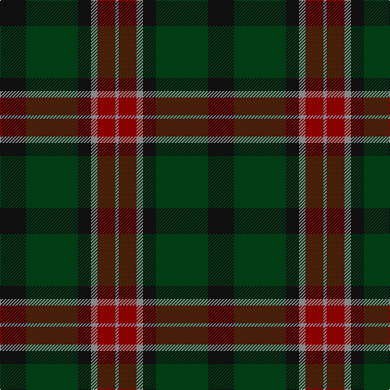

In pattern [KGKRRR](/patterns/kgkrrr/).

This was sourced from register-of-tartans.  It is a [6 stripes tartan](/stripes/stripes6/).

Original link https://www.tartanregister.gov.uk/tartanDetails.aspx?ref=11456

## Thread count
K/32 DG64 K16 N8 DR22 N/4

## Palette
Each colour and its ΔE from the base-6 reference it is a variant of.

| Colour | Shade | Base | ΔE (OKLab) |
|---|---|---|---|
| DG | <code style="background-color:#003C14;">#003C14</code> `#003C14` | G <code style="background-color:#006400;">#006400</code> | 0.14 |
| DR | <code style="background-color:#880000;">#880000</code> `#880000` | R <code style="background-color:#C80000;">#C80000</code> | 0.14 |
| K | <code style="background-color:#101010;">#101010</code> `#101010` | K <code style="background-color:#000000;">#000000</code> | 0.17 |
| N | <code style="background-color:#888888;">#888888</code> `#888888` | R <code style="background-color:#C80000;">#C80000</code> | 0.24 |

# Sample pattern

## Nearest tartans

The nearest existing variants by ΔTartan distance.

1. [(2) Cook](/setts/s7/g24b12g12r30k2r2k4-b006090-g004c00-k000000-r800000/) — ΔT 0.92
1. [Brown of the Southeast (Personal)](/setts/s8/b24g4b8g4b8k66g26r8-b505c64-g4c5420-k101010-rc80000/) — ΔT 1.10
1. [Louisville Spalding (Personal)](/setts/s5/k40b100g100r6k6-b1c1c50-g006818-k101010-rc80000/) — ΔT 1.14
1. [Lisbon](/setts/s6/g4b24ba6ga44ba44r4-b1c0070-ba441800-g8c7038-ga006818-r880000/) — ΔT 1.19
1. [Bailies of Bennachie Corporate Tartan Tartan Number: 3628. Earliest known date: 2002 The Bailes of Bennachie were founded in 1973 as caretakers of the mountain in Aberdeenshire, with the aim of 'preserving the amenity of the hill'. The tartan was produced on the occasion of the 25th anniversary to help create funds to continue their task. The colours reflect the autumn shades on the hill. See products available Copyright © Blair Urquhart, Comrie, 2015](/setts/s7/g54b4g8r30ba52k4ba12-b680028-ba002450-g48581c-k101010-ra44c00/) — ΔT 1.26
1. [National Galleries of Scotland Corporate Tartan Tartan Number: 2050. Earliest known date: November 1991 Based on the Black Watch or Government tartan. The three claret stripes represent the three galleries and the colour is that of William Playfair's original colour scheme for the National Gallery. See products available Copyright © Blair Urquhart, Comrie, 2015](/setts/s7/k14g44k44b12r4b30r4-b202060-g006818-k101010-rc80000/) — ΔT 1.27
1. [Jones (Arizona) (Name)](/setts/s10/g36k2r18k24r18k2g36k2b12g2-b5c5c5c-g005c34-k101010-r880000/) — ΔT 1.28
1. [McCarthy, Old](/setts/s5/b14r52b14g48y4-b202060-g003820-r880000-ye8c000/) — ΔT 1.28
1. [Cork, County (District)](/setts/s9/g56r24g8k40y4k6y4k6g14-g003820-k1c0034-r880000-ybc8c00/) — ΔT 1.30
1. [Ferguson Britt (Corporate)](/setts/s6/b12g72b72r6k72g12-b441800-g644824-k00002c-r9c2828/) — ΔT 1.31

## Neighbour map

Every grey dot is one of 15726 variants placed by the first two principal components of the ΔTartan feature space (44% of its variance). Red is this tartan; blue dots are its nearest — click one to open its page.

<svg viewBox="0 0 640 380" role="img" style="max-width:100%;height:auto;border:1px solid #e0e0e0;border-radius:4px;display:block" xmlns="http://www.w3.org/2000/svg"><image href="/nn/cloud.v1.png" width="640" height="380"/><a href="/setts/s7/g24b12g12r30k2r2k4-b006090-g004c00-k000000-r800000/"><circle cx="272.3" cy="206.2" r="4" fill="#3465a4"><title>(2) Cook</title></circle></a><a href="/setts/s8/b24g4b8g4b8k66g26r8-b505c64-g4c5420-k101010-rc80000/"><circle cx="300.0" cy="185.3" r="4" fill="#3465a4"><title>Brown of the Southeast (Personal)</title></circle></a><a href="/setts/s5/k40b100g100r6k6-b1c1c50-g006818-k101010-rc80000/"><circle cx="279.0" cy="225.5" r="4" fill="#3465a4"><title>Louisville Spalding (Personal)</title></circle></a><a href="/setts/s6/g4b24ba6ga44ba44r4-b1c0070-ba441800-g8c7038-ga006818-r880000/"><circle cx="237.3" cy="212.4" r="4" fill="#3465a4"><title>Lisbon</title></circle></a><a href="/setts/s7/g54b4g8r30ba52k4ba12-b680028-ba002450-g48581c-k101010-ra44c00/"><circle cx="257.3" cy="200.6" r="4" fill="#3465a4"><title>Bailies of Bennachie Corporate Tartan Tartan Number: 3628. Earliest known date: 2002 The Bailes of Bennachie were founded in 1973 as caretakers of the mountain in Aberdeenshire, with the aim of 'preserving the amenity of the hill'. The tartan was produced on the occasion of the 25th anniversary to help create funds to continue their task. The colours reflect the autumn shades on the hill. See products available Copyright © Blair Urquhart, Comrie, 2015</title></circle></a><a href="/setts/s7/k14g44k44b12r4b30r4-b202060-g006818-k101010-rc80000/"><circle cx="225.8" cy="229.5" r="4" fill="#3465a4"><title>National Galleries of Scotland Corporate Tartan Tartan Number: 2050. Earliest known date: November 1991 Based on the Black Watch or Government tartan. The three claret stripes represent the three galleries and the colour is that of William Playfair's original colour scheme for the National Gallery. See products available Copyright © Blair Urquhart, Comrie, 2015</title></circle></a><a href="/setts/s10/g36k2r18k24r18k2g36k2b12g2-b5c5c5c-g005c34-k101010-r880000/"><circle cx="314.1" cy="194.5" r="4" fill="#3465a4"><title>Jones (Arizona) (Name)</title></circle></a><a href="/setts/s5/b14r52b14g48y4-b202060-g003820-r880000-ye8c000/"><circle cx="272.1" cy="236.0" r="4" fill="#3465a4"><title>McCarthy, Old</title></circle></a><a href="/setts/s9/g56r24g8k40y4k6y4k6g14-g003820-k1c0034-r880000-ybc8c00/"><circle cx="315.4" cy="196.9" r="4" fill="#3465a4"><title>Cork, County (District)</title></circle></a><a href="/setts/s6/b12g72b72r6k72g12-b441800-g644824-k00002c-r9c2828/"><circle cx="257.6" cy="239.9" r="4" fill="#3465a4"><title>Ferguson Britt (Corporate)</title></circle></a><circle cx="294.6" cy="223.4" r="5" fill="#c00000"/></svg>

ID: /setts/s6/k32g64k16r8ra22r4-g003c14-k101010-r888888-ra880000/
