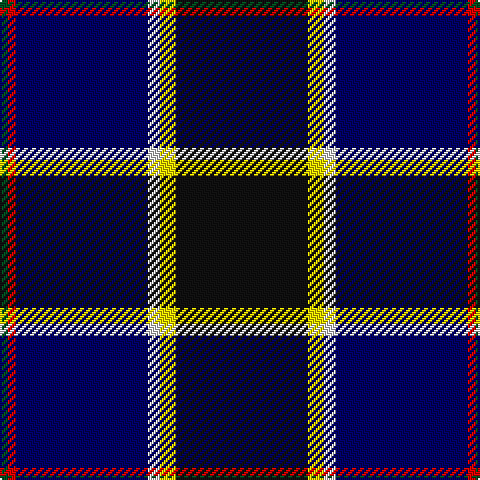

This page is one **sett** — a single exact thread-count. It belongs to the [tartan](/tartans/k33y4ln3db33r2g2/)
(the same proportion at any scale), whose colour order is pattern [GRBWYK](/stripes/grbwyk/).

Sourced from register-of-tartans.  It is a [6 stripe tartan](/stripes/stripes6/).

Original link https://www.tartanregister.gov.uk/tartanDetails.aspx?ref=5899

## Register references

External register numbers recorded for this tartan.

- Scottish Register of Tartans: [5899](https://www.tartanregister.gov.uk/tartanDetails.aspx?ref=5899)
- Scottish Tartans World Register: 3132

## Thread count
K/66 Y8 LN6 DB66 R4 G/4

## Palette
Each colour and the base-6 reference it is a variant of.

| Colour | Shade | Base |
|---|---|---|
| DB | <code style="background-color:#000064;">#000064</code> `oklch(22.7% 0.158 264.1)` <small>#000064</small> | B <code style="background-color:#2A418A;">#2A418A</code> |
| G | <code style="background-color:#005020;">#005020</code> `oklch(37.7% 0.105 149.6)` <small>#005020</small> | G <code style="background-color:#006100;">#006100</code> |
| K | <code style="background-color:#101010;">#101010</code> `oklch(17.3% 0.000 89.9)` <small>#101010</small> | K <code style="background-color:#000000;">#000000</code> |
| LN | <code style="background-color:#E0E0E0;">#E0E0E0</code> `oklch(90.7% 0.000 89.9)` <small>#E0E0E0</small> | W <code style="background-color:#F7F7F7;">#F7F7F7</code> |
| R | <code style="background-color:#DC0000;">#DC0000</code> `oklch(56.2% 0.230 29.2)` <small>#DC0000</small> | R <code style="background-color:#CC0000;">#CC0000</code> |
| Y | <code style="background-color:#FADC00;">#FADC00</code> `oklch(89.2% 0.185 99.2)` <small>#FADC00</small> | Y <code style="background-color:#F2BF00;">#F2BF00</code> |

# Sample pattern

## Nearest tartans

The nearest existing variants by ΔTartan distance, with this tartan at the top so the swatches line up against it.

ΔTartan

Tartan

Sett

—

<a href="/ttd/edit/#slug=k33ly4w3db33r2dg2~x2">Atlantic Police Academy</a> <a class="nn-out" href="/setts/s6/k33ly4w3db33r2dg2~x2/" title="open its dictionary page">↗</a>

0.59

<a href="/ttd/edit/#slug=k33ly4w3db33r2g2~x2">Atlantic Police Academy (Corporate)</a> <a class="nn-out" href="/setts/s6/k33ly4w3db33r2g2~x2/" title="open its dictionary page">↗</a>

0.69

<a href="/ttd/edit/#slug=r3w2g5k35db40ly3~x2">Italian National</a> <a class="nn-out" href="/setts/s6/r3w2g5k35db40ly3~x2/" title="open its dictionary page">↗</a>

0.71

<a href="/ttd/edit/#slug=w4db54k53dp4t8ly4">Pipers' Trail, The</a> <a class="nn-out" href="/setts/s6/w4db54k53dp4t8ly4/" title="open its dictionary page">↗</a>

0.99

<a href="/ttd/edit/#slug=w4dt54k53dp4b8lo4">Pipers' Trail, The</a> <a class="nn-out" href="/setts/s6/w4dt54k53dp4b8lo4/" title="open its dictionary page">↗</a>

1.22

<a href="/ttd/edit/#slug=r2t5k4lo1k4db16k3g2~x4">Arundel County (Dalgleish)</a> <a class="nn-out" href="/setts/s8/r2t5k4lo1k4db16k3g2~x4/" title="open its dictionary page">↗</a>

1.27

<a href="/ttd/edit/#slug=r3w6r2dg32db36k2db4lo2~x2">Canadian Centennial</a> <a class="nn-out" href="/setts/s8/r3w6r2dg32db36k2db4lo2~x2/" title="open its dictionary page">↗</a>

1.31

<a href="/ttd/edit/#slug=k4lo2k34db10lr4db4dp4db23w3~x2">Heirloom Dark Alba (Fashion)</a> <a class="nn-out" href="/setts/s9/k4lo2k34db10lr4db4dp4db23w3~x2/" title="open its dictionary page">↗</a>

1.32

<a href="/ttd/edit/#slug=r3db38k13w3o20ly2~x2">LLoyd of Astargus Canadian Family Tartan Tartan Number: 5771. Earliest known date: 2001 The designer of this tartan is of Welsh &amp; Scottish blood and sees this tartan as being appropriate for any Lloyds with Scottish blood. The 'Astargus' derives from Gaelic - 'Astar' being said to mean &quot;travelling or making distance&quot; and 'gus' meaning &quot;until I come back&quot; See products available Copyright © Blair Urquhart, Comrie, 2015</a> <a class="nn-out" href="/setts/s6/r3db38k13w3o20ly2~x2/" title="open its dictionary page">↗</a>

1.37

<a href="/ttd/edit/#slug=k1w1k18db20w1r1lo1~x4">Fuller of Hopewell (Personal)</a> <a class="nn-out" href="/setts/s7/k1w1k18db20w1r1lo1~x4/" title="open its dictionary page">↗</a>

1.37

<a href="/ttd/edit/#slug=b11db5g4w3r3k16db28b2~x2">Scottish Italian</a> <a class="nn-out" href="/setts/s8/b11db5g4w3r3k16db28b2~x2/" title="open its dictionary page">↗</a>

## Neighbour map

Every grey dot is one of 14299 variants placed by the first two principal components of the ΔTartan feature space (44% of its variance). Red is this tartan; blue dots are its nearest — click one to open its page.

<svg viewBox="0 0 640 380" role="img" style="max-width:100%;height:auto;border:1px solid #e0e0e0;border-radius:4px;display:block" xmlns="http://www.w3.org/2000/svg"><image href="/nn/cloud.v1.png" width="640" height="380"/><a href="/setts/s6/k33ly4w3db33r2g2~x2/"><circle cx="245.2" cy="148.5" r="4" fill="#3465a4"><title>Atlantic Police Academy (Corporate)</title></circle></a><a href="/setts/s6/r3w2g5k35db40ly3~x2/"><circle cx="260.7" cy="143.3" r="4" fill="#3465a4"><title>Italian National</title></circle></a><a href="/setts/s6/w4db54k53dp4t8ly4/"><circle cx="232.7" cy="158.7" r="4" fill="#3465a4"><title>Pipers' Trail, The</title></circle></a><a href="/setts/s6/w4dt54k53dp4b8lo4/"><circle cx="245.8" cy="170.1" r="4" fill="#3465a4"><title>Pipers' Trail, The</title></circle></a><a href="/setts/s8/r2t5k4lo1k4db16k3g2~x4/"><circle cx="184.9" cy="142.7" r="4" fill="#3465a4"><title>Arundel County (Dalgleish)</title></circle></a><a href="/setts/s8/r3w6r2dg32db36k2db4lo2~x2/"><circle cx="263.7" cy="132.6" r="4" fill="#3465a4"><title>Canadian Centennial</title></circle></a><a href="/setts/s9/k4lo2k34db10lr4db4dp4db23w3~x2/"><circle cx="258.0" cy="145.9" r="4" fill="#3465a4"><title>Heirloom Dark Alba (Fashion)</title></circle></a><a href="/setts/s6/r3db38k13w3o20ly2~x2/"><circle cx="236.9" cy="145.6" r="4" fill="#3465a4"><title>LLoyd of Astargus Canadian Family Tartan Tartan Number: 5771. Earliest known date: 2001 The designer of this tartan is of Welsh &amp; Scottish blood and sees this tartan as being appropriate for any Lloyds with Scottish blood. The 'Astargus' derives from Gaelic - 'Astar' being said to mean &quot;travelling or making distance&quot; and 'gus' meaning &quot;until I come back&quot; See products available Copyright © Blair Urquhart, Comrie, 2015</title></circle></a><a href="/setts/s7/k1w1k18db20w1r1lo1~x4/"><circle cx="313.5" cy="144.1" r="4" fill="#3465a4"><title>Fuller of Hopewell (Personal)</title></circle></a><a href="/setts/s8/b11db5g4w3r3k16db28b2~x2/"><circle cx="208.4" cy="156.1" r="4" fill="#3465a4"><title>Scottish Italian</title></circle></a><circle cx="239.9" cy="151.6" r="5" fill="#c00000"/></svg>

ID: /setts/s6/k33ly4w3db33r2dg2~x2/
