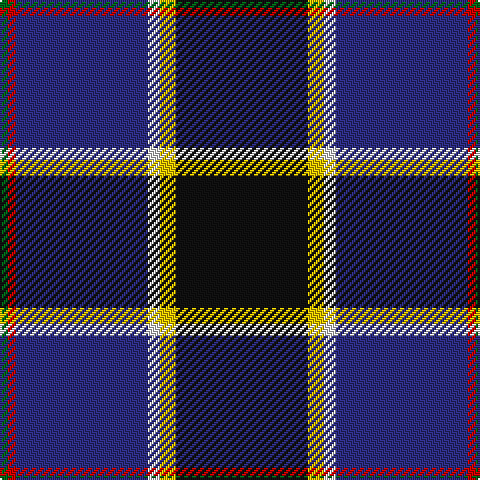

In pattern [GRBWYK](/patterns/grbwyk/).

This was sourced from tartans-authority.  It is a [6 stripes tartan](/stripes/stripes6/).

Original link http://www.tartansauthority.com/tartan-ferret/display/7344/

## Thread count
G/4 R4 DB66 LN6 Y8 K/66

## Palette
Each colour and its ΔE from the base-6 reference it is a variant of.

| Colour | Shade | Base | ΔE (OKLab) |
|---|---|---|---|
| DB | <code style="background-color:#2C2C80;">#2C2C80</code> `#2C2C80` | B <code style="background-color:#2A418A;">#2A418A</code> | 0.06 |
| G | <code style="background-color:#006818;">#006818</code> `#006818` | G <code style="background-color:#006100;">#006100</code> | 0.02 |
| K | <code style="background-color:#101010;">#101010</code> `#101010` | K <code style="background-color:#000000;">#000000</code> | 0.17 |
| LN | <code style="background-color:#E0E0E0;">#E0E0E0</code> `#E0E0E0` | W <code style="background-color:#F7F7F7;">#F7F7F7</code> | 0.07 |
| R | <code style="background-color:#C80000;">#C80000</code> `#C80000` | R <code style="background-color:#CC0000;">#CC0000</code> | 0.01 |
| Y | <code style="background-color:#E8C000;">#E8C000</code> `#E8C000` | Y <code style="background-color:#F2BF00;">#F2BF00</code> | 0.02 |

# Sample pattern

## Nearest tartans

The nearest existing variants by ΔTartan distance.

1. [Italian National](/setts/s6/r3w2g5k35b40y3x2~b2c2c80-g289c18-k101010-rc80000-wfcfcfc-ye8c000/) — ΔT 0.37
1. [Pipers' Trail, The](/setts/s6/w4b54k53ba4bb8y4~b2c2c80-ba780078-bb5c8ca8-k101010-wfcfcfc-yfccc00/) — ΔT 0.45
1. [Atlantic Police Academy](/setts/s6/k33y4w3b33r2g2x2~b000064-g005020-k101010-rdc0000-we0e0e0-yfadc00/) — ΔT 0.59
1. [Pipers' Trail, The](/setts/s6/w4b54k53ba4bb8y4~b003c64-ba5a008c-bb1870a4-k101010-wffffff-ye0a126/) — ΔT 0.90
1. [LLoyd of Astargus Canadian Family Tartan Tartan Number: 5771. Earliest known date: 2001 The designer of this tartan is of Welsh & Scottish blood and sees this tartan as being appropriate for any Lloyds with Scottish blood. The 'Astargus' derives from Gaelic - 'Astar' being said to mean "travelling or making distance" and 'gus' meaning "until I come back" See products available Copyright © Blair Urquhart, Comrie, 2015](/setts/s6/r3b38k13w3ra20y2x2~b202060-k101010-r800000-ra888888-we0e0e0-yf0c400/) — ΔT 0.94
1. [Canadian Centennial](/setts/s8/r3w6r2g32b36k2b4y2x2~b202060-g003820-k101010-rc80000-we0e0e0-yd09800/) — ΔT 1.03
1. [Hatfield & Mize (Personal)](/setts/s6/g10w2b10y5ba35r6x2~b1c1c1c-ba202060-g003820-rc80000-wffffff-ye0a126/) — ΔT 1.09
1. [Milne-Murtagh (2009)](/setts/s7/r5g2k30ga26gb2ga2ka4x2~g6e7f86-ga696969-gb6b5613-k101010-ka08033b-rc33f7b/) — ΔT 1.15
1. [Milne-Murtaugh (Personal)](/setts/s7/r5b2k30ba26y2ba2bb4x2~b5c8ca8-ba5c5c5c-bb1c1c50-k101010-re87878-ye8c000/) — ΔT 1.16
1. [Heirloom Dark Alba (Fashion)](/setts/s9/k4y2k34b10ya4b4ba4b23w3x2~b202060-ba780078-k101010-we0e0e0-ybc8c00-yaa0a0a0/) — ΔT 1.19

## Neighbour map

Every grey dot is one of 15726 variants placed by the first two principal components of the ΔTartan feature space (44% of its variance). Red is this tartan; blue dots are its nearest — click one to open its page.

<svg viewBox="0 0 640 380" role="img" style="max-width:100%;height:auto;border:1px solid #e0e0e0;border-radius:4px;display:block" xmlns="http://www.w3.org/2000/svg"><image href="/nn/cloud.v1.png" width="640" height="380"/><a href="/setts/s6/r3w2g5k35b40y3x2~b2c2c80-g289c18-k101010-rc80000-wfcfcfc-ye8c000/"><circle cx="257.5" cy="141.5" r="4" fill="#3465a4"><title>Italian National</title></circle></a><a href="/setts/s6/w4b54k53ba4bb8y4~b2c2c80-ba780078-bb5c8ca8-k101010-wfcfcfc-yfccc00/"><circle cx="229.3" cy="156.5" r="4" fill="#3465a4"><title>Pipers' Trail, The</title></circle></a><a href="/setts/s6/k33y4w3b33r2g2x2~b000064-g005020-k101010-rdc0000-we0e0e0-yfadc00/"><circle cx="236.1" cy="149.8" r="4" fill="#3465a4"><title>Atlantic Police Academy</title></circle></a><a href="/setts/s6/w4b54k53ba4bb8y4~b003c64-ba5a008c-bb1870a4-k101010-wffffff-ye0a126/"><circle cx="242.3" cy="165.7" r="4" fill="#3465a4"><title>Pipers' Trail, The</title></circle></a><a href="/setts/s6/r3b38k13w3ra20y2x2~b202060-k101010-r800000-ra888888-we0e0e0-yf0c400/"><circle cx="234.0" cy="144.3" r="4" fill="#3465a4"><title>LLoyd of Astargus Canadian Family Tartan Tartan Number: 5771. Earliest known date: 2001 The designer of this tartan is of Welsh &amp; Scottish blood and sees this tartan as being appropriate for any Lloyds with Scottish blood. The 'Astargus' derives from Gaelic - 'Astar' being said to mean &quot;travelling or making distance&quot; and 'gus' meaning &quot;until I come back&quot; See products available Copyright © Blair Urquhart, Comrie, 2015</title></circle></a><a href="/setts/s8/r3w6r2g32b36k2b4y2x2~b202060-g003820-k101010-rc80000-we0e0e0-yd09800/"><circle cx="260.6" cy="128.8" r="4" fill="#3465a4"><title>Canadian Centennial</title></circle></a><a href="/setts/s6/g10w2b10y5ba35r6x2~b1c1c1c-ba202060-g003820-rc80000-wffffff-ye0a126/"><circle cx="251.8" cy="154.1" r="4" fill="#3465a4"><title>Hatfield &amp; Mize (Personal)</title></circle></a><a href="/setts/s7/r5g2k30ga26gb2ga2ka4x2~g6e7f86-ga696969-gb6b5613-k101010-ka08033b-rc33f7b/"><circle cx="240.9" cy="144.9" r="4" fill="#3465a4"><title>Milne-Murtagh (2009)</title></circle></a><a href="/setts/s7/r5b2k30ba26y2ba2bb4x2~b5c8ca8-ba5c5c5c-bb1c1c50-k101010-re87878-ye8c000/"><circle cx="232.7" cy="141.8" r="4" fill="#3465a4"><title>Milne-Murtaugh (Personal)</title></circle></a><a href="/setts/s9/k4y2k34b10ya4b4ba4b23w3x2~b202060-ba780078-k101010-we0e0e0-ybc8c00-yaa0a0a0/"><circle cx="254.9" cy="141.0" r="4" fill="#3465a4"><title>Heirloom Dark Alba (Fashion)</title></circle></a><circle cx="241.9" cy="146.9" r="5" fill="#c00000"/></svg>

ID: /setts/s6/k33y4w3b33r2g2x2~b2c2c80-g006818-k101010-rc80000-we0e0e0-ye8c000/
