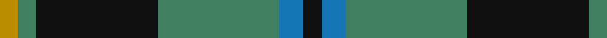
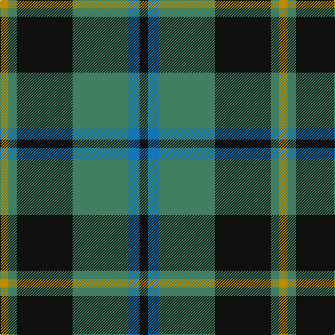

**Bands:** [KBGKGY](/stripes/kbgkgy/) · **Stripes:** [K B G K G LO](/stripes/stripes6/) K B G K G LO

This was sourced from register-of-tartans.  It is a [6 band tartan](/bands/bands6/).

Original link https://www.tartanregister.gov.uk/tartanDetails.aspx?ref=2944

## Attestations

This cloth appears in 2 source records; the oldest owns this page.

- 01/05/2003 — Michaluk (Personal) (register-of-tartans, [record](https://www.tartanregister.gov.uk/tartanDetails.aspx?ref=2944))
- pre 2004 — Michaluk (Personal) (tartans-authority, [record](http://www.tartansauthority.com/tartan-ferret/display/6217/))

## Register references

External register numbers recorded for this tartan.

- Scottish Register of Tartans: [2944](https://www.tartanregister.gov.uk/tartanDetails.aspx?ref=2944)
- Scottish Tartans Authority (ITI): 6217
- Scottish Tartans World Register: 2746

## Thread count
DY/12 G12 K80 G80 B16 K/12

## Palette
Each colour and its ΔE from the base-6 reference it is a variant of.

| Colour | Shade | Base | ΔE (OKLab) |
|---|---|---|---|
| B | <code style="background-color:#1474B4;">#1474B4</code> `#1474B4` | B <code style="background-color:#2A418A;">#2A418A</code> | 0.15 |
| DY | <code style="background-color:#BC8C00;">#BC8C00</code> `#BC8C00` | Y <code style="background-color:#F2BF00;">#F2BF00</code> | 0.16 |
| G | <code style="background-color:#408060;">#408060</code> `#408060` | G <code style="background-color:#006100;">#006100</code> | 0.14 |
| K | <code style="background-color:#101010;">#101010</code> `#101010` | K <code style="background-color:#000000;">#000000</code> | 0.17 |

# Sample pattern

## Nearest tartans

The nearest existing variants by ΔTartan distance.

1. [Irving of Bonshaw Tower (Personal)](/setts/s6/lr2db14g14db2g3r2~x2/) — ΔT 0.88
1. [Flower of Scotland](/setts/s6/db3g28db3k16db28r3/) — ΔT 0.92
1. [Thayer USA](/setts/s6/r5db25w5db3dg25db3~x2/) — ΔT 0.94
1. [Cameron of Lochiel (Hunting)](/setts/s7/r3g10r3g14db16g3ly2~x2/) — ΔT 1.01
1. [Cameron Hunting](/setts/s7/r3dg10r3dg14db16dg3ly2/) — ΔT 1.03
1. [Thayer USA (Name)](/setts/s6/r5db25w5db3g25db3~x2/) — ΔT 1.04
1. [Daks, Navy](/setts/s8/r5g12db4db4db22g18db4r5/) — ΔT 1.06
1. [Banff Centennial (Commemorative)](/setts/s8/k1b1k1b7dg8k1dg1ly1~x4/) — ΔT 1.06
1. [Heritage Tartan, The](/setts/s6/db8r4db24g35lb4g8/) — ΔT 1.07
1. [Brunton (Personal)](/setts/s8/k7r3k27g27ly3g3ly3g3~x2/) — ΔT 1.08

## Neighbour map

Every grey dot is one of 14313 variants placed by the first two principal components of the ΔTartan feature space (44% of its variance). Red is this tartan; blue dots are its nearest — click one to open its page.

<svg viewBox="0 0 640 380" role="img" style="max-width:100%;height:auto;border:1px solid #e0e0e0;border-radius:4px;display:block" xmlns="http://www.w3.org/2000/svg"><image href="/nn/cloud.v1.png" width="640" height="380"/><a href="/setts/s6/lr2db14g14db2g3r2~x2/"><circle cx="256.2" cy="230.4" r="4" fill="#3465a4"><title>Irving of Bonshaw Tower (Personal)</title></circle></a><a href="/setts/s6/db3g28db3k16db28r3/"><circle cx="207.0" cy="216.1" r="4" fill="#3465a4"><title>Flower of Scotland</title></circle></a><a href="/setts/s6/r5db25w5db3dg25db3~x2/"><circle cx="250.3" cy="215.7" r="4" fill="#3465a4"><title>Thayer USA</title></circle></a><a href="/setts/s7/r3g10r3g14db16g3ly2~x2/"><circle cx="260.0" cy="225.1" r="4" fill="#3465a4"><title>Cameron of Lochiel (Hunting)</title></circle></a><a href="/setts/s7/r3dg10r3dg14db16dg3ly2/"><circle cx="263.6" cy="229.8" r="4" fill="#3465a4"><title>Cameron Hunting</title></circle></a><a href="/setts/s6/r5db25w5db3g25db3~x2/"><circle cx="251.8" cy="216.1" r="4" fill="#3465a4"><title>Thayer USA (Name)</title></circle></a><a href="/setts/s8/r5g12db4db4db22g18db4r5/"><circle cx="175.1" cy="231.3" r="4" fill="#3465a4"><title>Daks, Navy</title></circle></a><a href="/setts/s8/k1b1k1b7dg8k1dg1ly1~x4/"><circle cx="224.7" cy="195.7" r="4" fill="#3465a4"><title>Banff Centennial (Commemorative)</title></circle></a><a href="/setts/s6/db8r4db24g35lb4g8/"><circle cx="284.9" cy="228.4" r="4" fill="#3465a4"><title>Heritage Tartan, The</title></circle></a><a href="/setts/s8/k7r3k27g27ly3g3ly3g3~x2/"><circle cx="252.2" cy="188.9" r="4" fill="#3465a4"><title>Brunton (Personal)</title></circle></a><circle cx="234.0" cy="227.3" r="5" fill="#c00000"/></svg>

ID: /setts/s6/k3b4g20k20g3lo3~x4/
