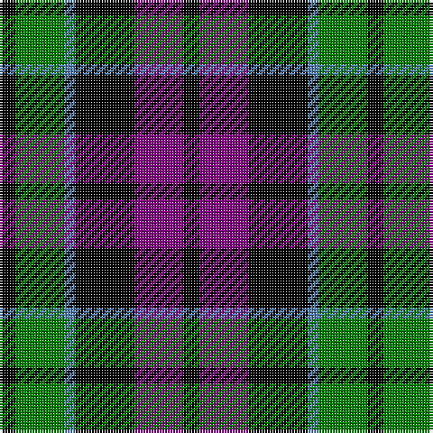

In pattern [KBKBGK](/patterns/kbkbgk/).

This was sourced from weddslist.  It is a [6 stripes tartan](/stripes/stripes6/).

Original link http://www.weddslist.com/cgi-bin/tartans/pg.pl?source=sts

## Thread count
K/6 G18 B4 K22 P18 K/6

## Palette
Each colour and its ΔE from the base-6 reference it is a variant of.

| Colour | Shade | Base | ΔE (OKLab) |
|---|---|---|---|
| B | <code style="background-color:#5480B0;">#5480B0</code> `#5480B0` | B <code style="background-color:#2A418A;">#2A418A</code> | 0.19 |
| G | <code style="background-color:#008000;">#008000</code> `#008000` | G <code style="background-color:#006100;">#006100</code> | 0.10 |
| K | <code style="background-color:#000000;">#000000</code> `#000000` | K <code style="background-color:#000000;">#000000</code> | 0.00 |
| P | <code style="background-color:#800080;">#800080</code> `#800080` | B <code style="background-color:#2A418A;">#2A418A</code> | 0.17 |

# Sample pattern

## Nearest tartans

The nearest existing variants by ΔTartan distance.

1. [Campbell, Sir Walter Scott](/setts/s6/k2g8b2k9ba7k2x2~b304080-ba800080-g008000-k000000/) — ΔT 0.43
1. [Forbes Ancient](/setts/s7/b1k6b6k6g6k1w1x2~b304080-g008000-k000000-we0e0e0/) — ΔT 0.91
1. [Wilson's, No 108](/setts/s8/k7g7k1g7k7b1ba7k1x4~b5480b0-ba800080-g008000-k000000/) — ΔT 1.08
1. [Melville](/setts/s6/k5w2g18k17b16k3~b5a3094-g004c00-k000000-wd0d0d0/) — ΔT 1.08
1. [Wilson's, No 64 or Abercrombie](/setts/s7/k6g6w1g6k6b6k1x4~b800080-g008000-k000000-we0e0e0/) — ΔT 1.09
1. [Lennie](/setts/s6/g2b8k9ba2g10k2x2~b800080-ba5480b0-g008000-k000000/) — ΔT 1.11
1. [Abercrombie, (Wilson's No 64)](/setts/s7/k6g6y1g6k6b6k1x4~b800080-g008000-k000000-yf0c000/) — ΔT 1.13
1. [MacNeil 2](/setts/s6/w2b10k10g9k3w2x2~b800080-g008000-k000000-we0e0e0/) — ΔT 1.23
1. [Brodie hunting](/setts/s7/r2b8g8k8y1k8r2x2~b304080-g008000-k000000-rc00000-yf0c000/) — ΔT 1.25
1. [Wilson's, No 97](/setts/s7/k11g12k2g12k12b12w3x2~b800080-g008000-k000000-we0e0e0/) — ΔT 1.25

## Neighbour map

Every grey dot is one of 15726 variants placed by the first two principal components of the ΔTartan feature space (44% of its variance). Red is this tartan; blue dots are its nearest — click one to open its page.

<svg viewBox="0 0 640 380" role="img" style="max-width:100%;height:auto;border:1px solid #e0e0e0;border-radius:4px;display:block" xmlns="http://www.w3.org/2000/svg"><image href="/nn/cloud.v1.png" width="640" height="380"/><a href="/setts/s6/k2g8b2k9ba7k2x2~b304080-ba800080-g008000-k000000/"><circle cx="148.8" cy="257.3" r="4" fill="#3465a4"><title>Campbell, Sir Walter Scott</title></circle></a><a href="/setts/s7/b1k6b6k6g6k1w1x2~b304080-g008000-k000000-we0e0e0/"><circle cx="180.6" cy="242.4" r="4" fill="#3465a4"><title>Forbes Ancient</title></circle></a><a href="/setts/s8/k7g7k1g7k7b1ba7k1x4~b5480b0-ba800080-g008000-k000000/"><circle cx="160.3" cy="230.2" r="4" fill="#3465a4"><title>Wilson's, No 108</title></circle></a><a href="/setts/s6/k5w2g18k17b16k3~b5a3094-g004c00-k000000-wd0d0d0/"><circle cx="183.8" cy="231.9" r="4" fill="#3465a4"><title>Melville</title></circle></a><a href="/setts/s7/k6g6w1g6k6b6k1x4~b800080-g008000-k000000-we0e0e0/"><circle cx="133.2" cy="252.4" r="4" fill="#3465a4"><title>Wilson's, No 64 or Abercrombie</title></circle></a><a href="/setts/s6/g2b8k9ba2g10k2x2~b800080-ba5480b0-g008000-k000000/"><circle cx="123.5" cy="245.8" r="4" fill="#3465a4"><title>Lennie</title></circle></a><a href="/setts/s7/k6g6y1g6k6b6k1x4~b800080-g008000-k000000-yf0c000/"><circle cx="134.2" cy="252.7" r="4" fill="#3465a4"><title>Abercrombie, (Wilson's No 64)</title></circle></a><a href="/setts/s6/w2b10k10g9k3w2x2~b800080-g008000-k000000-we0e0e0/"><circle cx="103.6" cy="240.9" r="4" fill="#3465a4"><title>MacNeil 2</title></circle></a><a href="/setts/s7/r2b8g8k8y1k8r2x2~b304080-g008000-k000000-rc00000-yf0c000/"><circle cx="135.0" cy="214.6" r="4" fill="#3465a4"><title>Brodie hunting</title></circle></a><a href="/setts/s7/k11g12k2g12k12b12w3x2~b800080-g008000-k000000-we0e0e0/"><circle cx="118.0" cy="254.6" r="4" fill="#3465a4"><title>Wilson's, No 97</title></circle></a><circle cx="165.1" cy="253.5" r="5" fill="#c00000"/></svg>

ID: /setts/s6/k3b9k11ba2g9k3x2~b800080-ba5480b0-g008000-k000000/
