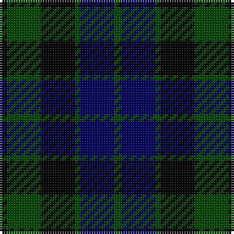

In pattern [GBGKGK](/stripes/gbgkgk/).

This was sourced from weddslist.  It is a [6 stripe tartan](/stripes/stripes6/).

Original link http://www.weddslist.com/cgi-bin/tartans/pg.pl?source=rb

## Attestations

This cloth appears in 2 source records; the oldest owns this page.

- undated — MacKay (weddslist, [record](http://www.weddslist.com/cgi-bin/tartans/pg.pl?source=rb))
- undated — MacKay (weddslist, [record](http://www.weddslist.com/cgi-bin/tartans/pg.pl?source=x))

## Thread count
K/3 G14 K14 G2 DB14 G/3

## Palette
Each colour and the base-6 reference it is a variant of.

| Colour | Shade | Base |
|---|---|---|
| DB | <code style="background-color:#000064;">#000064</code> `oklch(22.7% 0.158 264.1)` <small>#000064</small> | B <code style="background-color:#2A418A;">#2A418A</code> |
| G | <code style="background-color:#004C00;">#004C00</code> `oklch(36.1% 0.123 142.5)` <small>#004C00</small> | G <code style="background-color:#006100;">#006100</code> |
| K | <code style="background-color:#000000;">#000000</code> `oklch(0.0% 0.000 0.0)` <small>#000000</small> | K <code style="background-color:#000000;">#000000</code> |

# Sample pattern

## Nearest tartans

The nearest existing variants by ΔTartan distance, with this tartan at the top so the swatches line up against it.

ΔTartan

Tartan

Sett

—

<a href="/ttd/edit/#slug=k3dg14k14dg2db14dg3">MacKay</a> <a class="nn-out" href="/setts/s6/k3dg14k14dg2db14dg3/" title="open its dictionary page">↗</a>

0.48

<a href="/ttd/edit/#slug=k3dg14k14dg2db14dg3~x2">MacKay</a> <a class="nn-out" href="/setts/s6/k3dg14k14dg2db14dg3~x2/" title="open its dictionary page">↗</a>

0.56

<a href="/ttd/edit/#slug=k1dg6k6db6k1db1~x4">Black Watch (smallest sett)</a> <a class="nn-out" href="/setts/s6/k1dg6k6db6k1db1~x4/" title="open its dictionary page">↗</a>

1.04

<a href="/ttd/edit/#slug=dg8k2b1dg4k6db6k1~x2">MacCallum</a> <a class="nn-out" href="/setts/s7/dg8k2b1dg4k6db6k1~x2/" title="open its dictionary page">↗</a>

1.09

<a href="/ttd/edit/#slug=db6k1db6k8r1dg8k2">Fletcher</a> <a class="nn-out" href="/setts/s7/db6k1db6k8r1dg8k2/" title="open its dictionary page">↗</a>

1.09

<a href="/ttd/edit/#slug=k3dg14k14dg2db14r3~x2">Morrison</a> <a class="nn-out" href="/setts/s6/k3dg14k14dg2db14r3~x2/" title="open its dictionary page">↗</a>

1.11

<a href="/ttd/edit/#slug=k3dg14k14dg2db14r3">Morrison</a> <a class="nn-out" href="/setts/s6/k3dg14k14dg2db14r3/" title="open its dictionary page">↗</a>

1.14

<a href="/ttd/edit/#slug=db4k4db4dg9k2">Austin</a> <a class="nn-out" href="/setts/s5/db4k4db4dg9k2/" title="open its dictionary page">↗</a>

1.21

<a href="/ttd/edit/#slug=db6k1db6k8r1dg8k2~x2">Fletcher</a> <a class="nn-out" href="/setts/s7/db6k1db6k8r1dg8k2~x2/" title="open its dictionary page">↗</a>

1.25

<a href="/ttd/edit/#slug=dg8k2lb1dg4k6db6k1~x2">MacCallum</a> <a class="nn-out" href="/setts/s7/dg8k2lb1dg4k6db6k1~x2/" title="open its dictionary page">↗</a>

1.26

<a href="/ttd/edit/#slug=db2g6db6dp5db1dp2~x2">Unnamed, No 54</a> <a class="nn-out" href="/setts/s6/db2g6db6dp5db1dp2~x2/" title="open its dictionary page">↗</a>

## Neighbour map

Every grey dot is one of 14299 variants placed by the first two principal components of the ΔTartan feature space (44% of its variance). Red is this tartan; blue dots are its nearest — click one to open its page.

<svg viewBox="0 0 640 380" role="img" style="max-width:100%;height:auto;border:1px solid #e0e0e0;border-radius:4px;display:block" xmlns="http://www.w3.org/2000/svg"><image href="/nn/cloud.v1.png" width="640" height="380"/><a href="/setts/s6/k3dg14k14dg2db14dg3~x2/"><circle cx="231.3" cy="284.1" r="4" fill="#3465a4"><title>MacKay</title></circle></a><a href="/setts/s6/k1dg6k6db6k1db1~x4/"><circle cx="216.1" cy="275.7" r="4" fill="#3465a4"><title>Black Watch (smallest sett)</title></circle></a><a href="/setts/s7/dg8k2b1dg4k6db6k1~x2/"><circle cx="216.5" cy="256.2" r="4" fill="#3465a4"><title>MacCallum</title></circle></a><a href="/setts/s7/db6k1db6k8r1dg8k2/"><circle cx="197.2" cy="257.1" r="4" fill="#3465a4"><title>Fletcher</title></circle></a><a href="/setts/s6/k3dg14k14dg2db14r3~x2/"><circle cx="178.3" cy="259.9" r="4" fill="#3465a4"><title>Morrison</title></circle></a><a href="/setts/s6/k3dg14k14dg2db14r3/"><circle cx="164.2" cy="252.7" r="4" fill="#3465a4"><title>Morrison</title></circle></a><a href="/setts/s5/db4k4db4dg9k2/"><circle cx="199.5" cy="324.6" r="4" fill="#3465a4"><title>Austin</title></circle></a><a href="/setts/s7/db6k1db6k8r1dg8k2~x2/"><circle cx="205.3" cy="261.0" r="4" fill="#3465a4"><title>Fletcher</title></circle></a><a href="/setts/s7/dg8k2lb1dg4k6db6k1~x2/"><circle cx="194.4" cy="245.0" r="4" fill="#3465a4"><title>MacCallum</title></circle></a><a href="/setts/s6/db2g6db6dp5db1dp2~x2/"><circle cx="207.6" cy="288.4" r="4" fill="#3465a4"><title>Unnamed, No 54</title></circle></a><circle cx="217.6" cy="277.6" r="5" fill="#c00000"/></svg>

ID: /setts/s6/k3dg14k14dg2db14dg3/
