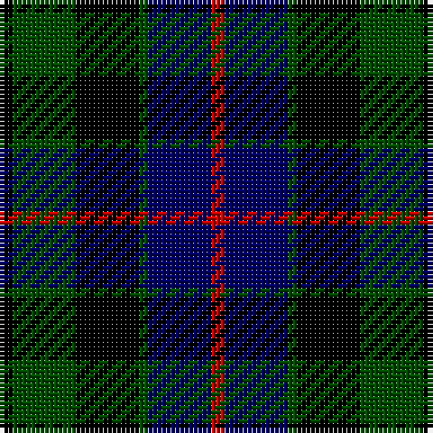

**Bands:** [KGKGBR](/stripes/kgkgbr/) · **Stripes:** [K DG K DG DB R](/stripes/stripes6/) K DG K DG DB R

This was sourced from weddslist.  It is a [6 band tartan](/bands/bands6/).

Original link http://www.weddslist.com/cgi-bin/tartans/pg.pl?source=rb

## Attestations

This cloth appears in 2 source records; the oldest owns this page.

- undated — Morrison (weddslist, [record](http://www.weddslist.com/cgi-bin/tartans/pg.pl?source=rb))
- undated — Morrison (weddslist, [record](http://www.weddslist.com/cgi-bin/tartans/pg.pl?source=x))

## Register references

External register numbers recorded for this tartan.

- Scottish Register of Tartans: [1166](https://www.tartanregister.gov.uk/tartanDetails.aspx?ref=1166)
- Scottish Register of Tartans: [1758](https://www.tartanregister.gov.uk/tartanDetails.aspx?ref=1758)
- Scottish Register of Tartans: [2307](https://www.tartanregister.gov.uk/tartanDetails.aspx?ref=2307)
- Scottish Register of Tartans: [2540](https://www.tartanregister.gov.uk/tartanDetails.aspx?ref=2540)
- Scottish Register of Tartans: [2625](https://www.tartanregister.gov.uk/tartanDetails.aspx?ref=2625)
- Scottish Register of Tartans: [2666](https://www.tartanregister.gov.uk/tartanDetails.aspx?ref=2666)
- Scottish Register of Tartans: [2862](https://www.tartanregister.gov.uk/tartanDetails.aspx?ref=2862)
- Scottish Register of Tartans: [3808](https://www.tartanregister.gov.uk/tartanDetails.aspx?ref=3808)
- Scottish Register of Tartans: [982](https://www.tartanregister.gov.uk/tartanDetails.aspx?ref=982)
- Scottish Tartans Authority (ITI): 1429
- Scottish Tartans Authority (ITI): 218
- Scottish Tartans World Register: 1010
- Scottish Tartans World Register: 1042
- Scottish Tartans World Register: 127
- Scottish Tartans World Register: 1429
- Scottish Tartans World Register: 1585
- Scottish Tartans World Register: 218
- Scottish Tartans World Register: 2218
- Scottish Tartans World Register: 737
- Scottish Tartans World Register: 897

## Variants

Other setts woven to the same stripe pattern.

- [Morrison](/setts/s6/k3dg14k14dg2db14r3~x2/)

## Thread count
K/3 G14 K14 G2 DB14 R/3

## Palette
Each colour and its ΔE from the base-6 reference it is a variant of.

| Colour | Shade | Base | ΔE (OKLab) |
|---|---|---|---|
| DB | <code style="background-color:#000064;">#000064</code> `#000064` | B <code style="background-color:#2A418A;">#2A418A</code> | 0.18 |
| G | <code style="background-color:#004C00;">#004C00</code> `#004C00` | G <code style="background-color:#006100;">#006100</code> | 0.07 |
| K | <code style="background-color:#000000;">#000000</code> `#000000` | K <code style="background-color:#000000;">#000000</code> | 0.00 |
| R | <code style="background-color:#C80000;">#C80000</code> `#C80000` | R <code style="background-color:#CC0000;">#CC0000</code> | 0.01 |

# Sample pattern

## Nearest tartans

The nearest existing variants by ΔTartan distance.

1. [Morrison](/setts/s6/k3dg14k14dg2db14r3~x2/) — ΔT 0.48
1. [Fletcher C](/setts/s7/db6k1db6k8r1dg8r2/) — ΔT 0.67
1. [Fletcher C](/setts/s7/db6k1db6k8r1dg8r2~x2/) — ΔT 0.79
1. [Scottish Airports](/setts/s6/dt4g18dt3k17dt18dp4~x2/) — ΔT 0.82
1. [Fletcher](/setts/s7/db6k1db6k8r1dg8k2/) — ΔT 0.84
1. [Gunn](/setts/s6/dg2db12dg1k12dg12r2/) — ΔT 0.91
1. [Baird](/setts/s8/db3k2db8k8dg8n1dg1n3~x2/) — ΔT 0.95
1. [Leslie Hunting](/setts/s6/r2db8k8lr1dg8k1~x2/) — ΔT 0.95
1. [Leslie Hunting](/setts/s6/r2db8k8lr1dg8k1/) — ΔT 0.95
1. [Baird](/setts/s8/db3k2db8k8dg8dp1dg1dp3~x2/) — ΔT 1.03

## Neighbour map

Every grey dot is one of 14299 variants placed by the first two principal components of the ΔTartan feature space (44% of its variance). Red is this tartan; blue dots are its nearest — click one to open its page.

<svg viewBox="0 0 640 380" role="img" style="max-width:100%;height:auto;border:1px solid #e0e0e0;border-radius:4px;display:block" xmlns="http://www.w3.org/2000/svg"><image href="/nn/cloud.v1.png" width="640" height="380"/><a href="/setts/s6/k3dg14k14dg2db14r3~x2/"><circle cx="178.3" cy="259.9" r="4" fill="#3465a4"><title>Morrison</title></circle></a><a href="/setts/s7/db6k1db6k8r1dg8r2/"><circle cx="168.2" cy="243.1" r="4" fill="#3465a4"><title>Fletcher C</title></circle></a><a href="/setts/s7/db6k1db6k8r1dg8r2~x2/"><circle cx="183.2" cy="251.1" r="4" fill="#3465a4"><title>Fletcher C</title></circle></a><a href="/setts/s6/dt4g18dt3k17dt18dp4~x2/"><circle cx="162.3" cy="252.7" r="4" fill="#3465a4"><title>Scottish Airports</title></circle></a><a href="/setts/s7/db6k1db6k8r1dg8k2/"><circle cx="197.2" cy="257.1" r="4" fill="#3465a4"><title>Fletcher</title></circle></a><a href="/setts/s6/dg2db12dg1k12dg12r2/"><circle cx="203.8" cy="228.4" r="4" fill="#3465a4"><title>Gunn</title></circle></a><a href="/setts/s8/db3k2db8k8dg8n1dg1n3~x2/"><circle cx="167.1" cy="241.9" r="4" fill="#3465a4"><title>Baird</title></circle></a><a href="/setts/s6/r2db8k8lr1dg8k1~x2/"><circle cx="139.2" cy="226.5" r="4" fill="#3465a4"><title>Leslie Hunting</title></circle></a><a href="/setts/s6/r2db8k8lr1dg8k1/"><circle cx="139.2" cy="226.5" r="4" fill="#3465a4"><title>Leslie Hunting</title></circle></a><a href="/setts/s8/db3k2db8k8dg8dp1dg1dp3~x2/"><circle cx="159.4" cy="238.6" r="4" fill="#3465a4"><title>Baird</title></circle></a><circle cx="164.2" cy="252.7" r="5" fill="#c00000"/></svg>

ID: /setts/s6/k3dg14k14dg2db14r3/
