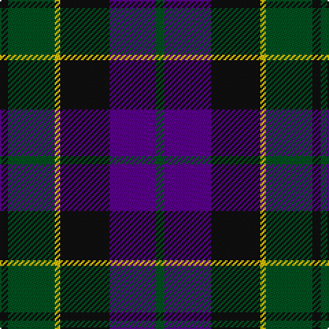

This page is one **sett** — a single exact thread-count. It belongs to the [tartan](/tartans/k3dg17ly2k18dp17dg3/)
(the same proportion at any scale), whose colour order is pattern [GBKYGK](/stripes/gbkygk/).

Sourced from register-of-tartans.  It is a [6 stripe tartan](/stripes/stripes6/).

Original link https://www.tartanregister.gov.uk/tartanDetails.aspx?ref=4674

## Register references

External register numbers recorded for this tartan.

- Scottish Register of Tartans: [4674](https://www.tartanregister.gov.uk/tartanDetails.aspx?ref=4674)
- Scottish Tartans World Register: 729

## Thread count
K/6 G34 Y4 K36 P34 G/6

## Palette

Palette: <strong>Tartan Register</strong>
<table><thead><tr><th>Colour</th><th>Threads</th><th>Shade</th><th>Base</th><th>OKLCh</th></tr></thead><tbody><tr><td>K/</td><td style="text-align:right;font-variant-numeric:tabular-nums">6</td><td><code style="background-color:#101010;">#101010</code> <small style="color:#888">#101010</small></td><td>K <code style="background-color:#000000;">#000000</code></td><td><small style="color:#888">oklch(17.3% 0.000 89.9)</small></td></tr><tr><td>G</td><td style="text-align:right;font-variant-numeric:tabular-nums">34</td><td><code style="background-color:#005020;">#005020</code> <small style="color:#888">#005020</small></td><td>G <code style="background-color:#006100;">#006100</code></td><td><small style="color:#888">oklch(37.7% 0.105 149.6)</small></td></tr><tr><td>Y</td><td style="text-align:right;font-variant-numeric:tabular-nums">4</td><td><code style="background-color:#E8C000;">#E8C000</code> <small style="color:#888">#E8C000</small></td><td>Y <code style="background-color:#F2BF00;">#F2BF00</code></td><td><small style="color:#888">oklch(81.9% 0.168 93.7)</small></td></tr><tr><td>K</td><td style="text-align:right;font-variant-numeric:tabular-nums">36</td><td><code style="background-color:#101010;">#101010</code> <small style="color:#888">#101010</small></td><td>K <code style="background-color:#000000;">#000000</code></td><td><small style="color:#888">oklch(17.3% 0.000 89.9)</small></td></tr><tr><td>P</td><td style="text-align:right;font-variant-numeric:tabular-nums">34</td><td><code style="background-color:#5A008C;">#5A008C</code> <small style="color:#888">#5A008C</small></td><td>B <code style="background-color:#2A418A;">#2A418A</code></td><td><small style="color:#888">oklch(37.0% 0.191 306.3)</small></td></tr><tr><td>G/</td><td style="text-align:right;font-variant-numeric:tabular-nums">6</td><td><code style="background-color:#005020;">#005020</code> <small style="color:#888">#005020</small></td><td>G <code style="background-color:#006100;">#006100</code></td><td><small style="color:#888">oklch(37.7% 0.105 149.6)</small></td></tr></tbody></table>

# Sample pattern

## Nearest tartans

The nearest existing variants by ΔTartan distance, with this tartan at the top so the swatches line up against it.

ΔTartan

Tartan

Sett

—

<a href="/ttd/edit/#slug=k3dg17ly2k18dp17dg3~x2">Wilson's No.100</a> <a class="nn-out" href="/setts/s6/k3dg17ly2k18dp17dg3~x2/" title="open its dictionary page">↗</a>

0.69

<a href="/ttd/edit/#slug=g8t1g1k6dp6k1dp3~x4">Unnamed 19th Century Plaid</a> <a class="nn-out" href="/setts/s7/g8t1g1k6dp6k1dp3~x4/" title="open its dictionary page">↗</a>

0.70

<a href="/ttd/edit/#slug=k7g22k22db6r2db15r2~x2">National Galleries of Scotland</a> <a class="nn-out" href="/setts/s7/k7g22k22db6r2db15r2~x2/" title="open its dictionary page">↗</a>

0.75

<a href="/ttd/edit/#slug=db6k2db18k18g18k3r2~x2">Renfrew</a> <a class="nn-out" href="/setts/s7/db6k2db18k18g18k3r2~x2/" title="open its dictionary page">↗</a>

0.79

<a href="/ttd/edit/#slug=k4g25k24r3db24g4~x2">Ferguson of Balquhidder #2</a> <a class="nn-out" href="/setts/s6/k4g25k24r3db24g4~x2/" title="open its dictionary page">↗</a>

0.81

<a href="/ttd/edit/#slug=k2g10k9db9r1k1db2~x2">Reid and Taylor</a> <a class="nn-out" href="/setts/s7/k2g10k9db9r1k1db2~x2/" title="open its dictionary page">↗</a>

0.83

<a href="/ttd/edit/#slug=r2g12k12g1db12g2~x2">Gunn</a> <a class="nn-out" href="/setts/s6/r2g12k12g1db12g2~x2/" title="open its dictionary page">↗</a>

0.84

<a href="/ttd/edit/#slug=k3db14r2k14g14k3~x2">Gallamore</a> <a class="nn-out" href="/setts/s6/k3db14r2k14g14k3~x2/" title="open its dictionary page">↗</a>

0.92

<a href="/ttd/edit/#slug=n6k6n21k16db36ly4">Bareback (Corporate)</a> <a class="nn-out" href="/setts/s6/n6k6n21k16db36ly4/" title="open its dictionary page">↗</a>

0.94

<a href="/ttd/edit/#slug=db24k3db5k23ly2k11g22~x2">Mowat (Clans Originaux)</a> <a class="nn-out" href="/setts/s7/db24k3db5k23ly2k11g22~x2/" title="open its dictionary page">↗</a>

0.94

<a href="/ttd/edit/#slug=r4k4db24k24g24k2r3~x2">Black Watch (Coarse Kilt)</a> <a class="nn-out" href="/setts/s7/r4k4db24k24g24k2r3~x2/" title="open its dictionary page">↗</a>

## Neighbour map

Every grey dot is one of 14359 variants placed by the first two principal components of the ΔTartan feature space (44% of its variance). Red is this tartan; blue dots are its nearest — click one to open its page.

<svg viewBox="0 0 640 380" role="img" style="max-width:100%;height:auto;border:1px solid #e0e0e0;border-radius:4px;display:block" xmlns="http://www.w3.org/2000/svg"><image href="/nn/cloud.v1.png" width="640" height="380"/><a href="/setts/s7/g8t1g1k6dp6k1dp3~x4/"><circle cx="203.2" cy="243.0" r="4" fill="#3465a4"><title>Unnamed 19th Century Plaid</title></circle></a><a href="/setts/s7/k7g22k22db6r2db15r2~x2/"><circle cx="218.6" cy="230.6" r="4" fill="#3465a4"><title>National Galleries of Scotland</title></circle></a><a href="/setts/s7/db6k2db18k18g18k3r2~x2/"><circle cx="219.4" cy="240.0" r="4" fill="#3465a4"><title>Renfrew</title></circle></a><a href="/setts/s6/k4g25k24r3db24g4~x2/"><circle cx="204.5" cy="249.5" r="4" fill="#3465a4"><title>Ferguson of Balquhidder #2</title></circle></a><a href="/setts/s7/k2g10k9db9r1k1db2~x2/"><circle cx="221.4" cy="232.8" r="4" fill="#3465a4"><title>Reid and Taylor</title></circle></a><a href="/setts/s6/r2g12k12g1db12g2~x2/"><circle cx="216.6" cy="231.8" r="4" fill="#3465a4"><title>Gunn</title></circle></a><a href="/setts/s6/k3db14r2k14g14k3~x2/"><circle cx="214.3" cy="262.0" r="4" fill="#3465a4"><title>Gallamore</title></circle></a><a href="/setts/s6/n6k6n21k16db36ly4/"><circle cx="233.0" cy="241.5" r="4" fill="#3465a4"><title>Bareback (Corporate)</title></circle></a><a href="/setts/s7/db24k3db5k23ly2k11g22~x2/"><circle cx="238.5" cy="232.7" r="4" fill="#3465a4"><title>Mowat (Clans Originaux)</title></circle></a><a href="/setts/s7/r4k4db24k24g24k2r3~x2/"><circle cx="220.5" cy="219.1" r="4" fill="#3465a4"><title>Black Watch (Coarse Kilt)</title></circle></a><circle cx="204.3" cy="240.5" r="5" fill="#c00000"/></svg>

ID: /setts/s6/k3dg17ly2k18dp17dg3~x2/
