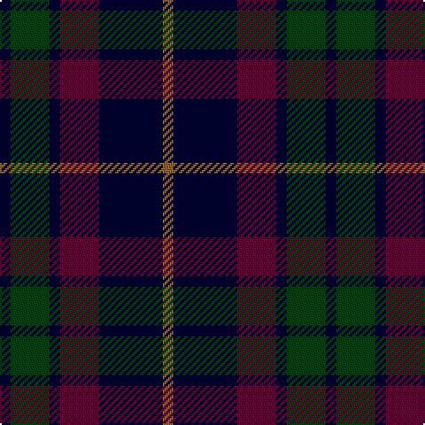

In pattern [KGKBKR](/patterns/kgkbkr/).

This was sourced from weddslist.  It is a [6 stripes tartan](/stripes/stripes6/).

Original link http://www.weddslist.com/cgi-bin/tartans/pg.pl?source=sts

## Thread count
DB/6 DG22 DB6 DR22 DB36 LT/6

## Palette
Each colour and its ΔE from the base-6 reference it is a variant of.

| Colour | Shade | Base | ΔE (OKLab) |
|---|---|---|---|
| DB | <code style="background-color:#000030;">#000030</code> `#000030` | K <code style="background-color:#000000;">#000000</code> | 0.17 |
| DG | <code style="background-color:#004010;">#004010</code> `#004010` | G <code style="background-color:#006100;">#006100</code> | 0.11 |
| DR | <code style="background-color:#600030;">#600030</code> `#600030` | B <code style="background-color:#2A418A;">#2A418A</code> | 0.20 |
| LT | <code style="background-color:#906030;">#906030</code> `#906030` | R <code style="background-color:#CC0000;">#CC0000</code> | 0.15 |

# Sample pattern

## Nearest tartans

The nearest existing variants by ΔTartan distance.

1. [Campbell, Sir Walter Scott](/setts/s6/k2g8b2k9ba7k2x2~b2c4084-ba5a008c-g005020-k101010/) — ΔT 0.87
1. [Glen Nevis #1](/setts/s8/g8r2g2r3g8b12g2y2x2~b000064-g002814-r880000-yc89600/) — ΔT 0.97
1. [Ferguson of Balquhidder #3](/setts/s6/k3b12r2k12g12k3x2~b2c4084-g005020-k101010-rdc0000/) — ΔT 1.11
1. [Wilson's No 108](/setts/s8/k7g7k1g7k7b1ba7k1x4~b3c82af-ba5a008c-g005020-k101010/) — ΔT 1.17
1. [Nairn](/setts/s5/r1k8g2b4r1x8~b2c2c80-g006818-k101010-rc80000/) — ΔT 1.23
1. [Nairn Family Tartan Tartan Number: 1331. Earliest known date: c.1930 The exact date of this design is uncertain. We know that it appeared around 1930 in the collection of Messrs. Anderson of Edinburgh. (Later Kinloch Anderson). A note on the weavers scale in the STS collection states '..worn by the Spencer-Nairn family. (done)'. The design is similar to the Hunting Brodie sett without the yellow. Nairns were first recorded in Fife and later in Moray. There is also a family called Nairne of Dunsinnan in Perthshire of MacBeth fame. See products available Copyright © Blair Urquhart, Comrie, 2015](/setts/s5/r1k8g2b4r1x4~b2c2c80-g006818-k101010-rc80000/) — ΔT 1.23
1. [Britannia](/setts/s5/k14r4k25b30w4x2~b202060-k101010-rc80000-we0e0e0/) — ΔT 1.26
1. [Glen Nevis #1 (Fashion)](/setts/s8/g8r2g2r3g8b12g2y2x2~b1c0070-g003820-r880000-ye8c000/) — ΔT 1.26
1. [Lennie](/setts/s6/g2b8k9ga2g10k2x2~b740074-g003820-ga789484-k101010/) — ΔT 1.28
1. [Gallamore](/setts/s6/k3b14r2k14g14k3x2~b2c2c80-g006818-k101010-rc80000/) — ΔT 1.31

## Neighbour map

Every grey dot is one of 15726 variants placed by the first two principal components of the ΔTartan feature space (44% of its variance). Red is this tartan; blue dots are its nearest — click one to open its page.

<svg viewBox="0 0 640 380" role="img" style="max-width:100%;height:auto;border:1px solid #e0e0e0;border-radius:4px;display:block" xmlns="http://www.w3.org/2000/svg"><image href="/nn/cloud.v1.png" width="640" height="380"/><a href="/setts/s6/k2g8b2k9ba7k2x2~b2c4084-ba5a008c-g005020-k101010/"><circle cx="221.3" cy="286.5" r="4" fill="#3465a4"><title>Campbell, Sir Walter Scott</title></circle></a><a href="/setts/s8/g8r2g2r3g8b12g2y2x2~b000064-g002814-r880000-yc89600/"><circle cx="273.3" cy="250.2" r="4" fill="#3465a4"><title>Glen Nevis #1</title></circle></a><a href="/setts/s6/k3b12r2k12g12k3x2~b2c4084-g005020-k101010-rdc0000/"><circle cx="222.3" cy="273.1" r="4" fill="#3465a4"><title>Ferguson of Balquhidder #3</title></circle></a><a href="/setts/s8/k7g7k1g7k7b1ba7k1x4~b3c82af-ba5a008c-g005020-k101010/"><circle cx="232.1" cy="258.4" r="4" fill="#3465a4"><title>Wilson's No 108</title></circle></a><a href="/setts/s5/r1k8g2b4r1x8~b2c2c80-g006818-k101010-rc80000/"><circle cx="271.9" cy="241.9" r="4" fill="#3465a4"><title>Nairn</title></circle></a><a href="/setts/s5/r1k8g2b4r1x4~b2c2c80-g006818-k101010-rc80000/"><circle cx="271.9" cy="241.9" r="4" fill="#3465a4"><title>Nairn Family Tartan Tartan Number: 1331. Earliest known date: c.1930 The exact date of this design is uncertain. We know that it appeared around 1930 in the collection of Messrs. Anderson of Edinburgh. (Later Kinloch Anderson). A note on the weavers scale in the STS collection states '..worn by the Spencer-Nairn family. (done)'. The design is similar to the Hunting Brodie sett without the yellow. Nairns were first recorded in Fife and later in Moray. There is also a family called Nairne of Dunsinnan in Perthshire of MacBeth fame. See products available Copyright © Blair Urquhart, Comrie, 2015</title></circle></a><a href="/setts/s5/k14r4k25b30w4x2~b202060-k101010-rc80000-we0e0e0/"><circle cx="283.0" cy="260.8" r="4" fill="#3465a4"><title>Britannia</title></circle></a><a href="/setts/s8/g8r2g2r3g8b12g2y2x2~b1c0070-g003820-r880000-ye8c000/"><circle cx="261.3" cy="242.6" r="4" fill="#3465a4"><title>Glen Nevis #1 (Fashion)</title></circle></a><a href="/setts/s6/g2b8k9ga2g10k2x2~b740074-g003820-ga789484-k101010/"><circle cx="198.3" cy="274.6" r="4" fill="#3465a4"><title>Lennie</title></circle></a><a href="/setts/s6/k3b14r2k14g14k3x2~b2c2c80-g006818-k101010-rc80000/"><circle cx="211.1" cy="255.8" r="4" fill="#3465a4"><title>Gallamore</title></circle></a><circle cx="265.5" cy="269.0" r="5" fill="#c00000"/></svg>

ID: /setts/s6/k3g11k3b11k18r3x2~b600030-g004010-k000030-r906030/
