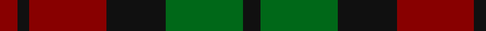
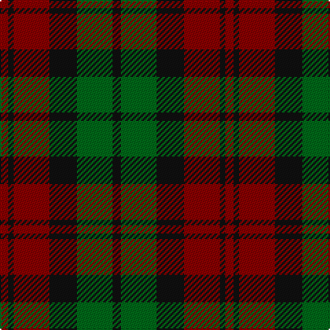

In pattern [KGKRKR](/patterns/kgkrkr/).

This was sourced from register-of-tartans.  It is a [6 stripes tartan](/stripes/stripes6/).

Original link https://www.tartanregister.gov.uk/tartanDetails.aspx?ref=2323

## Attestations

This cloth appears in 2 source records; the oldest owns this page.

- 01/01/1985 — MacCormick (Dress) (register-of-tartans, [record](https://www.tartanregister.gov.uk/tartanDetails.aspx?ref=2323))
- 1985 — MacCormick Dress (Name) (tartans-authority, [record](http://www.tartansauthority.com/tartan-ferret/display/1091/))

## Thread count
DR/6 K4 DR26 K20 G26 K/6

## Palette
Each colour and its ΔE from the base-6 reference it is a variant of.

| Colour | Shade | Base | ΔE (OKLab) |
|---|---|---|---|
| DR | <code style="background-color:#880000;">#880000</code> `#880000` | R <code style="background-color:#CC0000;">#CC0000</code> | 0.15 |
| G | <code style="background-color:#006818;">#006818</code> `#006818` | G <code style="background-color:#006100;">#006100</code> | 0.02 |
| K | <code style="background-color:#101010;">#101010</code> `#101010` | K <code style="background-color:#000000;">#000000</code> | 0.17 |

# Sample pattern

## Nearest tartans

The nearest existing variants by ΔTartan distance.

1. [Skene D](/setts/s7/b9r6g2r6g18r6g2~b000052-g11450d-raa0000~x2/) — ΔT 1.09
1. [Skene D](/setts/s7/b9r6g2r6g18r6g2~b000052-g11450d-raa0000/) — ΔT 1.09
1. [MacBean of Tomatin (Clan)](/setts/s7/b3r19b13r5g21r8b3~b1c0070-g006818-r880000~x2/) — ΔT 1.18
1. [MacCormick Dress Clan Tartan Tartan Number: 1091. Earliest known date: pre 1985 From Philip D.Smith, reported registered with STS by Pendleton Woolen Mills of Oregon, 1 July 1985. Very close to the Lindsay tartan (704). Sometimes referred to as the MacCormick Dress. The sett is the same as Campbell (12). Pendleton could have based the MacCormick tartan on an existing Scottish tartan and just changing the colours. This appears to have been the basis for many of the Irish family tartans. See products available Copyright © Blair Urquhart, Comrie, 2015](/setts/s6/k3g13k10r13k2r3~g006818-k101010-rc80000~x2/) — ΔT 1.20
1. [Strathspey (Fashion)](/setts/s6/g3r22b5g10k10g2~b48748c-g006818-k101010-r880000~x2/) — ΔT 1.42
1. [Skene D](/setts/s7/b9r6g2r6g18r6g2~b00004c-g004c00-rc80000/) — ΔT 1.44
1. [Harmony 8](/setts/s5/b2g10r15b10g2~b401000-g808080-r906030~x4/) — ΔT 1.45
1. [Unidentified Pinafore](/setts/s7/g24k4g24k24b7r24b7~b3c82af-g005020-k101010-r960028~x2/) — ΔT 1.46
1. [Canadian Autumn](/setts/s6/g4r28b6g10k10g3~b1c0070-g006818-k101010-r880000~x2/) — ΔT 1.49
1. [Eyre (Personal)](/setts/s6/r3b12r4g18r6k2~b202060-g006818-k101010-rc80000~x2/) — ΔT 1.50

## Neighbour map

Every grey dot is one of 15726 variants placed by the first two principal components of the ΔTartan feature space (44% of its variance). Red is this tartan; blue dots are its nearest — click one to open its page.

<svg viewBox="0 0 640 380" role="img" style="max-width:100%;height:auto;border:1px solid #e0e0e0;border-radius:4px;display:block" xmlns="http://www.w3.org/2000/svg"><image href="/nn/cloud.v1.png" width="640" height="380"/><a href="/setts/s7/b9r6g2r6g18r6g2~b000052-g11450d-raa0000~x2/"><circle cx="275.6" cy="244.8" r="4" fill="#3465a4"><title>Skene D</title></circle></a><a href="/setts/s7/b9r6g2r6g18r6g2~b000052-g11450d-raa0000/"><circle cx="275.6" cy="244.8" r="4" fill="#3465a4"><title>Skene D</title></circle></a><a href="/setts/s7/b3r19b13r5g21r8b3~b1c0070-g006818-r880000~x2/"><circle cx="254.8" cy="255.9" r="4" fill="#3465a4"><title>MacBean of Tomatin (Clan)</title></circle></a><a href="/setts/s6/k3g13k10r13k2r3~g006818-k101010-rc80000~x2/"><circle cx="197.3" cy="254.7" r="4" fill="#3465a4"><title>MacCormick Dress Clan Tartan Tartan Number: 1091. Earliest known date: pre 1985 From Philip D.Smith, reported registered with STS by Pendleton Woolen Mills of Oregon, 1 July 1985. Very close to the Lindsay tartan (704). Sometimes referred to as the MacCormick Dress. The sett is the same as Campbell (12). Pendleton could have based the MacCormick tartan on an existing Scottish tartan and just changing the colours. This appears to have been the basis for many of the Irish family tartans. See products available Copyright © Blair Urquhart, Comrie, 2015</title></circle></a><a href="/setts/s6/g3r22b5g10k10g2~b48748c-g006818-k101010-r880000~x2/"><circle cx="250.4" cy="222.5" r="4" fill="#3465a4"><title>Strathspey (Fashion)</title></circle></a><a href="/setts/s7/b9r6g2r6g18r6g2~b00004c-g004c00-rc80000/"><circle cx="254.3" cy="234.5" r="4" fill="#3465a4"><title>Skene D</title></circle></a><a href="/setts/s5/b2g10r15b10g2~b401000-g808080-r906030~x4/"><circle cx="256.1" cy="273.1" r="4" fill="#3465a4"><title>Harmony 8</title></circle></a><a href="/setts/s7/g24k4g24k24b7r24b7~b3c82af-g005020-k101010-r960028~x2/"><circle cx="190.1" cy="264.1" r="4" fill="#3465a4"><title>Unidentified Pinafore</title></circle></a><a href="/setts/s6/g4r28b6g10k10g3~b1c0070-g006818-k101010-r880000~x2/"><circle cx="266.4" cy="223.9" r="4" fill="#3465a4"><title>Canadian Autumn</title></circle></a><a href="/setts/s6/r3b12r4g18r6k2~b202060-g006818-k101010-rc80000~x2/"><circle cx="213.6" cy="222.4" r="4" fill="#3465a4"><title>Eyre (Personal)</title></circle></a><circle cx="226.4" cy="271.6" r="5" fill="#c00000"/></svg>

ID: /setts/s6/k3g13k10r13k2r3~g006818-k101010-r880000~x2/
