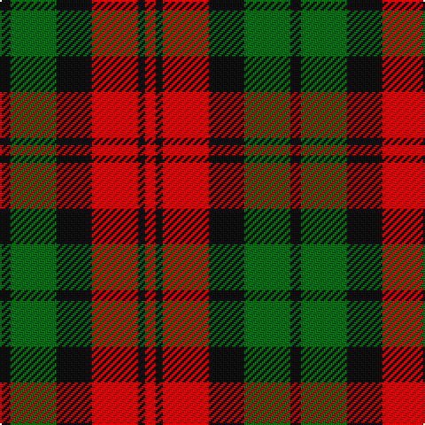

In pattern [KGKRKR](/patterns/kgkrkr/).

This was sourced from house-of-tartan.  It is a [6 stripes tartan](/stripes/stripes6/).

Original link http://www.house-of-tartan.scotland.net/house/TartanViewjs.asp?colr=Def&tnam=1091

## Thread count
K/6 G26 K20 R26 K4 R/6

## Palette
Each colour and its ΔE from the base-6 reference it is a variant of.

| Colour | Shade | Base | ΔE (OKLab) |
|---|---|---|---|
| G | <code style="background-color:#006818;">#006818</code> `#006818` | G <code style="background-color:#006100;">#006100</code> | 0.02 |
| K | <code style="background-color:#101010;">#101010</code> `#101010` | K <code style="background-color:#000000;">#000000</code> | 0.17 |
| R | <code style="background-color:#C80000;">#C80000</code> `#C80000` | R <code style="background-color:#CC0000;">#CC0000</code> | 0.01 |

# Sample pattern

## Nearest tartans

The nearest existing variants by ΔTartan distance.

1. [MacNab 1](/setts/s6/b3r19b18g19b3g3~b500060-g008000-rc00000~x2/) — ΔT 0.95
1. [Skene D](/setts/s7/b9r6g2r6g18r6g2~b00004c-g004c00-rc80000/) — ΔT 1.06
1. [MacCormick, dress](/setts/s6/k3g13k10r13k2r3~g008000-k000000-rc00000~x2/) — ΔT 1.11
1. [MacCormick (Dress)](/setts/s6/k3g13k10r13k2r3~g006818-k101010-r880000~x2/) — ΔT 1.20
1. [Londonderry, County](/setts/s7/r6k2g12y8r5k2g3~g003820-k101010-rb84c00-ybc8c00~x4/) — ΔT 1.32
1. [MacNab (Macgregor - Hastie)](/setts/s6/b3r19b18g19b3g3~b500050-g005020-rdc0000~x2/) — ΔT 1.32
1. [Portrait, The](/setts/s6/b2r11b2k11b16w2~b441800-k101010-ra07c58-we8ccb8~x4/) — ΔT 1.34
1. [Stewart, Plaid](/setts/s7/r2g4b8r9g9k2r2~b304080-g008000-k000000-rc00000~x2/) — ΔT 1.35
1. [Thompson Black (Fashion)](/setts/s6/g3k15r8g2ra8k2~g006818-k101010-rc80000-ra888888~x4/) — ΔT 1.35
1. [Wcwm 1651](/setts/s7/r10k1r3g7k7g5y3~g6c6c00-k000000-r8c0000-yc89800~x4/) — ΔT 1.37

## Neighbour map

Every grey dot is one of 15726 variants placed by the first two principal components of the ΔTartan feature space (44% of its variance). Red is this tartan; blue dots are its nearest — click one to open its page.

<svg viewBox="0 0 640 380" role="img" style="max-width:100%;height:auto;border:1px solid #e0e0e0;border-radius:4px;display:block" xmlns="http://www.w3.org/2000/svg"><image href="/nn/cloud.v1.png" width="640" height="380"/><a href="/setts/s6/b3r19b18g19b3g3~b500060-g008000-rc00000~x2/"><circle cx="208.9" cy="246.6" r="4" fill="#3465a4"><title>MacNab 1</title></circle></a><a href="/setts/s7/b9r6g2r6g18r6g2~b00004c-g004c00-rc80000/"><circle cx="254.3" cy="234.5" r="4" fill="#3465a4"><title>Skene D</title></circle></a><a href="/setts/s6/k3g13k10r13k2r3~g008000-k000000-rc00000~x2/"><circle cx="168.2" cy="246.6" r="4" fill="#3465a4"><title>MacCormick, dress</title></circle></a><a href="/setts/s6/k3g13k10r13k2r3~g006818-k101010-r880000~x2/"><circle cx="226.4" cy="271.6" r="4" fill="#3465a4"><title>MacCormick (Dress)</title></circle></a><a href="/setts/s7/r6k2g12y8r5k2g3~g003820-k101010-rb84c00-ybc8c00~x4/"><circle cx="168.6" cy="239.5" r="4" fill="#3465a4"><title>Londonderry, County</title></circle></a><a href="/setts/s6/b3r19b18g19b3g3~b500050-g005020-rdc0000~x2/"><circle cx="225.0" cy="251.1" r="4" fill="#3465a4"><title>MacNab (Macgregor - Hastie)</title></circle></a><a href="/setts/s6/b2r11b2k11b16w2~b441800-k101010-ra07c58-we8ccb8~x4/"><circle cx="231.1" cy="226.0" r="4" fill="#3465a4"><title>Portrait, The</title></circle></a><a href="/setts/s7/r2g4b8r9g9k2r2~b304080-g008000-k000000-rc00000~x2/"><circle cx="144.0" cy="246.6" r="4" fill="#3465a4"><title>Stewart, Plaid</title></circle></a><a href="/setts/s6/g3k15r8g2ra8k2~g006818-k101010-rc80000-ra888888~x4/"><circle cx="199.1" cy="224.1" r="4" fill="#3465a4"><title>Thompson Black (Fashion)</title></circle></a><a href="/setts/s7/r10k1r3g7k7g5y3~g6c6c00-k000000-r8c0000-yc89800~x4/"><circle cx="155.6" cy="220.7" r="4" fill="#3465a4"><title>Wcwm 1651</title></circle></a><circle cx="197.3" cy="254.7" r="5" fill="#c00000"/></svg>

ID: /setts/s6/k3g13k10r13k2r3~g006818-k101010-rc80000~x2/
