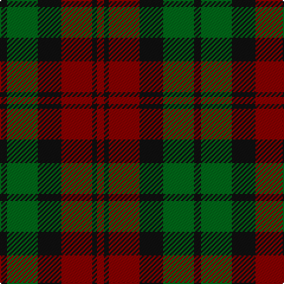

In pattern [KGKRKR](/stripes/kgkrkr/).

This was sourced from register-of-tartans.  It is a [6 stripe tartan](/stripes/stripes6/).

Original link https://www.tartanregister.gov.uk/tartanDetails.aspx?ref=2323

## Also known as

This cloth is also recorded under:

- MacCormick Dress
- MacCormick, dress

## Attestations

This cloth appears in 4 source records; the oldest owns this page.

- 01/01/1985 — MacCormick (Dress) (register-of-tartans, [record](https://www.tartanregister.gov.uk/tartanDetails.aspx?ref=2323))
- 1985 — MacCormick Dress (Name) (tartans-authority, [record](http://www.tartansauthority.com/tartan-ferret/display/1091/))
- undated — MacCormick, dress (weddslist, [record](http://www.weddslist.com/cgi-bin/tartans/pg.pl?source=sts))
- undated — MacCormick Dress Clan Tartan Tartan Number: 1091. Earliest known date: pre 1985 From Philip D.Smith, reported registered with STS by Pendleton Woolen Mills of Oregon, 1 July 1985. Very close to the Lindsay tartan (704). Sometimes referred to as the MacCormick Dress. The sett is the same as Campbell (12). Pendleton could have based the MacCormick tartan on an existing Scottish tartan and just changing the colours. This appears to have been the basis for many of the Irish family tartans. See products available Copyright © Blair Urquhart, Comrie, 2015 (house-of-tartan, [record](http://www.house-of-tartan.scotland.net/house/TartanViewjs.asp?colr=Def&tnam=1091))

## Register references

External register numbers recorded for this tartan.

- Scottish Register of Tartans: [2323](https://www.tartanregister.gov.uk/tartanDetails.aspx?ref=2323)
- Scottish Tartans Authority (ITI): 1091
- Scottish Tartans World Register: 1091

## Thread count
K/6 G26 K20 DR26 K4 DR/6

## Palette
Each colour and the base-6 reference it is a variant of.

| Colour | Shade | Base |
|---|---|---|
| DR | <code style="background-color:#880000;">#880000</code> `oklch(39.4% 0.162 29.2)` <small>#880000</small> | R <code style="background-color:#CC0000;">#CC0000</code> |
| G | <code style="background-color:#006818;">#006818</code> `oklch(45.0% 0.142 145.0)` <small>#006818</small> | G <code style="background-color:#006100;">#006100</code> |
| K | <code style="background-color:#101010;">#101010</code> `oklch(17.3% 0.000 89.9)` <small>#101010</small> | K <code style="background-color:#000000;">#000000</code> |

# Sample pattern

## Nearest tartans

The nearest existing variants by ΔTartan distance, with this tartan at the top so the swatches line up against it.

ΔTartan

Tartan

Sett

—

<a href="/ttd/edit/#slug=k3g13k10r13k2r3~x2">MacCormick (Dress)</a> <a class="nn-out" href="/setts/s6/k3g13k10r13k2r3~x2/" title="open its dictionary page">↗</a>

1.08

<a href="/ttd/edit/#slug=db9r6dg2r6dg18r6dg2~x2">Skene D</a> <a class="nn-out" href="/setts/s7/db9r6dg2r6dg18r6dg2~x2/" title="open its dictionary page">↗</a>

1.18

<a href="/ttd/edit/#slug=db3r19db13r5g21r8db3~x2">MacBean of Tomatin (Clan)</a> <a class="nn-out" href="/setts/s7/db3r19db13r5g21r8db3~x2/" title="open its dictionary page">↗</a>

1.43

<a href="/ttd/edit/#slug=g3r22t5g10k10g2~x2">Strathspey (Fashion)</a> <a class="nn-out" href="/setts/s6/g3r22t5g10k10g2~x2/" title="open its dictionary page">↗</a>

1.43

<a href="/ttd/edit/#slug=db9r6dg2r6dg18r6dg2">Skene D</a> <a class="nn-out" href="/setts/s7/db9r6dg2r6dg18r6dg2/" title="open its dictionary page">↗</a>

1.46

<a href="/ttd/edit/#slug=dr2y10o15dr10y2~x4">Harmony 8</a> <a class="nn-out" href="/setts/s5/dr2y10o15dr10y2~x4/" title="open its dictionary page">↗</a>

1.47

<a href="/ttd/edit/#slug=dg24k4dg24k24t7r24t7~x2">Unidentified Pinafore</a> <a class="nn-out" href="/setts/s7/dg24k4dg24k24t7r24t7~x2/" title="open its dictionary page">↗</a>

1.50

<a href="/ttd/edit/#slug=g4r28db6g10k10g3~x2">Canadian Autumn</a> <a class="nn-out" href="/setts/s6/g4r28db6g10k10g3~x2/" title="open its dictionary page">↗</a>

1.50

<a href="/ttd/edit/#slug=r3db12r4g18r6k2~x2">Eyre (Personal)</a> <a class="nn-out" href="/setts/s6/r3db12r4g18r6k2~x2/" title="open its dictionary page">↗</a>

1.52

<a href="/ttd/edit/#slug=dp3r19dp18g19dp3g3~x2">MacNab 1</a> <a class="nn-out" href="/setts/s6/dp3r19dp18g19dp3g3~x2/" title="open its dictionary page">↗</a>

1.52

<a href="/ttd/edit/#slug=dg25r4db24r21dg25r3db4~x2">Glasgow #2</a> <a class="nn-out" href="/setts/s7/dg25r4db24r21dg25r3db4~x2/" title="open its dictionary page">↗</a>

## Neighbour map

Every grey dot is one of 14299 variants placed by the first two principal components of the ΔTartan feature space (44% of its variance). Red is this tartan; blue dots are its nearest — click one to open its page.

<svg viewBox="0 0 640 380" role="img" style="max-width:100%;height:auto;border:1px solid #e0e0e0;border-radius:4px;display:block" xmlns="http://www.w3.org/2000/svg"><image href="/nn/cloud.v1.png" width="640" height="380"/><a href="/setts/s7/db9r6dg2r6dg18r6dg2~x2/"><circle cx="277.2" cy="246.1" r="4" fill="#3465a4"><title>Skene D</title></circle></a><a href="/setts/s7/db3r19db13r5g21r8db3~x2/"><circle cx="256.4" cy="257.4" r="4" fill="#3465a4"><title>MacBean of Tomatin (Clan)</title></circle></a><a href="/setts/s6/g3r22t5g10k10g2~x2/"><circle cx="251.9" cy="225.9" r="4" fill="#3465a4"><title>Strathspey (Fashion)</title></circle></a><a href="/setts/s7/db9r6dg2r6dg18r6dg2/"><circle cx="256.1" cy="233.3" r="4" fill="#3465a4"><title>Skene D</title></circle></a><a href="/setts/s5/dr2y10o15dr10y2~x4/"><circle cx="257.0" cy="276.7" r="4" fill="#3465a4"><title>Harmony 8</title></circle></a><a href="/setts/s7/dg24k4dg24k24t7r24t7~x2/"><circle cx="192.5" cy="268.7" r="4" fill="#3465a4"><title>Unidentified Pinafore</title></circle></a><a href="/setts/s6/g4r28db6g10k10g3~x2/"><circle cx="267.8" cy="226.5" r="4" fill="#3465a4"><title>Canadian Autumn</title></circle></a><a href="/setts/s6/r3db12r4g18r6k2~x2/"><circle cx="215.7" cy="223.8" r="4" fill="#3465a4"><title>Eyre (Personal)</title></circle></a><a href="/setts/s6/dp3r19dp18g19dp3g3~x2/"><circle cx="210.6" cy="245.5" r="4" fill="#3465a4"><title>MacNab 1</title></circle></a><a href="/setts/s7/dg25r4db24r21dg25r3db4~x2/"><circle cx="281.8" cy="261.5" r="4" fill="#3465a4"><title>Glasgow #2</title></circle></a><circle cx="228.2" cy="274.4" r="5" fill="#c00000"/></svg>

ID: /setts/s6/k3g13k10r13k2r3~x2/
