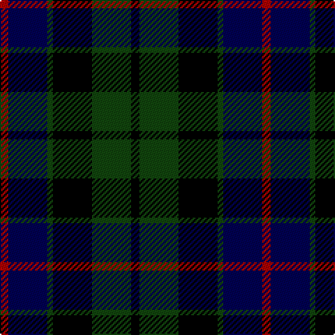

In pattern [KGKGBR](/patterns/kgkgbr/).

This was sourced from weddslist.  It is a [6 stripes tartan](/stripes/stripes6/).

Original link http://www.weddslist.com/cgi-bin/tartans/pg.pl?source=tinsel

## Thread count
DR/6 DB28 DG4 K28 DG28 K/6

## Palette
Each colour and its ΔE from the base-6 reference it is a variant of.

| Colour | Shade | Base | ΔE (OKLab) |
|---|---|---|---|
| DB | <code style="background-color:#000052;">#000052</code> `#000052` | B <code style="background-color:#2A418A;">#2A418A</code> | 0.20 |
| DG | <code style="background-color:#11450D;">#11450D</code> `#11450D` | G <code style="background-color:#006100;">#006100</code> | 0.09 |
| DR | <code style="background-color:#AA0000;">#AA0000</code> `#AA0000` | R <code style="background-color:#CC0000;">#CC0000</code> | 0.07 |
| K | <code style="background-color:#000000;">#000000</code> `#000000` | K <code style="background-color:#000000;">#000000</code> | 0.00 |

# Sample pattern

## Nearest tartans

The nearest existing variants by ΔTartan distance.

1. [Morrison](/setts/s6/k3g14k14g2b14r3~b000052-g11450d-k000000-raa0000/) — ΔT 0.00
1. [Morrison](/setts/s6/k3g14k14g2b14r3~b000064-g004c00-k000000-rc80000/) — ΔT 0.49
1. [Fletcher C](/setts/s7/b6k1b6k8r1g8r2x2~b000052-g11450d-k000000-raa0000/) — ΔT 0.62
1. [Fletcher C](/setts/s7/b6k1b6k8r1g8r2~b000052-g11450d-k000000-raa0000/) — ΔT 0.62
1. [Fletcher](/setts/s7/b6k1b6k8r1g8k2~b00004c-g004c00-k000000-rc80000/) — ΔT 0.63
1. [Fletcher](/setts/s7/b6k1b6k8r1g8k2x2~b000052-g11450d-k000000-raa0000/) — ΔT 0.77
1. [Fletcher](/setts/s7/b6k1b6k8r1g8k2~b000052-g11450d-k000000-raa0000/) — ΔT 0.77
1. [Baird](/setts/s8/b3k2b8k8g8ba1g1ba3x2~b000052-ba6e5058-g11450d-k000000/) — ΔT 0.77
1. [Fletcher C](/setts/s7/b6k1b6k8r1g8r2~b000064-g004c00-k000000-rc80000/) — ΔT 0.85
1. [Gunn](/setts/s6/g2b12g1k12g12r2x2~b000052-g11450d-k000000-raa0000/) — ΔT 0.91

## Neighbour map

Every grey dot is one of 15726 variants placed by the first two principal components of the ΔTartan feature space (44% of its variance). Red is this tartan; blue dots are its nearest — click one to open its page.

<svg viewBox="0 0 640 380" role="img" style="max-width:100%;height:auto;border:1px solid #e0e0e0;border-radius:4px;display:block" xmlns="http://www.w3.org/2000/svg"><image href="/nn/cloud.v1.png" width="640" height="380"/><a href="/setts/s6/k3g14k14g2b14r3~b000052-g11450d-k000000-raa0000/"><circle cx="174.5" cy="255.6" r="4" fill="#3465a4"><title>Morrison</title></circle></a><a href="/setts/s6/k3g14k14g2b14r3~b000064-g004c00-k000000-rc80000/"><circle cx="160.2" cy="249.9" r="4" fill="#3465a4"><title>Morrison</title></circle></a><a href="/setts/s7/b6k1b6k8r1g8r2x2~b000052-g11450d-k000000-raa0000/"><circle cx="179.6" cy="246.9" r="4" fill="#3465a4"><title>Fletcher C</title></circle></a><a href="/setts/s7/b6k1b6k8r1g8r2~b000052-g11450d-k000000-raa0000/"><circle cx="179.6" cy="246.9" r="4" fill="#3465a4"><title>Fletcher C</title></circle></a><a href="/setts/s7/b6k1b6k8r1g8k2~b00004c-g004c00-k000000-rc80000/"><circle cx="193.4" cy="252.4" r="4" fill="#3465a4"><title>Fletcher</title></circle></a><a href="/setts/s7/b6k1b6k8r1g8k2x2~b000052-g11450d-k000000-raa0000/"><circle cx="201.6" cy="255.5" r="4" fill="#3465a4"><title>Fletcher</title></circle></a><a href="/setts/s7/b6k1b6k8r1g8k2~b000052-g11450d-k000000-raa0000/"><circle cx="201.6" cy="255.5" r="4" fill="#3465a4"><title>Fletcher</title></circle></a><a href="/setts/s8/b3k2b8k8g8ba1g1ba3x2~b000052-ba6e5058-g11450d-k000000/"><circle cx="163.1" cy="236.2" r="4" fill="#3465a4"><title>Baird</title></circle></a><a href="/setts/s7/b6k1b6k8r1g8r2~b000064-g004c00-k000000-rc80000/"><circle cx="164.4" cy="240.4" r="4" fill="#3465a4"><title>Fletcher C</title></circle></a><a href="/setts/s6/g2b12g1k12g12r2x2~b000052-g11450d-k000000-raa0000/"><circle cx="214.4" cy="231.0" r="4" fill="#3465a4"><title>Gunn</title></circle></a><circle cx="174.5" cy="255.6" r="5" fill="#c00000"/></svg>

ID: /setts/s6/k3g14k14g2b14r3x2~b000052-g11450d-k000000-raa0000/
