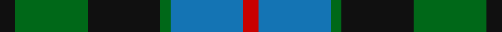

In pattern [KGKGBR](/stripes/kgkgbr/).

This was sourced from register-of-tartans.  It is a [6 stripe tartan](/stripes/stripes6/).

Original link https://www.tartanregister.gov.uk/tartanDetails.aspx?ref=3021

## Also known as

This cloth is also recorded under:

- Morrison

## Attestations

This cloth appears in 2 source records; the oldest owns this page.

- 01/01/1880 — Morrison Society (register-of-tartans, [record](https://www.tartanregister.gov.uk/tartanDetails.aspx?ref=3021))
- 1880 — Morrison Society (Clan) (tartans-authority, [record](http://www.tartansauthority.com/tartan-ferret/display/1083/))

## Register references

External register numbers recorded for this tartan.

- Scottish Register of Tartans: [3021](https://www.tartanregister.gov.uk/tartanDetails.aspx?ref=3021)
- Scottish Tartans Authority (ITI): 1083
- Scottish Tartans World Register: 1083

## Thread count
K/6 G28 K28 G4 B28 R/6

## Palette
Each colour and the base-6 reference it is a variant of.

| Colour | Shade | Base |
|---|---|---|
| B | <code style="background-color:#1474B4;">#1474B4</code> `oklch(54.0% 0.129 245.1)` <small>#1474B4</small> | B <code style="background-color:#2A418A;">#2A418A</code> |
| G | <code style="background-color:#006818;">#006818</code> `oklch(45.0% 0.142 145.0)` <small>#006818</small> | G <code style="background-color:#006100;">#006100</code> |
| K | <code style="background-color:#101010;">#101010</code> `oklch(17.3% 0.000 89.9)` <small>#101010</small> | K <code style="background-color:#000000;">#000000</code> |
| R | <code style="background-color:#C80000;">#C80000</code> `oklch(52.3% 0.215 29.2)` <small>#C80000</small> | R <code style="background-color:#CC0000;">#CC0000</code> |

# Sample pattern

## Nearest tartans

The nearest existing variants by ΔTartan distance.

1. [Campbell of Argyll (Smiths)](/setts/s6/db2k2db12k11g16w2~x2/) — ΔT 0.55
1. [Hudson Valley Reg. Police P & D (Cor](/setts/s6/ly5g16k16db16k2db2~x2/) — ΔT 0.62
1. [Unidentified No 26](/setts/s6/w4db4dg22k20db20w3/) — ΔT 0.66
1. [Redland](/setts/s6/g52lb7g9k35db35k7/) — ΔT 0.74
1. [Blaylock Annandale](/setts/s7/g24b6lb3k6b12k15g4~x2/) — ΔT 0.76
1. [Fletcher of Dunans](/setts/s7/b10k3b10k14r2g14r5~x2/) — ΔT 0.77
1. [Wellington or Waterloo](/setts/s6/t3dg12k14t11r3t3~x2/) — ΔT 0.80
1. [Gunn - 1810 (Clan)](/setts/s6/r4g12k12g2db12g3~x2/) — ΔT 0.81
1. [Callum Beg (Fashion)](/setts/s6/g1db6k6g6r1g1~x6/) — ΔT 0.84
1. [Waterloo](/setts/s6/y3dg6k6y4r1y1~x2/) — ΔT 0.85

## Neighbour map

Every grey dot is one of 14299 variants placed by the first two principal components of the ΔTartan feature space (44% of its variance). Red is this tartan; blue dots are its nearest — click one to open its page.

<svg viewBox="0 0 640 380" role="img" style="max-width:100%;height:auto;border:1px solid #e0e0e0;border-radius:4px;display:block" xmlns="http://www.w3.org/2000/svg"><image href="/nn/cloud.v1.png" width="640" height="380"/><a href="/setts/s6/db2k2db12k11g16w2~x2/"><circle cx="184.6" cy="237.1" r="4" fill="#3465a4"><title>Campbell of Argyll (Smiths)</title></circle></a><a href="/setts/s6/ly5g16k16db16k2db2~x2/"><circle cx="151.5" cy="238.7" r="4" fill="#3465a4"><title>Hudson Valley Reg. Police P &amp; D (Cor</title></circle></a><a href="/setts/s6/w4db4dg22k20db20w3/"><circle cx="150.1" cy="239.6" r="4" fill="#3465a4"><title>Unidentified No 26</title></circle></a><a href="/setts/s6/g52lb7g9k35db35k7/"><circle cx="207.6" cy="246.5" r="4" fill="#3465a4"><title>Redland</title></circle></a><a href="/setts/s7/g24b6lb3k6b12k15g4~x2/"><circle cx="189.5" cy="235.8" r="4" fill="#3465a4"><title>Blaylock Annandale</title></circle></a><a href="/setts/s7/b10k3b10k14r2g14r5~x2/"><circle cx="141.8" cy="250.5" r="4" fill="#3465a4"><title>Fletcher of Dunans</title></circle></a><a href="/setts/s6/t3dg12k14t11r3t3~x2/"><circle cx="149.6" cy="264.1" r="4" fill="#3465a4"><title>Wellington or Waterloo</title></circle></a><a href="/setts/s6/r4g12k12g2db12g3~x2/"><circle cx="167.6" cy="263.6" r="4" fill="#3465a4"><title>Gunn - 1810 (Clan)</title></circle></a><a href="/setts/s6/g1db6k6g6r1g1~x6/"><circle cx="197.7" cy="260.1" r="4" fill="#3465a4"><title>Callum Beg (Fashion)</title></circle></a><a href="/setts/s6/y3dg6k6y4r1y1~x2/"><circle cx="157.5" cy="254.1" r="4" fill="#3465a4"><title>Waterloo</title></circle></a><circle cx="163.1" cy="247.3" r="5" fill="#c00000"/></svg>

ID: /setts/s6/k3g14k14g2b14r3~x2/
