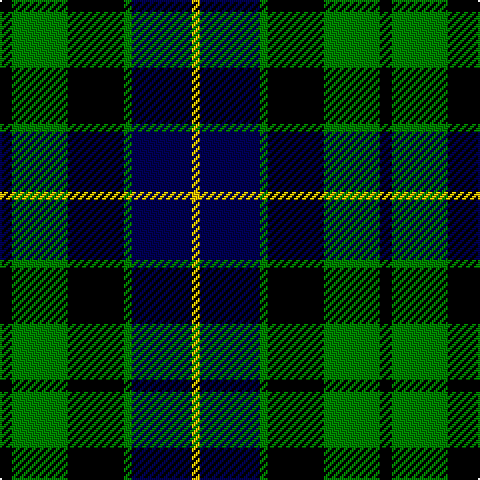

This page is one **sett** — a single exact thread-count. It belongs to the [tartan](/tartans/k3g14k14g2db15ly2/)
(the same proportion at any scale), whose colour order is pattern [KGKGBY](/stripes/kgkgby/).

Sourced from weddslist.  It is a [6 stripe tartan](/stripes/stripes6/).

Original link http://www.weddslist.com/cgi-bin/tartans/pg.pl?source=sts

2 attestations — the source records this cloth was collapsed from (oldest owns this page)

<ul>
<li>undated — Glenturret (weddslist, <a href="http://www.weddslist.com/cgi-bin/tartans/pg.pl?source=sts">record</a>)</li>
<li>undated — Glenturret Corporate Tartan Tartan Number: 1097. Earliest known date: 1988 Glenturret Distillery is open to the public. Visitors can view the whisky making process and taste the final product. Glenturret tartan goods are for sale in the distillery shop. See products available Copyright © Blair Urquhart, Comrie, 2015 (house-of-tartan, <a href="http://www.house-of-tartan.scotland.net/house/TartanViewjs.asp?colr=Def&tnam=1097">record</a>)</li>
</ul>

## Thread count
K/6 G28 K28 G4 DB30 Y/4

## Palette

Palette: <strong>Ingles Buchan</strong> <small style="color:#888">(1 of 4 colours)</small>
<table><thead><tr><th>Colour</th><th>Threads</th><th>Shade</th><th>Base</th><th>OKLCh</th></tr></thead><tbody><tr><td>K/</td><td style="text-align:right;font-variant-numeric:tabular-nums">6</td><td><code style="background-color:#000000;">#000000</code> <small style="color:#888">#000000</small></td><td>K <code style="background-color:#000000;">#000000</code></td><td><small style="color:#888">oklch(0.0% 0.000 0.0)</small></td></tr><tr><td>G</td><td style="text-align:right;font-variant-numeric:tabular-nums">28</td><td><code style="background-color:#008000;">#008000</code> <small style="color:#888">#008000</small></td><td>G <code style="background-color:#006100;">#006100</code></td><td><small style="color:#888">oklch(52.0% 0.177 142.5)</small></td></tr><tr><td>K</td><td style="text-align:right;font-variant-numeric:tabular-nums">28</td><td><code style="background-color:#000000;">#000000</code> <small style="color:#888">#000000</small></td><td>K <code style="background-color:#000000;">#000000</code></td><td><small style="color:#888">oklch(0.0% 0.000 0.0)</small></td></tr><tr><td>G</td><td style="text-align:right;font-variant-numeric:tabular-nums">4</td><td><code style="background-color:#008000;">#008000</code> <small style="color:#888">#008000</small></td><td>G <code style="background-color:#006100;">#006100</code></td><td><small style="color:#888">oklch(52.0% 0.177 142.5)</small></td></tr><tr><td>DB</td><td style="text-align:right;font-variant-numeric:tabular-nums">30</td><td><code style="background-color:#000050;">#000050</code> <small style="color:#888">#000050</small></td><td>B <code style="background-color:#2A418A;">#2A418A</code></td><td><small style="color:#888">oklch(19.5% 0.135 264.1)</small></td></tr><tr><td>Y/</td><td style="text-align:right;font-variant-numeric:tabular-nums">4</td><td><code style="background-color:#F0C000;">#F0C000</code> <small style="color:#888">#F0C000</small></td><td>Y <code style="background-color:#F2BF00;">#F2BF00</code></td><td><small style="color:#888">oklch(82.7% 0.169 90.5)</small></td></tr></tbody></table>

# Sample pattern

## Nearest tartans

The nearest existing variants by ΔTartan distance, with this tartan at the top so the swatches line up against it.

ΔTartan

Tartan

Sett

—

<a href="/ttd/edit/#slug=k3g14k14g2db15ly2~x2">Glenturret</a> <a class="nn-out" href="/setts/s6/k3g14k14g2db15ly2~x2/" title="open its dictionary page">↗</a>

0.61

<a href="/ttd/edit/#slug=k3g14k14g2db14r3~x2">Morrison</a> <a class="nn-out" href="/setts/s6/k3g14k14g2db14r3~x2/" title="open its dictionary page">↗</a>

0.65

<a href="/ttd/edit/#slug=k4w2g18k13db12k2~x2">Melville</a> <a class="nn-out" href="/setts/s6/k4w2g18k13db12k2~x2/" title="open its dictionary page">↗</a>

0.69

<a href="/ttd/edit/#slug=w1db9k9g9k2w1~x4">MacNeil 1</a> <a class="nn-out" href="/setts/s6/w1db9k9g9k2w1~x4/" title="open its dictionary page">↗</a>

0.74

<a href="/ttd/edit/#slug=db2k2db12k11g12w2~x2">Campbell, The White Stripe</a> <a class="nn-out" href="/setts/s6/db2k2db12k11g12w2~x2/" title="open its dictionary page">↗</a>

0.75

<a href="/ttd/edit/#slug=db1k1db6k6g6k1w1~x2">Forbes</a> <a class="nn-out" href="/setts/s7/db1k1db6k6g6k1w1~x2/" title="open its dictionary page">↗</a>

0.78

<a href="/ttd/edit/#slug=t1db11k11g11k2t1~x2">Unnamed, No 59</a> <a class="nn-out" href="/setts/s6/t1db11k11g11k2t1~x2/" title="open its dictionary page">↗</a>

0.84

<a href="/ttd/edit/#slug=db6k1db6k8r1g8k2~x2">Fletcher</a> <a class="nn-out" href="/setts/s7/db6k1db6k8r1g8k2~x2/" title="open its dictionary page">↗</a>

0.84

<a href="/ttd/edit/#slug=k4g19k16w2db15g4~x2">Graham of Montrose</a> <a class="nn-out" href="/setts/s6/k4g19k16w2db15g4~x2/" title="open its dictionary page">↗</a>

0.86

<a href="/ttd/edit/#slug=k2g12k12r1db12g2~x2">Ferguson of Balquhidder</a> <a class="nn-out" href="/setts/s6/k2g12k12r1db12g2~x2/" title="open its dictionary page">↗</a>

0.88

<a href="/setts/s8/db10k6t1g6k1~x2/">Unnamed, No 115</a>

## Neighbour map

Every grey dot is one of 14299 variants placed by the first two principal components of the ΔTartan feature space (44% of its variance). Red is this tartan; blue dots are its nearest — click one to open its page.

<svg viewBox="0 0 640 380" role="img" style="max-width:100%;height:auto;border:1px solid #e0e0e0;border-radius:4px;display:block" xmlns="http://www.w3.org/2000/svg"><image href="/nn/cloud.v1.png" width="640" height="380"/><a href="/setts/s6/k3g14k14g2db14r3~x2/"><circle cx="137.1" cy="235.4" r="4" fill="#3465a4"><title>Morrison</title></circle></a><a href="/setts/s6/k4w2g18k13db12k2~x2/"><circle cx="159.8" cy="221.5" r="4" fill="#3465a4"><title>Melville</title></circle></a><a href="/setts/s6/w1db9k9g9k2w1~x4/"><circle cx="146.6" cy="216.6" r="4" fill="#3465a4"><title>MacNeil 1</title></circle></a><a href="/setts/s6/db2k2db12k11g12w2~x2/"><circle cx="129.7" cy="236.0" r="4" fill="#3465a4"><title>Campbell, The White Stripe</title></circle></a><a href="/setts/s7/db1k1db6k6g6k1w1~x2/"><circle cx="142.8" cy="223.0" r="4" fill="#3465a4"><title>Forbes</title></circle></a><a href="/setts/s6/t1db11k11g11k2t1~x2/"><circle cx="167.6" cy="212.4" r="4" fill="#3465a4"><title>Unnamed, No 59</title></circle></a><a href="/setts/s7/db6k1db6k8r1g8k2~x2/"><circle cx="158.3" cy="232.2" r="4" fill="#3465a4"><title>Fletcher</title></circle></a><a href="/setts/s6/k4g19k16w2db15g4~x2/"><circle cx="162.2" cy="224.2" r="4" fill="#3465a4"><title>Graham of Montrose</title></circle></a><a href="/setts/s6/k2g12k12r1db12g2~x2/"><circle cx="171.6" cy="211.8" r="4" fill="#3465a4"><title>Ferguson of Balquhidder</title></circle></a><a href="/setts/s8/db10k6t1g6k1~x2/"><circle cx="146.4" cy="214.8" r="4" fill="#3465a4"><title>Unnamed, No 115</title></circle></a><circle cx="143.5" cy="233.1" r="5" fill="#c00000"/></svg>

ID: /setts/s6/k3g14k14g2db15ly2~x2/
