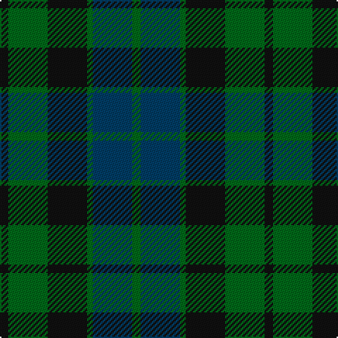

This page is one **sett** — a single exact thread-count. It belongs to the [tartan](/tartans/k3g14k14g2dt14g3/)
(the same proportion at any scale), whose colour order is pattern [GBGKGK](/stripes/gbgkgk/).

Sourced from house-of-tartan.  It is a [6 stripe tartan](/stripes/stripes6/).

Original link http://www.house-of-tartan.scotland.net/house/TartanViewjs.asp?colr=Def&tnam=703

## Thread count
K/6 G28 K28 G4 DB28 G/6

## Palette

Palette: <strong>Tartan Register</strong>
<table><thead><tr><th>Colour</th><th>Threads</th><th>Shade</th><th>Base</th><th>OKLCh</th></tr></thead><tbody><tr><td>K/</td><td style="text-align:right;font-variant-numeric:tabular-nums">6</td><td><code style="background-color:#101010;">#101010</code> <small style="color:#888">#101010</small></td><td>K <code style="background-color:#000000;">#000000</code></td><td><small style="color:#888">oklch(17.3% 0.000 89.9)</small></td></tr><tr><td>G</td><td style="text-align:right;font-variant-numeric:tabular-nums">28</td><td><code style="background-color:#006818;">#006818</code> <small style="color:#888">#006818</small></td><td>G <code style="background-color:#006100;">#006100</code></td><td><small style="color:#888">oklch(45.0% 0.142 145.0)</small></td></tr><tr><td>K</td><td style="text-align:right;font-variant-numeric:tabular-nums">28</td><td><code style="background-color:#101010;">#101010</code> <small style="color:#888">#101010</small></td><td>K <code style="background-color:#000000;">#000000</code></td><td><small style="color:#888">oklch(17.3% 0.000 89.9)</small></td></tr><tr><td>G</td><td style="text-align:right;font-variant-numeric:tabular-nums">4</td><td><code style="background-color:#006818;">#006818</code> <small style="color:#888">#006818</small></td><td>G <code style="background-color:#006100;">#006100</code></td><td><small style="color:#888">oklch(45.0% 0.142 145.0)</small></td></tr><tr><td>DB</td><td style="text-align:right;font-variant-numeric:tabular-nums">28</td><td><code style="background-color:#003C64;">#003C64</code> <small style="color:#888">#003C64</small></td><td>B <code style="background-color:#2A418A;">#2A418A</code></td><td><small style="color:#888">oklch(34.5% 0.089 246.0)</small></td></tr><tr><td>G/</td><td style="text-align:right;font-variant-numeric:tabular-nums">6</td><td><code style="background-color:#006818;">#006818</code> <small style="color:#888">#006818</small></td><td>G <code style="background-color:#006100;">#006100</code></td><td><small style="color:#888">oklch(45.0% 0.142 145.0)</small></td></tr></tbody></table>

# Sample pattern

## Nearest tartans

The nearest existing variants by ΔTartan distance, with this tartan at the top so the swatches line up against it.

ΔTartan

Tartan

Sett

—

<a href="/ttd/edit/#slug=k3g14k14g2dt14g3~x2">MacKay Clan Tartan Tartan Number: 703. Earliest known date: 1816 Wilson's of Bannockburn (1819) record the same sett with blue changed to purple. Logan calls the colour 'corbeau' which is in fact a dark shade of green. The pattern shows a marked similarity to the Gunn tartan in all but colour, suggesting a territorial origin for both. Recently historians of Scottish dress have tended to stress the geographical sources, rather than the clan associations of the earliest Highland tartans. A sample was signed and sealed by the Chief for Highland Society of London in 1816. See products available Copyright © Blair Urquhart, Comrie, 2015</a> <a class="nn-out" href="/setts/s6/k3g14k14g2dt14g3~x2/" title="open its dictionary page">↗</a>

1.11

<a href="/ttd/edit/#slug=k4g23k23g2n23g4~x2">MacKay - 1800 (Clan)</a> <a class="nn-out" href="/setts/s6/k4g23k23g2n23g4~x2/" title="open its dictionary page">↗</a>

1.13

<a href="/ttd/edit/#slug=n4g18n3k17n18p4~x2">Scottish Airports</a> <a class="nn-out" href="/setts/s6/n4g18n3k17n18p4~x2/" title="open its dictionary page">↗</a>

1.14

<a href="/ttd/edit/#slug=dp4n18k17n3g18n4~x2">Scottish Airports (Corporate)</a> <a class="nn-out" href="/setts/s6/dp4n18k17n3g18n4~x2/" title="open its dictionary page">↗</a>

1.15

<a href="/ttd/edit/#slug=k3dg20k20g20k3~x2">MacCormick Hunting (Name)</a> <a class="nn-out" href="/setts/s5/k3dg20k20g20k3~x2/" title="open its dictionary page">↗</a>

1.28

<a href="/ttd/edit/#slug=k4dg19k16w2db15dg4~x2">Graham of Montrose</a> <a class="nn-out" href="/setts/s6/k4dg19k16w2db15dg4~x2/" title="open its dictionary page">↗</a>

1.28

<a href="/ttd/edit/#slug=dg1db5dg1k5dg6ly1~x2">MacKay (Bonner)</a> <a class="nn-out" href="/setts/s6/dg1db5dg1k5dg6ly1~x2/" title="open its dictionary page">↗</a>

1.33

<a href="/ttd/edit/#slug=g24db6t3k6db12k15g4~x2">Blaylock Annandale (Name)</a> <a class="nn-out" href="/setts/s7/g24db6t3k6db12k15g4~x2/" title="open its dictionary page">↗</a>

1.33

<a href="/ttd/edit/#slug=g8t1g1k6db6k1~x4">Graham of Menteith (Clan)</a> <a class="nn-out" href="/setts/s6/g8t1g1k6db6k1~x4/" title="open its dictionary page">↗</a>

1.33

<a href="/ttd/edit/#slug=g21k6t3g11k17db17k3~x2">MacCallum</a> <a class="nn-out" href="/setts/s7/g21k6t3g11k17db17k3~x2/" title="open its dictionary page">↗</a>

1.34

<a href="/ttd/edit/#slug=k3dg12k12r2db12k3~x2">Ferguson of Balquhidder #3</a> <a class="nn-out" href="/setts/s6/k3dg12k12r2db12k3~x2/" title="open its dictionary page">↗</a>

## Neighbour map

Every grey dot is one of 14359 variants placed by the first two principal components of the ΔTartan feature space (44% of its variance). Red is this tartan; blue dots are its nearest — click one to open its page.

<svg viewBox="0 0 640 380" role="img" style="max-width:100%;height:auto;border:1px solid #e0e0e0;border-radius:4px;display:block" xmlns="http://www.w3.org/2000/svg"><image href="/nn/cloud.v1.png" width="640" height="380"/><a href="/setts/s6/k4g23k23g2n23g4~x2/"><circle cx="252.1" cy="255.5" r="4" fill="#3465a4"><title>MacKay - 1800 (Clan)</title></circle></a><a href="/setts/s6/n4g18n3k17n18p4~x2/"><circle cx="211.5" cy="276.2" r="4" fill="#3465a4"><title>Scottish Airports</title></circle></a><a href="/setts/s6/dp4n18k17n3g18n4~x2/"><circle cx="223.0" cy="281.8" r="4" fill="#3465a4"><title>Scottish Airports (Corporate)</title></circle></a><a href="/setts/s5/k3dg20k20g20k3~x2/"><circle cx="276.8" cy="321.5" r="4" fill="#3465a4"><title>MacCormick Hunting (Name)</title></circle></a><a href="/setts/s6/k4dg19k16w2db15dg4~x2/"><circle cx="223.0" cy="255.3" r="4" fill="#3465a4"><title>Graham of Montrose</title></circle></a><a href="/setts/s6/dg1db5dg1k5dg6ly1~x2/"><circle cx="213.0" cy="266.8" r="4" fill="#3465a4"><title>MacKay (Bonner)</title></circle></a><a href="/setts/s7/g24db6t3k6db12k15g4~x2/"><circle cx="212.9" cy="249.3" r="4" fill="#3465a4"><title>Blaylock Annandale (Name)</title></circle></a><a href="/setts/s6/g8t1g1k6db6k1~x4/"><circle cx="218.0" cy="249.9" r="4" fill="#3465a4"><title>Graham of Menteith (Clan)</title></circle></a><a href="/setts/s7/g21k6t3g11k17db17k3~x2/"><circle cx="206.0" cy="263.4" r="4" fill="#3465a4"><title>MacCallum</title></circle></a><a href="/setts/s6/k3dg12k12r2db12k3~x2/"><circle cx="225.3" cy="281.3" r="4" fill="#3465a4"><title>Ferguson of Balquhidder #3</title></circle></a><circle cx="250.9" cy="292.8" r="5" fill="#c00000"/></svg>

ID: /setts/s6/k3g14k14g2dt14g3~x2/
