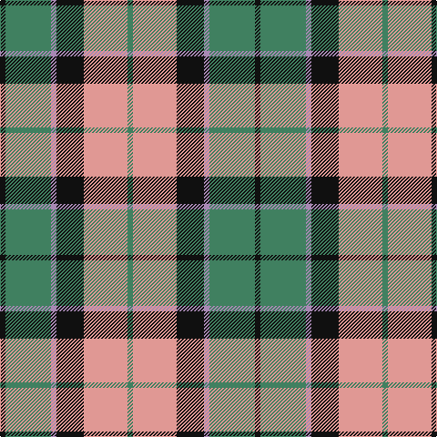

**Bands:** [KGRKYG](/stripes/kgrkyg/) · **Stripes:** [K G O K LR G](/stripes/stripes6/) K G O K LR G

This was sourced from register-of-tartans.  It is a [6 band tartan](/bands/bands6/).

Original link https://www.tartanregister.gov.uk/tartanDetails.aspx?ref=4409

## Register references

External register numbers recorded for this tartan.

- Scottish Register of Tartans: [4409](https://www.tartanregister.gov.uk/tartanDetails.aspx?ref=4409)
- Scottish Tartans Authority (ITI): 7232

## Thread count
K/6 G50 N6 K30 LR48 G/6

## Palette
Each colour and its ΔE from the base-6 reference it is a variant of.

| Colour | Shade | Base | ΔE (OKLab) |
|---|---|---|---|
| G | <code style="background-color:#408060;">#408060</code> `#408060` | G <code style="background-color:#006100;">#006100</code> | 0.14 |
| K | <code style="background-color:#101010;">#101010</code> `#101010` | K <code style="background-color:#000000;">#000000</code> | 0.17 |
| LR | <code style="background-color:#E09894;">#E09894</code> `#E09894` | Y <code style="background-color:#F2BF00;">#F2BF00</code> | 0.17 |
| N | <code style="background-color:#A888B4;">#A888B4</code> `#A888B4` | R <code style="background-color:#CC0000;">#CC0000</code> | 0.25 |

# Sample pattern

## Nearest tartans

The nearest existing variants by ΔTartan distance.

1. [MacKintosh Dress (Scott Adie)](/setts/s6/r3w8db4dg14r4db2~x4/) — ΔT 0.68
1. [Thompson/Thomson/MacTavish special grey](/setts/s6/r3y27k6lo13k14r3~x2/) — ΔT 0.75
1. [Thompson Grey Family Tartan Tartan Number: 1611. Earliest known date: pre 2003 Designed for Lord Thomson of Fleet in 1958 based on a sample in the Moy Hall collection dating from the mid 19th century. The tartan is also suitable for MacTavishs and Thompsons, who claim descent from the Clan MacIntosh. See products available Copyright © Blair Urquhart, Comrie, 2015](/setts/s6/r2o20k5w10k10r2~x2/) — ΔT 0.77
1. [Thompson Camel Clan Tartan Tartan Number: 2421. Earliest known date: 1967 Designed by Scotty Thompson. It it a simple colour variation on the usual blue Thompson, but is often confused with the Burberry Check. See products available Copyright © Blair Urquhart, Comrie, 2015](/setts/s6/r2lo20k5w10k10w2~x2/) — ΔT 0.84
1. [Thompson Grey Dress](/setts/s6/r1o6k1w3k3r1~x8/) — ΔT 0.92
1. [Thomson Camel](/setts/s6/r4lo30k6w13k13w3~x2/) — ΔT 0.92
1. [Cercle de Fermieres de St-Elie . . .](/setts/s7/r2ly1b8r1g7ly1r2~x6/) — ΔT 0.92
1. [MacTavish / Thom(p)son, hunting](/setts/s6/t4o28g6t12k12t3~x2/) — ΔT 0.94
1. [MacIntosh, dress](/setts/s6/r3w8db4g14r4db2~x2/) — ΔT 0.99
1. [Cape Breton District Tartan Tartan Number: 1883. Earliest known date: 1957 In 1907, Mrs Lillian Crewe Walsh of Glace Bay, Cape Breton, wrote a poem in praise of Cape Breton. This poem was given by Mrs Walsh to Mrs Grant in 1957 and the tartan designed to accord with the poem. Grey for our Cape Breton Steel, Green for our lofty See products available Copyright © Blair Urquhart, Comrie, 2015](/setts/s7/ly5k5g17k6o24k6ly3~x2/) — ΔT 0.99

## Neighbour map

Every grey dot is one of 14299 variants placed by the first two principal components of the ΔTartan feature space (44% of its variance). Red is this tartan; blue dots are its nearest — click one to open its page.

<svg viewBox="0 0 640 380" role="img" style="max-width:100%;height:auto;border:1px solid #e0e0e0;border-radius:4px;display:block" xmlns="http://www.w3.org/2000/svg"><image href="/nn/cloud.v1.png" width="640" height="380"/><a href="/setts/s6/r3w8db4dg14r4db2~x4/"><circle cx="150.6" cy="213.9" r="4" fill="#3465a4"><title>MacKintosh Dress (Scott Adie)</title></circle></a><a href="/setts/s6/r3y27k6lo13k14r3~x2/"><circle cx="192.4" cy="206.6" r="4" fill="#3465a4"><title>Thompson/Thomson/MacTavish special grey</title></circle></a><a href="/setts/s6/r2o20k5w10k10r2~x2/"><circle cx="174.6" cy="192.3" r="4" fill="#3465a4"><title>Thompson Grey Family Tartan Tartan Number: 1611. Earliest known date: pre 2003 Designed for Lord Thomson of Fleet in 1958 based on a sample in the Moy Hall collection dating from the mid 19th century. The tartan is also suitable for MacTavishs and Thompsons, who claim descent from the Clan MacIntosh. See products available Copyright © Blair Urquhart, Comrie, 2015</title></circle></a><a href="/setts/s6/r2lo20k5w10k10w2~x2/"><circle cx="176.4" cy="189.9" r="4" fill="#3465a4"><title>Thompson Camel Clan Tartan Tartan Number: 2421. Earliest known date: 1967 Designed by Scotty Thompson. It it a simple colour variation on the usual blue Thompson, but is often confused with the Burberry Check. See products available Copyright © Blair Urquhart, Comrie, 2015</title></circle></a><a href="/setts/s6/r1o6k1w3k3r1~x8/"><circle cx="144.8" cy="214.2" r="4" fill="#3465a4"><title>Thompson Grey Dress</title></circle></a><a href="/setts/s6/r4lo30k6w13k13w3~x2/"><circle cx="190.6" cy="186.9" r="4" fill="#3465a4"><title>Thomson Camel</title></circle></a><a href="/setts/s7/r2ly1b8r1g7ly1r2~x6/"><circle cx="185.4" cy="203.4" r="4" fill="#3465a4"><title>Cercle de Fermieres de St-Elie . . .</title></circle></a><a href="/setts/s6/t4o28g6t12k12t3~x2/"><circle cx="202.5" cy="212.7" r="4" fill="#3465a4"><title>MacTavish / Thom(p)son, hunting</title></circle></a><a href="/setts/s6/r3w8db4g14r4db2~x2/"><circle cx="151.1" cy="216.1" r="4" fill="#3465a4"><title>MacIntosh, dress</title></circle></a><a href="/setts/s7/ly5k5g17k6o24k6ly3~x2/"><circle cx="152.5" cy="207.8" r="4" fill="#3465a4"><title>Cape Breton District Tartan Tartan Number: 1883. Earliest known date: 1957 In 1907, Mrs Lillian Crewe Walsh of Glace Bay, Cape Breton, wrote a poem in praise of Cape Breton. This poem was given by Mrs Walsh to Mrs Grant in 1957 and the tartan designed to accord with the poem. Grey for our Cape Breton Steel, Green for our lofty See products available Copyright © Blair Urquhart, Comrie, 2015</title></circle></a><circle cx="180.1" cy="205.9" r="5" fill="#c00000"/></svg>

ID: /setts/s6/k3g25o3k15lr24g3~x2/
