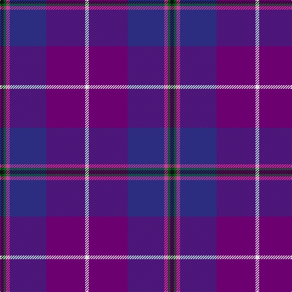

In pattern [KGRBBW](/stripes/kgrbbw/).

This was sourced from register-of-tartans.  It is a [6 stripe tartan](/stripes/stripes6/).

Original link https://www.tartanregister.gov.uk/tartanDetails.aspx?ref=3372

## Attestations

This cloth appears in 2 source records; the oldest owns this page.

- 01/11/2001 — Pride of Glencoe (register-of-tartans, [record](https://www.tartanregister.gov.uk/tartanDetails.aspx?ref=3372))
- 2001 — Pride of Glencoe (Fashion) (tartans-authority, [record](http://www.tartansauthority.com/tartan-ferret/display/3446/))

## Register references

External register numbers recorded for this tartan.

- Scottish Register of Tartans: [3372](https://www.tartanregister.gov.uk/tartanDetails.aspx?ref=3372)
- Scottish Tartans Authority (ITI): 3446
- Scottish Tartans World Register: 2865

## Thread count
K/6 G4 P6 DB60 Pa64 LN/6

## Palette
Each colour and the base-6 reference it is a variant of.

| Colour | Shade | Base |
|---|---|---|
| DB | <code style="background-color:#2C2C80;">#2C2C80</code> `oklch(35.0% 0.138 276.6)` <small>#2C2C80</small> | B <code style="background-color:#2A418A;">#2A418A</code> |
| G | <code style="background-color:#006818;">#006818</code> `oklch(45.0% 0.142 145.0)` <small>#006818</small> | G <code style="background-color:#006100;">#006100</code> |
| K | <code style="background-color:#101010;">#101010</code> `oklch(17.3% 0.000 89.9)` <small>#101010</small> | K <code style="background-color:#000000;">#000000</code> |
| LN | <code style="background-color:#E0E0E0;">#E0E0E0</code> `oklch(90.7% 0.000 89.9)` <small>#E0E0E0</small> | W <code style="background-color:#F7F7F7;">#F7F7F7</code> |
| P | <code style="background-color:#C04094;">#C04094</code> `oklch(57.9% 0.185 344.2)` <small>#C04094</small> | R <code style="background-color:#CC0000;">#CC0000</code> |
| Pa | <code style="background-color:#6C0070;">#6C0070</code> `oklch(37.6% 0.174 326.5)` <small>#6C0070</small> | B <code style="background-color:#2A418A;">#2A418A</code> |

# Sample pattern

## Nearest tartans

The nearest existing variants by ΔTartan distance.

1. [Custer (Personal)](/setts/s10/db20w1dp8t1r2k3r2t1dp20db8~x2/) — ΔT 1.15
1. [Gretna Gold (Fashion)](/setts/s8/w3dp2lo2dp38db28m2db2r2~x2/) — ΔT 1.25
1. [First (Corporate)](/setts/s7/m4dp1m1dp12k6dt16w1~x2/) — ΔT 1.59
1. [First](/setts/s8/dp1m4dp1m1dp12k6dt16w1~x2/) — ΔT 1.61
1. [Alba](/setts/s8/dp24dt2g3m2g3k11dt29w2~x2/) — ΔT 1.64
1. [Charleston Police Department](/setts/s7/dp22lo10dp6lr18dp50db71k6/) — ΔT 1.64
1. [Riley's Theme (Fashion)](/setts/s6/db20k4g5dp14w1db2~x2/) — ΔT 1.65
1. [Cheadle (Personal)](/setts/s6/dp10ly3dp8db42g5o5~x2/) — ΔT 1.71
1. [Albannach](/setts/s8/k4dp2r7dp60y15db60b5w3/) — ΔT 1.73
1. [Murdoch](/setts/s6/k2m1db17m17dt1ly2~x4/) — ΔT 1.80

## Neighbour map

Every grey dot is one of 14299 variants placed by the first two principal components of the ΔTartan feature space (44% of its variance). Red is this tartan; blue dots are its nearest — click one to open its page.

<svg viewBox="0 0 640 380" role="img" style="max-width:100%;height:auto;border:1px solid #e0e0e0;border-radius:4px;display:block" xmlns="http://www.w3.org/2000/svg"><image href="/nn/cloud.v1.png" width="640" height="380"/><a href="/setts/s10/db20w1dp8t1r2k3r2t1dp20db8~x2/"><circle cx="304.2" cy="144.3" r="4" fill="#3465a4"><title>Custer (Personal)</title></circle></a><a href="/setts/s8/w3dp2lo2dp38db28m2db2r2~x2/"><circle cx="346.4" cy="130.1" r="4" fill="#3465a4"><title>Gretna Gold (Fashion)</title></circle></a><a href="/setts/s7/m4dp1m1dp12k6dt16w1~x2/"><circle cx="252.4" cy="183.2" r="4" fill="#3465a4"><title>First (Corporate)</title></circle></a><a href="/setts/s8/dp1m4dp1m1dp12k6dt16w1~x2/"><circle cx="254.7" cy="171.7" r="4" fill="#3465a4"><title>First</title></circle></a><a href="/setts/s8/dp24dt2g3m2g3k11dt29w2~x2/"><circle cx="237.1" cy="154.0" r="4" fill="#3465a4"><title>Alba</title></circle></a><a href="/setts/s7/dp22lo10dp6lr18dp50db71k6/"><circle cx="262.2" cy="200.0" r="4" fill="#3465a4"><title>Charleston Police Department</title></circle></a><a href="/setts/s6/db20k4g5dp14w1db2~x2/"><circle cx="311.4" cy="197.1" r="4" fill="#3465a4"><title>Riley's Theme (Fashion)</title></circle></a><a href="/setts/s6/dp10ly3dp8db42g5o5~x2/"><circle cx="356.7" cy="185.8" r="4" fill="#3465a4"><title>Cheadle (Personal)</title></circle></a><a href="/setts/s8/k4dp2r7dp60y15db60b5w3/"><circle cx="278.7" cy="116.4" r="4" fill="#3465a4"><title>Albannach</title></circle></a><a href="/setts/s6/k2m1db17m17dt1ly2~x4/"><circle cx="314.4" cy="171.7" r="4" fill="#3465a4"><title>Murdoch</title></circle></a><circle cx="302.1" cy="169.9" r="5" fill="#c00000"/></svg>

ID: /setts/s6/k3g2m3db30dp32w3~x2/
