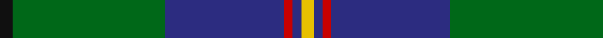

In pattern [KGBRBY](/patterns/kgbrby/).

This was sourced from house-of-tartan.  It is a [6 stripes tartan](/stripes/stripes6/).

Original link http://www.house-of-tartan.scotland.net/house/TartanViewjs.asp?colr=Def&tnam=1078

## Thread count
K/6 G72 DB56 R4 DB4 Y/6

## Palette
Each colour and its ΔE from the base-6 reference it is a variant of.

| Colour | Shade | Base | ΔE (OKLab) |
|---|---|---|---|
| DB | <code style="background-color:#2C2C80;">#2C2C80</code> `#2C2C80` | B <code style="background-color:#2A418A;">#2A418A</code> | 0.06 |
| G | <code style="background-color:#006818;">#006818</code> `#006818` | G <code style="background-color:#006100;">#006100</code> | 0.02 |
| K | <code style="background-color:#101010;">#101010</code> `#101010` | K <code style="background-color:#000000;">#000000</code> | 0.17 |
| R | <code style="background-color:#C80000;">#C80000</code> `#C80000` | R <code style="background-color:#CC0000;">#CC0000</code> | 0.01 |
| Y | <code style="background-color:#E8C000;">#E8C000</code> `#E8C000` | Y <code style="background-color:#F2BF00;">#F2BF00</code> | 0.02 |

# Sample pattern

## Nearest tartans

The nearest existing variants by ΔTartan distance.

1. [Hardie Clan Tartan Tartan Number: 3903. Earliest known date: 2001 Designed by Paul Hardie of Ecclesmachan, West Lothian so that the Hardie family could have their own tartan. Hardie's have worn the MacHardie tartan till now. See products available Copyright © Blair Urquhart, Comrie, 2015](/setts/s6/r4g9w2g24b37ra3x2~b2c2c80-g006818-r9c68a4-rac80000-we0e0e0/) — ΔT 0.75
1. [Hydesville Tower (Corporate)](/setts/s7/g30b6r2b2y2b15w2x2~b202060-g285800-rc80000-we0e0e0-yfccc00/) — ΔT 0.75
1. [Singh Name Tartan Tartan Number: 2600. Earliest known date: 1999 Created for the use of those with the name Singh. The proposer was Sirdar Iqubal Singh, Lord of Butley See products available Copyright © Blair Urquhart, Comrie, 2015](/setts/s8/b3r3b36g17y2g21w2r3x2~b2c2c80-g006818-rc80000-we0e0e0-ye8c000/) — ΔT 0.80
1. [Carmichael](/setts/s6/k3g36b28r2b2y3x2~b304080-g008000-k000000-rc00000-yf0c000/) — ΔT 0.86
1. [Singh](/setts/s8/b3r3b36g17y2g21w2r3x2~b304080-g008000-rc00000-we0e0e0-yf0c000/) — ΔT 0.94
1. [Lowry Clan Tartan Tartan Number: 3203. Earliest known date: 2000 One of a set of three similar designs for Laurie, Lawrie and Lowry, designed by Peter MacDonald for Iain Laurie. See products available Copyright © Blair Urquhart, Comrie, 2015](/setts/s7/b6y2b1g25ba16k2ba4x2~b440044-ba2c2c80-g006818-k101010-ye8c000/) — ΔT 1.00
1. [Pride of Yorkland (Fashion)](/setts/s6/g35k3b26k4ba4w3x2~b2c2c80-ba1c0070-g006818-k101010-wfcfcfc/) — ΔT 1.01
1. [Militello, Massimiliano (Personal)](/setts/s6/r3w3b36g36k2r2x2~b1c0070-g006818-k101010-rc80000-we0e0e0/) — ΔT 1.08
1. [McFadden (Personal)](/setts/s8/b18ba2b16k13g3k2g42y3x2~b1c0070-ba6c0070-g006818-k101010-yd09800/) — ΔT 1.10
1. [MX-5 Owners' Club](/setts/s7/r6b27ba2g2ba2g30w4x2~b2c2c80-ba2888c4-g006818-rc80000-wfcfcfc/) — ΔT 1.14

## Neighbour map

Every grey dot is one of 15726 variants placed by the first two principal components of the ΔTartan feature space (44% of its variance). Red is this tartan; blue dots are its nearest — click one to open its page.

<svg viewBox="0 0 640 380" role="img" style="max-width:100%;height:auto;border:1px solid #e0e0e0;border-radius:4px;display:block" xmlns="http://www.w3.org/2000/svg"><image href="/nn/cloud.v1.png" width="640" height="380"/><a href="/setts/s6/r4g9w2g24b37ra3x2~b2c2c80-g006818-r9c68a4-rac80000-we0e0e0/"><circle cx="296.5" cy="176.9" r="4" fill="#3465a4"><title>Hardie Clan Tartan Tartan Number: 3903. Earliest known date: 2001 Designed by Paul Hardie of Ecclesmachan, West Lothian so that the Hardie family could have their own tartan. Hardie's have worn the MacHardie tartan till now. See products available Copyright © Blair Urquhart, Comrie, 2015</title></circle></a><a href="/setts/s7/g30b6r2b2y2b15w2x2~b202060-g285800-rc80000-we0e0e0-yfccc00/"><circle cx="304.4" cy="162.3" r="4" fill="#3465a4"><title>Hydesville Tower (Corporate)</title></circle></a><a href="/setts/s8/b3r3b36g17y2g21w2r3x2~b2c2c80-g006818-rc80000-we0e0e0-ye8c000/"><circle cx="280.8" cy="154.7" r="4" fill="#3465a4"><title>Singh Name Tartan Tartan Number: 2600. Earliest known date: 1999 Created for the use of those with the name Singh. The proposer was Sirdar Iqubal Singh, Lord of Butley See products available Copyright © Blair Urquhart, Comrie, 2015</title></circle></a><a href="/setts/s6/k3g36b28r2b2y3x2~b304080-g008000-k000000-rc00000-yf0c000/"><circle cx="293.4" cy="161.7" r="4" fill="#3465a4"><title>Carmichael</title></circle></a><a href="/setts/s8/b3r3b36g17y2g21w2r3x2~b304080-g008000-rc00000-we0e0e0-yf0c000/"><circle cx="278.6" cy="153.5" r="4" fill="#3465a4"><title>Singh</title></circle></a><a href="/setts/s7/b6y2b1g25ba16k2ba4x2~b440044-ba2c2c80-g006818-k101010-ye8c000/"><circle cx="282.7" cy="155.1" r="4" fill="#3465a4"><title>Lowry Clan Tartan Tartan Number: 3203. Earliest known date: 2000 One of a set of three similar designs for Laurie, Lawrie and Lowry, designed by Peter MacDonald for Iain Laurie. See products available Copyright © Blair Urquhart, Comrie, 2015</title></circle></a><a href="/setts/s6/g35k3b26k4ba4w3x2~b2c2c80-ba1c0070-g006818-k101010-wfcfcfc/"><circle cx="249.3" cy="185.0" r="4" fill="#3465a4"><title>Pride of Yorkland (Fashion)</title></circle></a><a href="/setts/s6/r3w3b36g36k2r2x2~b1c0070-g006818-k101010-rc80000-we0e0e0/"><circle cx="270.3" cy="158.8" r="4" fill="#3465a4"><title>Militello, Massimiliano (Personal)</title></circle></a><a href="/setts/s8/b18ba2b16k13g3k2g42y3x2~b1c0070-ba6c0070-g006818-k101010-yd09800/"><circle cx="267.1" cy="156.0" r="4" fill="#3465a4"><title>McFadden (Personal)</title></circle></a><a href="/setts/s7/r6b27ba2g2ba2g30w4x2~b2c2c80-ba2888c4-g006818-rc80000-wfcfcfc/"><circle cx="239.7" cy="156.5" r="4" fill="#3465a4"><title>MX-5 Owners' Club</title></circle></a><circle cx="310.3" cy="168.5" r="5" fill="#c00000"/></svg>

ID: /setts/s6/k3g36b28r2b2y3x2~b2c2c80-g006818-k101010-rc80000-ye8c000/
