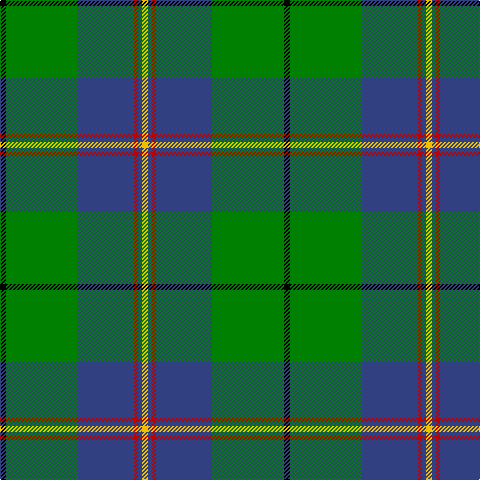

In pattern [KGBRBY](/stripes/kgbrby/).

This was sourced from weddslist.  It is a [6 stripe tartan](/stripes/stripes6/).

Original link http://www.weddslist.com/cgi-bin/tartans/pg.pl?source=sts

## Attestations

This cloth appears in 2 source records; the oldest owns this page.

- undated — Carmichael (weddslist, [record](http://www.weddslist.com/cgi-bin/tartans/pg.pl?source=sts))
- undated — Carmichael Family Tartan Tartan Number: 1078. Earliest known date: 1907 It was the Carmichael of Artherstone who, in 1907, sealed a sample of the Carmichael tartan in the Collection of the Highland Society. This is the first known appearance of the tartan. This sett is sometimes woven in slightly different proportions, most noticable in the black and green stripes. Carmichaels are associated with the Stewarts of Appin and with the MacDougalls (MacMichaels), but all of the name, Carmichael, have the chiefs approval for the wearing of the Carmichael tartan. See products available Copyright © Blair Urquhart, Comrie, 2015 (house-of-tartan, [record](http://www.house-of-tartan.scotland.net/house/TartanViewjs.asp?colr=Def&tnam=1078))

## Thread count
K/6 G72 B56 R4 B4 Y/6

## Palette
Each colour and the base-6 reference it is a variant of.

| Colour | Shade | Base |
|---|---|---|
| B | <code style="background-color:#304080;">#304080</code> `oklch(39.4% 0.109 270.2)` <small>#304080</small> | B <code style="background-color:#2A418A;">#2A418A</code> |
| G | <code style="background-color:#008000;">#008000</code> `oklch(52.0% 0.177 142.5)` <small>#008000</small> | G <code style="background-color:#006100;">#006100</code> |
| K | <code style="background-color:#000000;">#000000</code> `oklch(0.0% 0.000 0.0)` <small>#000000</small> | K <code style="background-color:#000000;">#000000</code> |
| R | <code style="background-color:#C00000;">#C00000</code> `oklch(50.7% 0.208 29.2)` <small>#C00000</small> | R <code style="background-color:#CC0000;">#CC0000</code> |
| Y | <code style="background-color:#F0C000;">#F0C000</code> `oklch(82.7% 0.169 90.5)` <small>#F0C000</small> | Y <code style="background-color:#F2BF00;">#F2BF00</code> |

# Sample pattern

## Nearest tartans

The nearest existing variants by ΔTartan distance, with this tartan at the top so the swatches line up against it.

ΔTartan

Tartan

Sett

—

<a href="/ttd/edit/#slug=k3g36db28r2db2ly3~x2">Carmichael</a> <a class="nn-out" href="/setts/s6/k3g36db28r2db2ly3~x2/" title="open its dictionary page">↗</a>

0.84

<a href="/ttd/edit/#slug=db3r3db36g17ly2g21w2r3~x2">Singh</a> <a class="nn-out" href="/setts/s8/db3r3db36g17ly2g21w2r3~x2/" title="open its dictionary page">↗</a>

0.97

<a href="/ttd/edit/#slug=dg30db6r2db2ly2db15w2~x2">Hydesville Tower (Corporate)</a> <a class="nn-out" href="/setts/s7/dg30db6r2db2ly2db15w2~x2/" title="open its dictionary page">↗</a>

1.14

<a href="/ttd/edit/#slug=g37w2g6db23ly6db2ly3db2~x2">MacAuliffe (Name)</a> <a class="nn-out" href="/setts/s8/g37w2g6db23ly6db2ly3db2~x2/" title="open its dictionary page">↗</a>

1.16

<a href="/ttd/edit/#slug=r2w7db30g36ly2~x2">Centennial-King George Lodge No.171</a> <a class="nn-out" href="/setts/s5/r2w7db30g36ly2~x2/" title="open its dictionary page">↗</a>

1.18

<a href="/ttd/edit/#slug=w9dg2g2w3g18k2dg33lo2~x2">New World Irish (Fashion)</a> <a class="nn-out" href="/setts/s8/w9dg2g2w3g18k2dg33lo2~x2/" title="open its dictionary page">↗</a>

1.18

<a href="/ttd/edit/#slug=r1g1k1g9db9w1~x6">Irving of Bonshaw Tower</a> <a class="nn-out" href="/setts/s6/r1g1k1g9db9w1~x6/" title="open its dictionary page">↗</a>

1.19

<a href="/ttd/edit/#slug=g13dp1g1dp1g3db5k4ly2~x2">Carrick Hunting District Tartan Tartan Number: 721. Earliest known date: 1930 This sample comes from the MacGregor-Hastie collection which forms the basis of the cloth archive of the Scottish Tartans Society. Some of the samples, including this one, were unmarked. One can assume that the sample dates between 1930 and 1950. See products available Copyright © Blair Urquhart, Comrie, 2015</a> <a class="nn-out" href="/setts/s8/g13dp1g1dp1g3db5k4ly2~x2/" title="open its dictionary page">↗</a>

1.21

<a href="/ttd/edit/#slug=k2b8k6g35k8lo2w2k2lo2~x2">160th SOAR(A) Night Stalkers (Mil.)</a> <a class="nn-out" href="/setts/s9/k2b8k6g35k8lo2w2k2lo2~x2/" title="open its dictionary page">↗</a>

1.22

<a href="/ttd/edit/#slug=r4k2g36k2b18ly3b18k2~x2">Fox Hunting</a> <a class="nn-out" href="/setts/s8/r4k2g36k2b18ly3b18k2~x2/" title="open its dictionary page">↗</a>

1.23

<a href="/ttd/edit/#slug=r1g16db2g10db22ly4r2ly1~x2">New Mexico</a> <a class="nn-out" href="/setts/s8/r1g16db2g10db22ly4r2ly1~x2/" title="open its dictionary page">↗</a>

## Neighbour map

Every grey dot is one of 14299 variants placed by the first two principal components of the ΔTartan feature space (44% of its variance). Red is this tartan; blue dots are its nearest — click one to open its page.

<svg viewBox="0 0 640 380" role="img" style="max-width:100%;height:auto;border:1px solid #e0e0e0;border-radius:4px;display:block" xmlns="http://www.w3.org/2000/svg"><image href="/nn/cloud.v1.png" width="640" height="380"/><a href="/setts/s8/db3r3db36g17ly2g21w2r3~x2/"><circle cx="281.5" cy="156.5" r="4" fill="#3465a4"><title>Singh</title></circle></a><a href="/setts/s7/dg30db6r2db2ly2db15w2~x2/"><circle cx="307.2" cy="164.1" r="4" fill="#3465a4"><title>Hydesville Tower (Corporate)</title></circle></a><a href="/setts/s8/g37w2g6db23ly6db2ly3db2~x2/"><circle cx="317.6" cy="156.9" r="4" fill="#3465a4"><title>MacAuliffe (Name)</title></circle></a><a href="/setts/s5/r2w7db30g36ly2~x2/"><circle cx="252.6" cy="171.4" r="4" fill="#3465a4"><title>Centennial-King George Lodge No.171</title></circle></a><a href="/setts/s8/w9dg2g2w3g18k2dg33lo2~x2/"><circle cx="270.3" cy="149.8" r="4" fill="#3465a4"><title>New World Irish (Fashion)</title></circle></a><a href="/setts/s6/r1g1k1g9db9w1~x6/"><circle cx="238.4" cy="190.2" r="4" fill="#3465a4"><title>Irving of Bonshaw Tower</title></circle></a><a href="/setts/s8/g13dp1g1dp1g3db5k4ly2~x2/"><circle cx="289.3" cy="173.1" r="4" fill="#3465a4"><title>Carrick Hunting District Tartan Tartan Number: 721. Earliest known date: 1930 This sample comes from the MacGregor-Hastie collection which forms the basis of the cloth archive of the Scottish Tartans Society. Some of the samples, including this one, were unmarked. One can assume that the sample dates between 1930 and 1950. See products available Copyright © Blair Urquhart, Comrie, 2015</title></circle></a><a href="/setts/s9/k2b8k6g35k8lo2w2k2lo2~x2/"><circle cx="291.2" cy="134.7" r="4" fill="#3465a4"><title>160th SOAR(A) Night Stalkers (Mil.)</title></circle></a><a href="/setts/s8/r4k2g36k2b18ly3b18k2~x2/"><circle cx="271.2" cy="163.3" r="4" fill="#3465a4"><title>Fox Hunting</title></circle></a><a href="/setts/s8/r1g16db2g10db22ly4r2ly1~x2/"><circle cx="289.7" cy="164.1" r="4" fill="#3465a4"><title>New Mexico</title></circle></a><circle cx="296.5" cy="163.5" r="5" fill="#c00000"/></svg>

ID: /setts/s6/k3g36db28r2db2ly3~x2/
