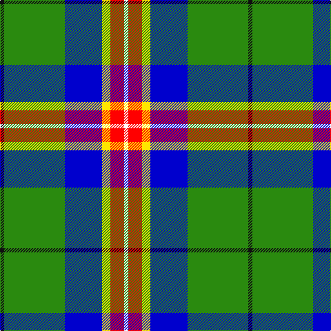

In pattern [KGBYRW](/patterns/kgbyrw/).

This was sourced from register-of-tartans.  It is a [6 stripes tartan](/stripes/stripes6/).

Original link https://www.tartanregister.gov.uk/tartanDetails.aspx?ref=10600

## Thread count
K/6 G88 B54 Y12 R20 W/6

## Palette
Each colour and its ΔE from the base-6 reference it is a variant of.

| Colour | Shade | Base | ΔE (OKLab) |
|---|---|---|---|
| B | <code style="background-color:#0000CD;">#0000CD</code> `#0000CD` | B <code style="background-color:#2A418A;">#2A418A</code> | 0.14 |
| G | <code style="background-color:#2A8A0F;">#2A8A0F</code> `#2A8A0F` | G <code style="background-color:#006100;">#006100</code> | 0.13 |
| K | <code style="background-color:#101010;">#101010</code> `#101010` | K <code style="background-color:#000000;">#000000</code> | 0.17 |
| R | <code style="background-color:#FF0000;">#FF0000</code> `#FF0000` | R <code style="background-color:#CC0000;">#CC0000</code> | 0.11 |
| W | <code style="background-color:#FFFFFF;">#FFFFFF</code> `#FFFFFF` | W <code style="background-color:#F7F7F7;">#F7F7F7</code> | 0.02 |
| Y | <code style="background-color:#FFE600;">#FFE600</code> `#FFE600` | Y <code style="background-color:#F2BF00;">#F2BF00</code> | 0.10 |

# Sample pattern

## Nearest tartans

The nearest existing variants by ΔTartan distance.

1. [Sirens & Swords](/setts/s6/b36g20ga6w12k6r3~b0c4252-g789484-ga003c14-k1c1714-r960028-wffffff~x2/) — ΔT 1.05
1. [Shawlands International (Commem.)](/setts/s6/k3g44b27y6r10w3~b1c0070-g006818-k101010-rc80000-we0e0e0-yfccc00~x2/) — ΔT 1.09
1. [Lethcoe (Thousand Oaks) (Personal)](/setts/s6/k16w4y2g31b4ba4~b5f749c-ba433a5a-g649848-k000000-wf9f5ef-yf8e38c~x4/) — ΔT 1.11
1. [Crofters (Corporate?)](/setts/s7/b20r2g9w6y4k2g8~b2c2c80-g009420-k101010-rc80000-wf8f8f8-ye8c000~x2/) — ΔT 1.18
1. [Vipont](/setts/s7/r4g14k3w3g12b36wa4~b304080-g008000-k000000-rc00000-wc0a0e0-wae0e0e0~x2/) — ΔT 1.19
1. [Carleton College Rugby](/setts/s6/r5b30w3g15y8ra4~b003c64-g004c00-rb07430-rac80000-wf8f8f8-yfccc00~x2/) — ΔT 1.20
1. [Driver (Name)](/setts/s6/g11w11k3y3ga36ya7~g006818-ga003820-k101010-we0e0e0-ye8c000-yad87c00~x2/) — ΔT 1.20
1. [Ayrshire (District)](/setts/s8/b2r1b10w1g4ga8y1ga2~b1c0070-g785000-ga30ac38-r880000-we0e0e0-ybc8c00~x4/) — ΔT 1.22
1. [Crofters (Personal)](/setts/s7/b20r2g9w6y4k2g8~b2c4084-g309c18-k101010-rdc0000-we0e0e0-ye8c000~x2/) — ΔT 1.24
1. [Scotstown](/setts/s5/y2g17w6b5r1~b1474b4-g005020-rfa4b00-wffffff-ya0a0a0~x4/) — ΔT 1.24

## Neighbour map

Every grey dot is one of 15726 variants placed by the first two principal components of the ΔTartan feature space (44% of its variance). Red is this tartan; blue dots are its nearest — click one to open its page.

<svg viewBox="0 0 640 380" role="img" style="max-width:100%;height:auto;border:1px solid #e0e0e0;border-radius:4px;display:block" xmlns="http://www.w3.org/2000/svg"><image href="/nn/cloud.v1.png" width="640" height="380"/><a href="/setts/s6/b36g20ga6w12k6r3~b0c4252-g789484-ga003c14-k1c1714-r960028-wffffff~x2/"><circle cx="151.0" cy="162.1" r="4" fill="#3465a4"><title>Sirens &amp; Swords</title></circle></a><a href="/setts/s6/k3g44b27y6r10w3~b1c0070-g006818-k101010-rc80000-we0e0e0-yfccc00~x2/"><circle cx="208.2" cy="150.0" r="4" fill="#3465a4"><title>Shawlands International (Commem.)</title></circle></a><a href="/setts/s6/k16w4y2g31b4ba4~b5f749c-ba433a5a-g649848-k000000-wf9f5ef-yf8e38c~x4/"><circle cx="204.9" cy="135.9" r="4" fill="#3465a4"><title>Lethcoe (Thousand Oaks) (Personal)</title></circle></a><a href="/setts/s7/b20r2g9w6y4k2g8~b2c2c80-g009420-k101010-rc80000-wf8f8f8-ye8c000~x2/"><circle cx="119.0" cy="160.1" r="4" fill="#3465a4"><title>Crofters (Corporate?)</title></circle></a><a href="/setts/s7/r4g14k3w3g12b36wa4~b304080-g008000-k000000-rc00000-wc0a0e0-wae0e0e0~x2/"><circle cx="217.9" cy="152.3" r="4" fill="#3465a4"><title>Vipont</title></circle></a><a href="/setts/s6/r5b30w3g15y8ra4~b003c64-g004c00-rb07430-rac80000-wf8f8f8-yfccc00~x2/"><circle cx="169.0" cy="167.5" r="4" fill="#3465a4"><title>Carleton College Rugby</title></circle></a><a href="/setts/s6/g11w11k3y3ga36ya7~g006818-ga003820-k101010-we0e0e0-ye8c000-yad87c00~x2/"><circle cx="199.2" cy="155.3" r="4" fill="#3465a4"><title>Driver (Name)</title></circle></a><a href="/setts/s8/b2r1b10w1g4ga8y1ga2~b1c0070-g785000-ga30ac38-r880000-we0e0e0-ybc8c00~x4/"><circle cx="149.3" cy="152.6" r="4" fill="#3465a4"><title>Ayrshire (District)</title></circle></a><a href="/setts/s7/b20r2g9w6y4k2g8~b2c4084-g309c18-k101010-rdc0000-we0e0e0-ye8c000~x2/"><circle cx="127.3" cy="162.9" r="4" fill="#3465a4"><title>Crofters (Personal)</title></circle></a><a href="/setts/s5/y2g17w6b5r1~b1474b4-g005020-rfa4b00-wffffff-ya0a0a0~x4/"><circle cx="253.9" cy="167.2" r="4" fill="#3465a4"><title>Scotstown</title></circle></a><circle cx="188.4" cy="141.5" r="5" fill="#c00000"/></svg>

ID: /setts/s6/k3g44b27y6r10w3~b0000cd-g2a8a0f-k101010-rff0000-wffffff-yffe600~x2/
