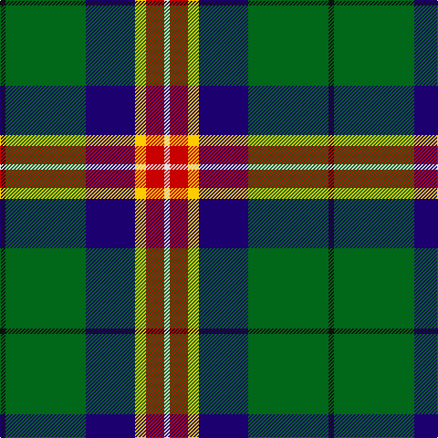

In pattern [KGBYRW](/patterns/kgbyrw/).

This was sourced from tartans-authority.  It is a [6 stripes tartan](/stripes/stripes6/).

Original link http://www.tartansauthority.com/tartan-ferret/display/10600/

## Thread count
K/6 G88 DB54 Y12 R20 LN/6

## Palette
Each colour and its ΔE from the base-6 reference it is a variant of.

| Colour | Shade | Base | ΔE (OKLab) |
|---|---|---|---|
| DB | <code style="background-color:#1C0070;">#1C0070</code> `#1C0070` | B <code style="background-color:#2A418A;">#2A418A</code> | 0.14 |
| G | <code style="background-color:#006818;">#006818</code> `#006818` | G <code style="background-color:#006100;">#006100</code> | 0.02 |
| K | <code style="background-color:#101010;">#101010</code> `#101010` | K <code style="background-color:#000000;">#000000</code> | 0.17 |
| LN | <code style="background-color:#E0E0E0;">#E0E0E0</code> `#E0E0E0` | W <code style="background-color:#F7F7F7;">#F7F7F7</code> | 0.07 |
| R | <code style="background-color:#C80000;">#C80000</code> `#C80000` | R <code style="background-color:#CC0000;">#CC0000</code> | 0.01 |
| Y | <code style="background-color:#FCCC00;">#FCCC00</code> `#FCCC00` | Y <code style="background-color:#F2BF00;">#F2BF00</code> | 0.04 |

# Sample pattern

## Nearest tartans

The nearest existing variants by ΔTartan distance.

1. [Carleton College Rugby](/setts/s6/r5b30w3g15y8ra4~b003c64-g004c00-rb07430-rac80000-wf8f8f8-yfccc00~x2/) — ΔT 0.82
1. [East Lothian](/setts/s7/b6ba17bb4ba2k11g33y4~b5480b0-ba304080-bb800080-g008000-k000000-yf0c000~x2/) — ΔT 0.89
1. [Vipont](/setts/s7/r4g14k3w3g12b36wa4~b304080-g008000-k000000-rc00000-wc0a0e0-wae0e0e0~x2/) — ΔT 0.90
1. [Driver (Name)](/setts/s6/g11w11k3y3ga36ya7~g006818-ga003820-k101010-we0e0e0-ye8c000-yad87c00~x2/) — ΔT 0.91
1. [Souza Nery](/setts/s7/y4g22r3k17r3b37w3~b304080-g008000-k000000-rc00020-we0e0e0-yf0c000~x2/) — ΔT 0.99
1. [Royal College of General Practitioners](/setts/s8/y11k66r32g11r10b6r10ya4~b2c2c80-g003820-k101010-r888888-yffa500-yad87c00/) — ΔT 1.00
1. [Official Glasgow 2014, The](/setts/s6/k3g44b27y6r10w3~b0000cd-g2a8a0f-k101010-rff0000-wffffff-yffe600~x2/) — ΔT 1.09
1. [Lethcoe (Thousand Oaks) (Personal)](/setts/s6/k16w4y2g31b4ba4~b5f749c-ba433a5a-g649848-k000000-wf9f5ef-yf8e38c~x4/) — ΔT 1.10
1. [Sirens & Swords](/setts/s6/b36g20ga6w12k6r3~b0c4252-g789484-ga003c14-k1c1714-r960028-wffffff~x2/) — ΔT 1.11
1. [Wishart Hunting Family Tartan Tartan Number: 2104. Earliest known date: 1990 The Wisharts of Pittarrow and Logie Wishart were a lowland family dating from around the 12th Century. The family's origins are unknown, but the name Guiscard, Wiscard, Wishart, meaning 'cunning' is Norman-French. We have also sought to associate the Wishart tartan with that of another family by virtue of the marriage of a Sir John Wishart to Jean, daughter of William Douglas, 9th Earl of Angus in the 16th Century. The Wishart tartan combines the Wallace and Douglas tartans, in an original new sett which was designed by Dr David Wishart with the assistance of the Scottish College of Textiles in Galashiels. (D. Wishart, 1990) See products available Copyright © Blair Urquhart, Comrie, 2015](/setts/s7/k2b2g16ba2y1ba13w2~b2c2c80-ba202060-g006818-k101010-we0e0e0-ye8c000~x2/) — ΔT 1.12

## Neighbour map

Every grey dot is one of 15726 variants placed by the first two principal components of the ΔTartan feature space (44% of its variance). Red is this tartan; blue dots are its nearest — click one to open its page.

<svg viewBox="0 0 640 380" role="img" style="max-width:100%;height:auto;border:1px solid #e0e0e0;border-radius:4px;display:block" xmlns="http://www.w3.org/2000/svg"><image href="/nn/cloud.v1.png" width="640" height="380"/><a href="/setts/s6/r5b30w3g15y8ra4~b003c64-g004c00-rb07430-rac80000-wf8f8f8-yfccc00~x2/"><circle cx="169.0" cy="167.5" r="4" fill="#3465a4"><title>Carleton College Rugby</title></circle></a><a href="/setts/s7/b6ba17bb4ba2k11g33y4~b5480b0-ba304080-bb800080-g008000-k000000-yf0c000~x2/"><circle cx="167.0" cy="142.8" r="4" fill="#3465a4"><title>East Lothian</title></circle></a><a href="/setts/s7/r4g14k3w3g12b36wa4~b304080-g008000-k000000-rc00000-wc0a0e0-wae0e0e0~x2/"><circle cx="217.9" cy="152.3" r="4" fill="#3465a4"><title>Vipont</title></circle></a><a href="/setts/s6/g11w11k3y3ga36ya7~g006818-ga003820-k101010-we0e0e0-ye8c000-yad87c00~x2/"><circle cx="199.2" cy="155.3" r="4" fill="#3465a4"><title>Driver (Name)</title></circle></a><a href="/setts/s7/y4g22r3k17r3b37w3~b304080-g008000-k000000-rc00020-we0e0e0-yf0c000~x2/"><circle cx="153.4" cy="146.4" r="4" fill="#3465a4"><title>Souza Nery</title></circle></a><a href="/setts/s8/y11k66r32g11r10b6r10ya4~b2c2c80-g003820-k101010-r888888-yffa500-yad87c00/"><circle cx="203.4" cy="126.4" r="4" fill="#3465a4"><title>Royal College of General Practitioners</title></circle></a><a href="/setts/s6/k3g44b27y6r10w3~b0000cd-g2a8a0f-k101010-rff0000-wffffff-yffe600~x2/"><circle cx="188.4" cy="141.5" r="4" fill="#3465a4"><title>Official Glasgow 2014, The</title></circle></a><a href="/setts/s6/k16w4y2g31b4ba4~b5f749c-ba433a5a-g649848-k000000-wf9f5ef-yf8e38c~x4/"><circle cx="204.9" cy="135.9" r="4" fill="#3465a4"><title>Lethcoe (Thousand Oaks) (Personal)</title></circle></a><a href="/setts/s6/b36g20ga6w12k6r3~b0c4252-g789484-ga003c14-k1c1714-r960028-wffffff~x2/"><circle cx="151.0" cy="162.1" r="4" fill="#3465a4"><title>Sirens &amp; Swords</title></circle></a><a href="/setts/s7/k2b2g16ba2y1ba13w2~b2c2c80-ba202060-g006818-k101010-we0e0e0-ye8c000~x2/"><circle cx="220.5" cy="146.3" r="4" fill="#3465a4"><title>Wishart Hunting Family Tartan Tartan Number: 2104. Earliest known date: 1990 The Wisharts of Pittarrow and Logie Wishart were a lowland family dating from around the 12th Century. The family's origins are unknown, but the name Guiscard, Wiscard, Wishart, meaning 'cunning' is Norman-French. We have also sought to associate the Wishart tartan with that of another family by virtue of the marriage of a Sir John Wishart to Jean, daughter of William Douglas, 9th Earl of Angus in the 16th Century. The Wishart tartan combines the Wallace and Douglas tartans, in an original new sett which was designed by Dr David Wishart with the assistance of the Scottish College of Textiles in Galashiels. (D. Wishart, 1990) See products available Copyright © Blair Urquhart, Comrie, 2015</title></circle></a><circle cx="208.2" cy="150.0" r="5" fill="#c00000"/></svg>

ID: /setts/s6/k3g44b27y6r10w3~b1c0070-g006818-k101010-rc80000-we0e0e0-yfccc00~x2/
