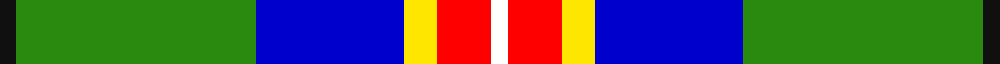

**Bands:** [KGBYRW](/stripes/kgbyrw/) · **Stripes:** [K G DB LY R W](/stripes/stripes6/) K G DB LY R W

This was sourced from register-of-tartans.  It is a [6 band tartan](/bands/bands6/).

Original link https://www.tartanregister.gov.uk/tartanDetails.aspx?ref=10600

## Also known as

This cloth is also recorded under:

- Official Glasgow 2014, The

## Attestations

This cloth appears in 2 source records; the oldest owns this page.

- 14/02/2012 — Official Glasgow 2014, The (register-of-tartans, [record](https://www.tartanregister.gov.uk/tartanDetails.aspx?ref=10600))
- 14/02/2012 — Shawlands International (Commem.) (tartans-authority, [record](http://www.tartansauthority.com/tartan-ferret/display/10600/))

## Register references

External register numbers recorded for this tartan.

- Scottish Register of Tartans: [10600](https://www.tartanregister.gov.uk/tartanDetails.aspx?ref=10600)

## Thread count
K/6 G88 B54 Y12 R20 W/6

## Palette
Each colour and its ΔE from the base-6 reference it is a variant of.

| Colour | Shade | Base | ΔE (OKLab) |
|---|---|---|---|
| B | <code style="background-color:#0000CD;">#0000CD</code> `#0000CD` | B <code style="background-color:#2A418A;">#2A418A</code> | 0.14 |
| G | <code style="background-color:#2A8A0F;">#2A8A0F</code> `#2A8A0F` | G <code style="background-color:#006100;">#006100</code> | 0.13 |
| K | <code style="background-color:#101010;">#101010</code> `#101010` | K <code style="background-color:#000000;">#000000</code> | 0.17 |
| R | <code style="background-color:#FF0000;">#FF0000</code> `#FF0000` | R <code style="background-color:#CC0000;">#CC0000</code> | 0.11 |
| W | <code style="background-color:#FFFFFF;">#FFFFFF</code> `#FFFFFF` | W <code style="background-color:#F7F7F7;">#F7F7F7</code> | 0.02 |
| Y | <code style="background-color:#FFE600;">#FFE600</code> `#FFE600` | Y <code style="background-color:#F2BF00;">#F2BF00</code> | 0.10 |

# Sample pattern

## Nearest tartans

The nearest existing variants by ΔTartan distance.

1. [Sirens & Swords](/setts/s6/dt36y20dg6w12k6r3~x2/) — ΔT 1.05
1. [Lethcoe (Thousand Oaks) (Personal)](/setts/s6/k16w4ly2g31t4dp4~x4/) — ΔT 1.11
1. [Vipont](/setts/s7/r4g14k3lp3g12db36w4~x2/) — ΔT 1.18
1. [Carleton College Rugby](/setts/s6/o5dt30w3dg15ly8r4~x2/) — ΔT 1.20
1. [Driver (Name)](/setts/s6/g11w11k3ly3dg36lo7~x2/) — ΔT 1.20
1. [Ayrshire (District)](/setts/s8/db2r1db10w1y4g8lo1g2~x4/) — ΔT 1.22
1. [Crofters (Personal)](/setts/s7/db20r2g9w6ly4k2g8~x2/) — ΔT 1.23
1. [Scotstown](/setts/s5/lr2dg17w6b5r1~x4/) — ΔT 1.24
1. [East Lothian](/setts/s7/t6db17p4db2k11g33ly4~x2/) — ΔT 1.25
1. [Bahamas](/setts/s8/db3g11w11r2g7db22ly2db2~x2/) — ΔT 1.30

## Neighbour map

Every grey dot is one of 14299 variants placed by the first two principal components of the ΔTartan feature space (44% of its variance). Red is this tartan; blue dots are its nearest — click one to open its page.

<svg viewBox="0 0 640 380" role="img" style="max-width:100%;height:auto;border:1px solid #e0e0e0;border-radius:4px;display:block" xmlns="http://www.w3.org/2000/svg"><image href="/nn/cloud.v1.png" width="640" height="380"/><a href="/setts/s6/dt36y20dg6w12k6r3~x2/"><circle cx="154.2" cy="162.6" r="4" fill="#3465a4"><title>Sirens &amp; Swords</title></circle></a><a href="/setts/s6/k16w4ly2g31t4dp4~x4/"><circle cx="208.0" cy="133.3" r="4" fill="#3465a4"><title>Lethcoe (Thousand Oaks) (Personal)</title></circle></a><a href="/setts/s7/r4g14k3lp3g12db36w4~x2/"><circle cx="221.1" cy="154.1" r="4" fill="#3465a4"><title>Vipont</title></circle></a><a href="/setts/s6/o5dt30w3dg15ly8r4~x2/"><circle cx="172.0" cy="167.9" r="4" fill="#3465a4"><title>Carleton College Rugby</title></circle></a><a href="/setts/s6/g11w11k3ly3dg36lo7~x2/"><circle cx="202.0" cy="154.8" r="4" fill="#3465a4"><title>Driver (Name)</title></circle></a><a href="/setts/s8/db2r1db10w1y4g8lo1g2~x4/"><circle cx="152.8" cy="153.2" r="4" fill="#3465a4"><title>Ayrshire (District)</title></circle></a><a href="/setts/s7/db20r2g9w6ly4k2g8~x2/"><circle cx="130.5" cy="163.7" r="4" fill="#3465a4"><title>Crofters (Personal)</title></circle></a><a href="/setts/s5/lr2dg17w6b5r1~x4/"><circle cx="256.8" cy="164.8" r="4" fill="#3465a4"><title>Scotstown</title></circle></a><a href="/setts/s7/t6db17p4db2k11g33ly4~x2/"><circle cx="170.7" cy="144.5" r="4" fill="#3465a4"><title>East Lothian</title></circle></a><a href="/setts/s8/db3g11w11r2g7db22ly2db2~x2/"><circle cx="192.2" cy="166.3" r="4" fill="#3465a4"><title>Bahamas</title></circle></a><circle cx="191.7" cy="140.6" r="5" fill="#c00000"/></svg>

ID: /setts/s6/k3g44db27ly6r10w3~x2/
