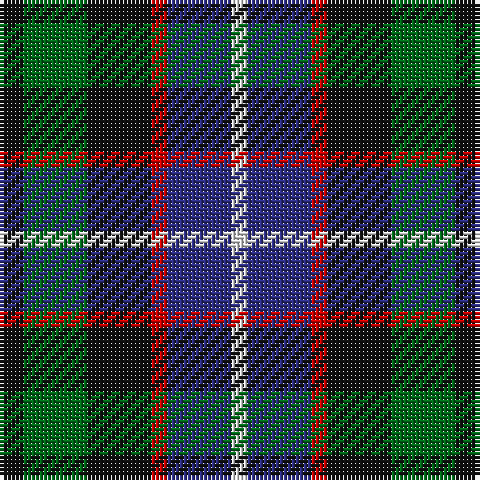

This page is one **sett** — a single exact thread-count. It belongs to the [tartan](/tartans/k3g8k8r2db8w2/)
(the same proportion at any scale), whose colour order is pattern [KGKRBW](/stripes/kgkrbw/).

Sourced from house-of-tartan.  It is a [6 stripe tartan](/stripes/stripes6/).

Original link http://www.house-of-tartan.scotland.net/house/TartanViewjs.asp?colr=Def&tnam=2142

## Thread count
K/6 G16 K16 R4 DB16 LN/4

## Palette

Palette: <strong>Tartan Register</strong>
<table><thead><tr><th>Colour</th><th>Threads</th><th>Shade</th><th>Base</th><th>OKLCh</th></tr></thead><tbody><tr><td>K/</td><td style="text-align:right;font-variant-numeric:tabular-nums">6</td><td><code style="background-color:#101010;">#101010</code> <small style="color:#888">#101010</small></td><td>K <code style="background-color:#000000;">#000000</code></td><td><small style="color:#888">oklch(17.3% 0.000 89.9)</small></td></tr><tr><td>G</td><td style="text-align:right;font-variant-numeric:tabular-nums">16</td><td><code style="background-color:#006818;">#006818</code> <small style="color:#888">#006818</small></td><td>G <code style="background-color:#006100;">#006100</code></td><td><small style="color:#888">oklch(45.0% 0.142 145.0)</small></td></tr><tr><td>K</td><td style="text-align:right;font-variant-numeric:tabular-nums">16</td><td><code style="background-color:#101010;">#101010</code> <small style="color:#888">#101010</small></td><td>K <code style="background-color:#000000;">#000000</code></td><td><small style="color:#888">oklch(17.3% 0.000 89.9)</small></td></tr><tr><td>R</td><td style="text-align:right;font-variant-numeric:tabular-nums">4</td><td><code style="background-color:#C80000;">#C80000</code> <small style="color:#888">#C80000</small></td><td>R <code style="background-color:#CC0000;">#CC0000</code></td><td><small style="color:#888">oklch(52.3% 0.215 29.2)</small></td></tr><tr><td>DB</td><td style="text-align:right;font-variant-numeric:tabular-nums">16</td><td><code style="background-color:#2C2C80;">#2C2C80</code> <small style="color:#888">#2C2C80</small></td><td>B <code style="background-color:#2A418A;">#2A418A</code></td><td><small style="color:#888">oklch(35.0% 0.138 276.6)</small></td></tr><tr><td>LN/</td><td style="text-align:right;font-variant-numeric:tabular-nums">4</td><td><code style="background-color:#E0E0E0;">#E0E0E0</code> <small style="color:#888">#E0E0E0</small></td><td>W <code style="background-color:#F7F7F7;">#F7F7F7</code></td><td><small style="color:#888">oklch(90.7% 0.000 89.9)</small></td></tr></tbody></table>

# Sample pattern

## Nearest tartans

The nearest existing variants by ΔTartan distance, with this tartan at the top so the swatches line up against it.

ΔTartan

Tartan

Sett

—

<a href="/ttd/edit/#slug=k3g8k8r2db8w2~x2">Mitchell Family Tartan Tartan Number: 2142. Earliest known date: 1816-20 Named in honour of General Billy Mitchell when it was adopted as the tartan of the United States Air Force pipe band. The sett is also known as Russell, Hunter and Galbraith. The earliest reference to the tartan is in the collection of the Highland Society of London where it is labelled Galbraith. See products available Copyright © Blair Urquhart, Comrie, 2015</a> <a class="nn-out" href="/setts/s6/k3g8k8r2db8w2~x2/" title="open its dictionary page">↗</a>

0.57

<a href="/ttd/edit/#slug=k3g10k10r3db8w3~x2">Russell (Clan)</a> <a class="nn-out" href="/setts/s6/k3g10k10r3db8w3~x2/" title="open its dictionary page">↗</a>

0.68

<a href="/ttd/edit/#slug=k3w2k3g8k8db8r2db3~x2">Davidson, Double</a> <a class="nn-out" href="/setts/s8/k3w2k3g8k8db8r2db3~x2/" title="open its dictionary page">↗</a>

0.70

<a href="/ttd/edit/#slug=k19t10dp19dg40ly10">Gala Water Old</a> <a class="nn-out" href="/setts/s5/k19t10dp19dg40ly10/" title="open its dictionary page">↗</a>

0.84

<a href="/ttd/edit/#slug=t3g8k9db7r2db2~x2">Wellington, or Waterloo</a> <a class="nn-out" href="/setts/s6/t3g8k9db7r2db2~x2/" title="open its dictionary page">↗</a>

0.86

<a href="/ttd/edit/#slug=k2ly1dg6k6db6w1~x4">Dyce #3</a> <a class="nn-out" href="/setts/s6/k2ly1dg6k6db6w1~x4/" title="open its dictionary page">↗</a>

0.89

<a href="/ttd/edit/#slug=dp2g6k2db6k1r2~x4">MacCaughan, or MacEachain</a> <a class="nn-out" href="/setts/s6/dp2g6k2db6k1r2~x4/" title="open its dictionary page">↗</a>

0.92

<a href="/ttd/edit/#slug=r1k2g4k1g1k2db3k1w1~x6">MacKean Dress (Personal)</a> <a class="nn-out" href="/setts/s9/r1k2g4k1g1k2db3k1w1~x6/" title="open its dictionary page">↗</a>

0.95

<a href="/ttd/edit/#slug=db8k4lo2k3r2k3lo2k4g8~x4">Vosko</a> <a class="nn-out" href="/setts/s9/db8k4lo2k3r2k3lo2k4g8~x4/" title="open its dictionary page">↗</a>

0.96

<a href="/ttd/edit/#slug=g15dg18db23w4r8~x2">Friebe (2014)</a> <a class="nn-out" href="/setts/s5/g15dg18db23w4r8~x2/" title="open its dictionary page">↗</a>

0.96

<a href="/ttd/edit/#slug=o8g4db16g4k14o14db4b3~x2">Hinnigan (Personal)</a> <a class="nn-out" href="/setts/s8/o8g4db16g4k14o14db4b3~x2/" title="open its dictionary page">↗</a>

## Neighbour map

Every grey dot is one of 14299 variants placed by the first two principal components of the ΔTartan feature space (44% of its variance). Red is this tartan; blue dots are its nearest — click one to open its page.

<svg viewBox="0 0 640 380" role="img" style="max-width:100%;height:auto;border:1px solid #e0e0e0;border-radius:4px;display:block" xmlns="http://www.w3.org/2000/svg"><image href="/nn/cloud.v1.png" width="640" height="380"/><a href="/setts/s6/k3g10k10r3db8w3~x2/"><circle cx="67.4" cy="257.5" r="4" fill="#3465a4"><title>Russell (Clan)</title></circle></a><a href="/setts/s8/k3w2k3g8k8db8r2db3~x2/"><circle cx="104.3" cy="242.5" r="4" fill="#3465a4"><title>Davidson, Double</title></circle></a><a href="/setts/s5/k19t10dp19dg40ly10/"><circle cx="113.5" cy="261.2" r="4" fill="#3465a4"><title>Gala Water Old</title></circle></a><a href="/setts/s6/t3g8k9db7r2db2~x2/"><circle cx="57.1" cy="245.0" r="4" fill="#3465a4"><title>Wellington, or Waterloo</title></circle></a><a href="/setts/s6/k2ly1dg6k6db6w1~x4/"><circle cx="135.4" cy="239.1" r="4" fill="#3465a4"><title>Dyce #3</title></circle></a><a href="/setts/s6/dp2g6k2db6k1r2~x4/"><circle cx="94.2" cy="225.7" r="4" fill="#3465a4"><title>MacCaughan, or MacEachain</title></circle></a><a href="/setts/s9/r1k2g4k1g1k2db3k1w1~x6/"><circle cx="100.2" cy="236.6" r="4" fill="#3465a4"><title>MacKean Dress (Personal)</title></circle></a><a href="/setts/s9/db8k4lo2k3r2k3lo2k4g8~x4/"><circle cx="104.6" cy="241.3" r="4" fill="#3465a4"><title>Vosko</title></circle></a><a href="/setts/s5/g15dg18db23w4r8~x2/"><circle cx="91.2" cy="249.9" r="4" fill="#3465a4"><title>Friebe (2014)</title></circle></a><a href="/setts/s8/o8g4db16g4k14o14db4b3~x2/"><circle cx="84.5" cy="224.1" r="4" fill="#3465a4"><title>Hinnigan (Personal)</title></circle></a><circle cx="94.8" cy="256.0" r="5" fill="#c00000"/></svg>

ID: /setts/s6/k3g8k8r2db8w2~x2/
