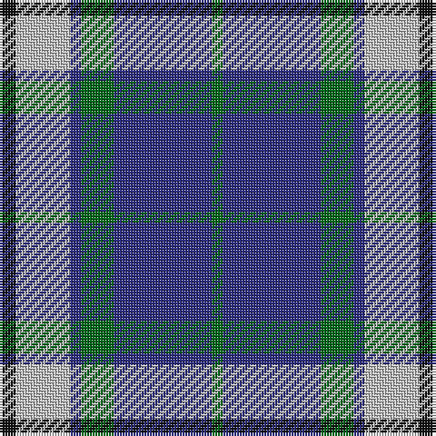

In pattern [GBGBWK](/stripes/gbgbwk/).

This was sourced from register-of-tartans.  It is a [6 stripe tartan](/stripes/stripes6/).

Original link https://www.tartanregister.gov.uk/tartanDetails.aspx?ref=809

## Attestations

This cloth appears in 2 source records; the oldest owns this page.

- 01/01/1996 — Crombie House Check (register-of-tartans, [record](https://www.tartanregister.gov.uk/tartanDetails.aspx?ref=809))
- pre 1997 — Crombie House Check (Corporate) (tartans-authority, [record](http://www.tartansauthority.com/tartan-ferret/display/2302/))

## Register references

External register numbers recorded for this tartan.

- Scottish Register of Tartans: [809](https://www.tartanregister.gov.uk/tartanDetails.aspx?ref=809)
- Scottish Tartans Authority (ITI): 2302
- Scottish Tartans World Register: 2302

## Thread count
K/6 N20 DB4 G12 DB36 G/4

## Palette
Each colour and the base-6 reference it is a variant of.

| Colour | Shade | Base |
|---|---|---|
| DB | <code style="background-color:#2C2C80;">#2C2C80</code> `oklch(35.0% 0.138 276.6)` <small>#2C2C80</small> | B <code style="background-color:#2A418A;">#2A418A</code> |
| G | <code style="background-color:#006818;">#006818</code> `oklch(45.0% 0.142 145.0)` <small>#006818</small> | G <code style="background-color:#006100;">#006100</code> |
| K | <code style="background-color:#101010;">#101010</code> `oklch(17.3% 0.000 89.9)` <small>#101010</small> | K <code style="background-color:#000000;">#000000</code> |
| N | <code style="background-color:#C0C0C0;">#C0C0C0</code> `oklch(80.8% 0.000 89.9)` <small>#C0C0C0</small> | W <code style="background-color:#F7F7F7;">#F7F7F7</code> |

# Sample pattern

## Nearest tartans

The nearest existing variants by ΔTartan distance.

1. [All as One (Corporate)](/setts/s5/k11t38r11g11k5~x2/) — ΔT 0.77
1. [Thayer USA (Name)](/setts/s6/r5db25w5db3g25db3~x2/) — ΔT 0.87
1. [Notre Dame Marching Guard (Corp)](/setts/s6/dr5b35k24b9g9dr5~x2/) — ΔT 0.89
1. [Hawick Rugby Club (Corporate)](/setts/s6/db2ly1db7w1k7w2~x6/) — ΔT 1.05
1. [Thayer USA](/setts/s6/r5db25w5db3dg25db3~x2/) — ΔT 1.08
1. [Tilburg (District)](/setts/s5/db9ly9db9t23r3~x2/) — ΔT 1.08
1. [Crombie House Check Corporate Tartan Tartan Number: 2302. Earliest known date: pre 1997 A Corporate tartan for a general merchandising company whose mills were at Langholm, Dumfriesshire. Dark green and royal blue called for but lighter colours used here to display the sett. See products available Copyright © Blair Urquhart, Comrie, 2015](/setts/s10/db18g6db2lb10k3lb10db2g6db18g2~x2/) — ΔT 1.14
1. [Newall (Dumbarton) (Personal)](/setts/s7/t30dp15w4dg12w9t8w3~x2/) — ΔT 1.15
1. [Keela (Corporate)](/setts/s7/dt7w3dt2w6dt16t26r4~x2/) — ΔT 1.15
1. [Thomson Dress (Blue)](/setts/s6/r1b10k2w4k4ly1~x6/) — ΔT 1.16

## Neighbour map

Every grey dot is one of 14299 variants placed by the first two principal components of the ΔTartan feature space (44% of its variance). Red is this tartan; blue dots are its nearest — click one to open its page.

<svg viewBox="0 0 640 380" role="img" style="max-width:100%;height:auto;border:1px solid #e0e0e0;border-radius:4px;display:block" xmlns="http://www.w3.org/2000/svg"><image href="/nn/cloud.v1.png" width="640" height="380"/><a href="/setts/s5/k11t38r11g11k5~x2/"><circle cx="228.6" cy="231.3" r="4" fill="#3465a4"><title>All as One (Corporate)</title></circle></a><a href="/setts/s6/r5db25w5db3g25db3~x2/"><circle cx="251.8" cy="215.9" r="4" fill="#3465a4"><title>Thayer USA (Name)</title></circle></a><a href="/setts/s6/dr5b35k24b9g9dr5~x2/"><circle cx="235.5" cy="234.5" r="4" fill="#3465a4"><title>Notre Dame Marching Guard (Corp)</title></circle></a><a href="/setts/s6/db2ly1db7w1k7w2~x6/"><circle cx="197.2" cy="217.3" r="4" fill="#3465a4"><title>Hawick Rugby Club (Corporate)</title></circle></a><a href="/setts/s6/r5db25w5db3dg25db3~x2/"><circle cx="250.4" cy="215.6" r="4" fill="#3465a4"><title>Thayer USA</title></circle></a><a href="/setts/s5/db9ly9db9t23r3~x2/"><circle cx="194.6" cy="245.3" r="4" fill="#3465a4"><title>Tilburg (District)</title></circle></a><a href="/setts/s10/db18g6db2lb10k3lb10db2g6db18g2~x2/"><circle cx="232.6" cy="193.8" r="4" fill="#3465a4"><title>Crombie House Check Corporate Tartan Tartan Number: 2302. Earliest known date: pre 1997 A Corporate tartan for a general merchandising company whose mills were at Langholm, Dumfriesshire. Dark green and royal blue called for but lighter colours used here to display the sett. See products available Copyright © Blair Urquhart, Comrie, 2015</title></circle></a><a href="/setts/s7/t30dp15w4dg12w9t8w3~x2/"><circle cx="214.2" cy="206.4" r="4" fill="#3465a4"><title>Newall (Dumbarton) (Personal)</title></circle></a><a href="/setts/s7/dt7w3dt2w6dt16t26r4~x2/"><circle cx="213.5" cy="181.9" r="4" fill="#3465a4"><title>Keela (Corporate)</title></circle></a><a href="/setts/s6/r1b10k2w4k4ly1~x6/"><circle cx="179.9" cy="178.2" r="4" fill="#3465a4"><title>Thomson Dress (Blue)</title></circle></a><circle cx="227.3" cy="208.4" r="5" fill="#c00000"/></svg>

ID: /setts/s6/k3lb10db2g6db18g2~x2/
