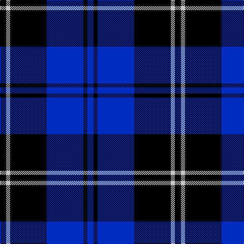

**Bands:** [KWKBKB](/stripes/kwkbkb/) · **Stripes:** [K LB K DB K DB](/stripes/stripes6/) K LB K DB K DB

This was sourced from register-of-tartans.  It is a [6 band tartan](/bands/bands6/).

Original link https://www.tartanregister.gov.uk/tartanDetails.aspx?ref=4054

## Attestations

This cloth appears in 2 source records; the oldest owns this page.

- 01/01/2002 — Swan (register-of-tartans, [record](https://www.tartanregister.gov.uk/tartanDetails.aspx?ref=4054))
- pre 2002 — Swan (Name) (tartans-authority, [record](http://www.tartansauthority.com/tartan-ferret/display/5164/))

## Register references

External register numbers recorded for this tartan.

- Scottish Register of Tartans: [4054](https://www.tartanregister.gov.uk/tartanDetails.aspx?ref=4054)
- Scottish Tartans Authority (ITI): 5164

## Thread count
K/12 N8 K72 B72 K8 B/12

## Palette
Each colour and its ΔE from the base-6 reference it is a variant of.

| Colour | Shade | Base | ΔE (OKLab) |
|---|---|---|---|
| B | <code style="background-color:#002CC0;">#002CC0</code> `#002CC0` | B <code style="background-color:#2A418A;">#2A418A</code> | 0.10 |
| K | <code style="background-color:#000000;">#000000</code> `#000000` | K <code style="background-color:#000000;">#000000</code> | 0.00 |
| N | <code style="background-color:#C8C8C8;">#C8C8C8</code> `#C8C8C8` | W <code style="background-color:#F7F7F7;">#F7F7F7</code> | 0.14 |

# Sample pattern

## Nearest tartans

The nearest existing variants by ΔTartan distance.

1. [Swan 2015, Brian E (Personal)](/setts/s7/k2db9k2db9k13w1k2~x4/) — ΔT 1.35
1. [Salem Scottish Dancer's Wee Bluet](/setts/s8/k10n10k60w9k7n36w6k6/) — ΔT 1.37
1. [Swan, Brian E](/setts/s6/k6db17k6db17k27w3~x2/) — ΔT 1.38
1. [Carrick High School](/setts/s7/k6lo2k16t6k3db18k2~x2/) — ΔT 1.42
1. [Scottish Express International](/setts/s6/k6db50k29b6k29db6/) — ΔT 1.61
1. [Marchmont](/setts/s7/k1db12k12g1k12db12w1~x4/) — ΔT 1.70
1. [Slanj (Corporate)](/setts/s6/m4k28b3k3b25k3~x2/) — ΔT 1.78
1. [Fenston/Morris (Personal)](/setts/s5/k33db8k4db35p3~x2/) — ΔT 1.79
1. [Christie (2016)](/setts/s5/b16r1k16w1r1~x4/) — ΔT 1.82
1. [Allen, Nicholas (Personal)](/setts/s6/r8k24db10k5db10k5~x2/) — ΔT 1.83

## Neighbour map

Every grey dot is one of 14299 variants placed by the first two principal components of the ΔTartan feature space (44% of its variance). Red is this tartan; blue dots are its nearest — click one to open its page.

<svg viewBox="0 0 640 380" role="img" style="max-width:100%;height:auto;border:1px solid #e0e0e0;border-radius:4px;display:block" xmlns="http://www.w3.org/2000/svg"><image href="/nn/cloud.v1.png" width="640" height="380"/><a href="/setts/s7/k2db9k2db9k13w1k2~x4/"><circle cx="322.6" cy="229.1" r="4" fill="#3465a4"><title>Swan 2015, Brian E (Personal)</title></circle></a><a href="/setts/s8/k10n10k60w9k7n36w6k6/"><circle cx="316.2" cy="203.3" r="4" fill="#3465a4"><title>Salem Scottish Dancer's Wee Bluet</title></circle></a><a href="/setts/s6/k6db17k6db17k27w3~x2/"><circle cx="291.7" cy="258.1" r="4" fill="#3465a4"><title>Swan, Brian E</title></circle></a><a href="/setts/s7/k6lo2k16t6k3db18k2~x2/"><circle cx="249.9" cy="217.8" r="4" fill="#3465a4"><title>Carrick High School</title></circle></a><a href="/setts/s6/k6db50k29b6k29db6/"><circle cx="255.9" cy="234.7" r="4" fill="#3465a4"><title>Scottish Express International</title></circle></a><a href="/setts/s7/k1db12k12g1k12db12w1~x4/"><circle cx="284.8" cy="218.0" r="4" fill="#3465a4"><title>Marchmont</title></circle></a><a href="/setts/s6/m4k28b3k3b25k3~x2/"><circle cx="323.6" cy="227.2" r="4" fill="#3465a4"><title>Slanj (Corporate)</title></circle></a><a href="/setts/s5/k33db8k4db35p3~x2/"><circle cx="346.8" cy="249.8" r="4" fill="#3465a4"><title>Fenston/Morris (Personal)</title></circle></a><a href="/setts/s5/b16r1k16w1r1~x4/"><circle cx="267.4" cy="177.4" r="4" fill="#3465a4"><title>Christie (2016)</title></circle></a><a href="/setts/s6/r8k24db10k5db10k5~x2/"><circle cx="252.6" cy="276.4" r="4" fill="#3465a4"><title>Allen, Nicholas (Personal)</title></circle></a><circle cx="298.5" cy="229.4" r="5" fill="#c00000"/></svg>

ID: /setts/s6/k3lb2k18db18k2db3~x4/
