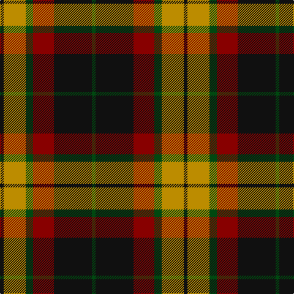

This page is one **sett** — a single exact thread-count. It belongs to the [tartan](/tartans/k3dy18dg6dr17k31dg3/)
(the same proportion at any scale), whose colour order is pattern [GKRGYK](/stripes/gkrgyk/).

Sourced from tartans-authority.  It is a [6 stripe tartan](/stripes/stripes6/).

Original link http://www.tartansauthority.com/tartan-ferret/display/2581/

## Also known as

This cloth is also recorded under:

- MacMillan Black

2 attestations — the source records this cloth was collapsed from (oldest owns this page)

<ul>
<li>pre 2002 — MacMillan - 2002 (Black - Unofficial (tartans-authority, <a href="http://www.tartansauthority.com/tartan-ferret/display/2581/">record</a>)</li>
<li>undated — MacMillan Black Fashion Tartan Tartan Number: 2581. Earliest known date: pre 2002 This unauthorised and symmetrical version of the traditional asymmetrical MacMillan clan tartan is produced by Marton Mills of Yorkshire. Although not recognised as a MacMillan tartan by the Chief (Jan. 2008), it seems to have gained some popularity in the USA. Originally brought to light by a Graeme Ross of Aberdeen, there may be a sample in the Scottish Tartans Society archives. See products available Copyright © Blair Urquhart, Comrie, 2015 (house-of-tartan, <a href="http://www.house-of-tartan.scotland.net/house/TartanViewjs.asp?colr=Def&tnam=2581">record</a>)</li>
</ul>

## Thread count
K/6 DY36 DG12 DR34 K62 DG/6

## Palette
Each colour and the base-6 reference it is a variant of.

| Colour | Shade | Base |
|---|---|---|
| DG | <code style="background-color:#004810;">#004810</code> `oklch(34.9% 0.108 145.5)` <small>#004810</small> | G <code style="background-color:#006100;">#006100</code> |
| DR | <code style="background-color:#880000;">#880000</code> `oklch(39.4% 0.162 29.2)` <small>#880000</small> | R <code style="background-color:#CC0000;">#CC0000</code> |
| DY | <code style="background-color:#BC8C00;">#BC8C00</code> `oklch(66.8% 0.137 84.1)` <small>#BC8C00</small> | Y <code style="background-color:#F2BF00;">#F2BF00</code> |
| K | <code style="background-color:#101010;">#101010</code> `oklch(17.3% 0.000 89.9)` <small>#101010</small> | K <code style="background-color:#000000;">#000000</code> |

# Sample pattern

## Nearest tartans

The nearest existing variants by ΔTartan distance, with this tartan at the top so the swatches line up against it.

ΔTartan

Tartan

Sett

—

<a href="/ttd/edit/#slug=k3lo18dg6r17k31dg3~x2">MacMillan - 2002 (Black - Unofficial</a> <a class="nn-out" href="/setts/s6/k3lo18dg6r17k31dg3~x2/" title="open its dictionary page">↗</a>

0.67

<a href="/ttd/edit/#slug=do2o11do2k11do16lb2~x4">Portrait, The</a> <a class="nn-out" href="/setts/s6/do2o11do2k11do16lb2~x4/" title="open its dictionary page">↗</a>

0.75

<a href="/ttd/edit/#slug=g3k15r8g2o8k2~x4">Thompson Black (Fashion)</a> <a class="nn-out" href="/setts/s6/g3k15r8g2o8k2~x4/" title="open its dictionary page">↗</a>

0.86

<a href="/ttd/edit/#slug=g1r9g3k3g3r1k9w1~x2">Manson Family Tartan Tartan Number: 987. Earliest known date: 1983 The official recording of the sett shows the letter G for the dark green stripe. In heraldic terms this means 'Gules' - red. The designer, Hugh Kirkwood Rankine, clearly intended dark green and this is reproduced here. See products available Copyright © Blair Urquhart, Comrie, 2015</a> <a class="nn-out" href="/setts/s8/g1r9g3k3g3r1k9w1~x2/" title="open its dictionary page">↗</a>

0.88

<a href="/ttd/edit/#slug=g3r20g16k22lo6k3g2~x2">Wcwm 1062</a> <a class="nn-out" href="/setts/s7/g3r20g16k22lo6k3g2~x2/" title="open its dictionary page">↗</a>

0.91

<a href="/ttd/edit/#slug=k2o20k8dg18o3w2~x2">Celtic Combat</a> <a class="nn-out" href="/setts/s6/k2o20k8dg18o3w2~x2/" title="open its dictionary page">↗</a>

0.91

<a href="/ttd/edit/#slug=k9lr4k1lr4dg15r4k1~x4">Logan - 1797 (Dark)</a> <a class="nn-out" href="/setts/s7/k9lr4k1lr4dg15r4k1~x4/" title="open its dictionary page">↗</a>

0.93

<a href="/ttd/edit/#slug=g8r2g12k6g3db6r24k4~x2">Dickie</a> <a class="nn-out" href="/setts/s8/g8r2g12k6g3db6r24k4~x2/" title="open its dictionary page">↗</a>

0.93

<a href="/ttd/edit/#slug=k2r7k6g12ly1g1k2~x4">Blackstock Hunting</a> <a class="nn-out" href="/setts/s7/k2r7k6g12ly1g1k2~x4/" title="open its dictionary page">↗</a>

0.97

<a href="/ttd/edit/#slug=k4dg5k2dg5r17db2~x2">Denny Hunting</a> <a class="nn-out" href="/setts/s6/k4dg5k2dg5r17db2~x2/" title="open its dictionary page">↗</a>

0.98

<a href="/ttd/edit/#slug=r3db12r4g18r6k2~x2">Eyre (Personal)</a> <a class="nn-out" href="/setts/s6/r3db12r4g18r6k2~x2/" title="open its dictionary page">↗</a>

## Neighbour map

Every grey dot is one of 14299 variants placed by the first two principal components of the ΔTartan feature space (44% of its variance). Red is this tartan; blue dots are its nearest — click one to open its page.

<svg viewBox="0 0 640 380" role="img" style="max-width:100%;height:auto;border:1px solid #e0e0e0;border-radius:4px;display:block" xmlns="http://www.w3.org/2000/svg"><image href="/nn/cloud.v1.png" width="640" height="380"/><a href="/setts/s6/do2o11do2k11do16lb2~x4/"><circle cx="232.8" cy="225.9" r="4" fill="#3465a4"><title>Portrait, The</title></circle></a><a href="/setts/s6/g3k15r8g2o8k2~x4/"><circle cx="201.2" cy="223.0" r="4" fill="#3465a4"><title>Thompson Black (Fashion)</title></circle></a><a href="/setts/s8/g1r9g3k3g3r1k9w1~x2/"><circle cx="203.3" cy="192.3" r="4" fill="#3465a4"><title>Manson Family Tartan Tartan Number: 987. Earliest known date: 1983 The official recording of the sett shows the letter G for the dark green stripe. In heraldic terms this means 'Gules' - red. The designer, Hugh Kirkwood Rankine, clearly intended dark green and this is reproduced here. See products available Copyright © Blair Urquhart, Comrie, 2015</title></circle></a><a href="/setts/s7/g3r20g16k22lo6k3g2~x2/"><circle cx="179.7" cy="196.8" r="4" fill="#3465a4"><title>Wcwm 1062</title></circle></a><a href="/setts/s6/k2o20k8dg18o3w2~x2/"><circle cx="237.3" cy="204.2" r="4" fill="#3465a4"><title>Celtic Combat</title></circle></a><a href="/setts/s7/k9lr4k1lr4dg15r4k1~x4/"><circle cx="215.3" cy="185.3" r="4" fill="#3465a4"><title>Logan - 1797 (Dark)</title></circle></a><a href="/setts/s8/g8r2g12k6g3db6r24k4~x2/"><circle cx="200.7" cy="180.3" r="4" fill="#3465a4"><title>Dickie</title></circle></a><a href="/setts/s7/k2r7k6g12ly1g1k2~x4/"><circle cx="229.5" cy="195.1" r="4" fill="#3465a4"><title>Blackstock Hunting</title></circle></a><a href="/setts/s6/k4dg5k2dg5r17db2~x2/"><circle cx="266.6" cy="215.9" r="4" fill="#3465a4"><title>Denny Hunting</title></circle></a><a href="/setts/s6/r3db12r4g18r6k2~x2/"><circle cx="215.7" cy="223.8" r="4" fill="#3465a4"><title>Eyre (Personal)</title></circle></a><circle cx="218.1" cy="210.6" r="5" fill="#c00000"/></svg>

ID: /setts/s6/k3lo18dg6r17k31dg3~x2/
