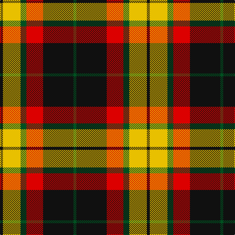

This page is one **sett** — a single exact thread-count. It belongs to the [tartan](/tartans/k3ly18dg6r17k31dg3/)
(the same proportion at any scale), whose colour order is pattern [GKRGYK](/stripes/gkrgyk/).

Sourced from register-of-tartans.  It is a [6 stripe tartan](/stripes/stripes6/).

Original link https://www.tartanregister.gov.uk/tartanDetails.aspx?ref=2662

## Also known as

This cloth is also recorded under:

- MacMillan Variant

## Register references

External register numbers recorded for this tartan.

- Scottish Register of Tartans: [2662](https://www.tartanregister.gov.uk/tartanDetails.aspx?ref=2662)
- Scottish Tartans World Register: 2581

## Thread count
K/6 Y36 G12 R34 K62 G/6

## Palette

Palette: <strong>Tartan Register</strong>
<table><thead><tr><th>Colour</th><th>Threads</th><th>Shade</th><th>Base</th><th>OKLCh</th></tr></thead><tbody><tr><td>K/</td><td style="text-align:right;font-variant-numeric:tabular-nums">6</td><td><code style="background-color:#101010;">#101010</code> <small style="color:#888">#101010</small></td><td>K <code style="background-color:#000000;">#000000</code></td><td><small style="color:#888">oklch(17.3% 0.000 89.9)</small></td></tr><tr><td>Y</td><td style="text-align:right;font-variant-numeric:tabular-nums">36</td><td><code style="background-color:#E8C000;">#E8C000</code> <small style="color:#888">#E8C000</small></td><td>Y <code style="background-color:#F2BF00;">#F2BF00</code></td><td><small style="color:#888">oklch(81.9% 0.168 93.7)</small></td></tr><tr><td>G</td><td style="text-align:right;font-variant-numeric:tabular-nums">12</td><td><code style="background-color:#005020;">#005020</code> <small style="color:#888">#005020</small></td><td>G <code style="background-color:#006100;">#006100</code></td><td><small style="color:#888">oklch(37.7% 0.105 149.6)</small></td></tr><tr><td>R</td><td style="text-align:right;font-variant-numeric:tabular-nums">34</td><td><code style="background-color:#DC0000;">#DC0000</code> <small style="color:#888">#DC0000</small></td><td>R <code style="background-color:#CC0000;">#CC0000</code></td><td><small style="color:#888">oklch(56.2% 0.230 29.2)</small></td></tr><tr><td>K</td><td style="text-align:right;font-variant-numeric:tabular-nums">62</td><td><code style="background-color:#101010;">#101010</code> <small style="color:#888">#101010</small></td><td>K <code style="background-color:#000000;">#000000</code></td><td><small style="color:#888">oklch(17.3% 0.000 89.9)</small></td></tr><tr><td>G/</td><td style="text-align:right;font-variant-numeric:tabular-nums">6</td><td><code style="background-color:#005020;">#005020</code> <small style="color:#888">#005020</small></td><td>G <code style="background-color:#006100;">#006100</code></td><td><small style="color:#888">oklch(37.7% 0.105 149.6)</small></td></tr></tbody></table>

# Sample pattern

## Nearest tartans

The nearest existing variants by ΔTartan distance, with this tartan at the top so the swatches line up against it.

ΔTartan

Tartan

Sett

—

<a href="/ttd/edit/#slug=k3ly18dg6r17k31dg3~x2">MacMillan Varient (Unidentified)</a> <a class="nn-out" href="/setts/s6/k3ly18dg6r17k31dg3~x2/" title="open its dictionary page">↗</a>

0.71

<a href="/ttd/edit/#slug=ly2g7k6r12k1r1ly2~x4">Blackstock, dress</a> <a class="nn-out" href="/setts/s7/ly2g7k6r12k1r1ly2~x4/" title="open its dictionary page">↗</a>

0.73

<a href="/ttd/edit/#slug=k3ly18g6r17k31g3~x2">MacMillan Variant (Unidentified)</a> <a class="nn-out" href="/setts/s6/k3ly18g6r17k31g3~x2/" title="open its dictionary page">↗</a>

0.83

<a href="/ttd/edit/#slug=ly2dg7k6r11k1r1ly2~x4">Blackstock Red (Dress)</a> <a class="nn-out" href="/setts/s7/ly2dg7k6r11k1r1ly2~x4/" title="open its dictionary page">↗</a>

0.94

<a href="/ttd/edit/#slug=g8r2g12k6g3db6r24k4~x2">Dickie</a> <a class="nn-out" href="/setts/s8/g8r2g12k6g3db6r24k4~x2/" title="open its dictionary page">↗</a>

1.08

<a href="/ttd/edit/#slug=k6w6k6o21r2~x4">Burberry, Check</a> <a class="nn-out" href="/setts/s5/k6w6k6o21r2~x4/" title="open its dictionary page">↗</a>

1.08

<a href="/ttd/edit/#slug=lb5o34k24o4r24o4~x2">Wcwm 759-3</a> <a class="nn-out" href="/setts/s6/lb5o34k24o4r24o4~x2/" title="open its dictionary page">↗</a>

1.09

<a href="/ttd/edit/#slug=r4o30k6w13k13w3~x2">Thom(p)son camel</a> <a class="nn-out" href="/setts/s6/r4o30k6w13k13w3~x2/" title="open its dictionary page">↗</a>

1.10

<a href="/ttd/edit/#slug=k6r2g17r16k1t2~x2">Unidentified 12</a> <a class="nn-out" href="/setts/s6/k6r2g17r16k1t2~x2/" title="open its dictionary page">↗</a>

1.10

<a href="/ttd/edit/#slug=k9r4k1r4g15r4k1~x2">Logan, Dark</a> <a class="nn-out" href="/setts/s7/k9r4k1r4g15r4k1~x2/" title="open its dictionary page">↗</a>

1.13

<a href="/ttd/edit/#slug=r2dg17r8db8ly2~x4">British Hills</a> <a class="nn-out" href="/setts/s5/r2dg17r8db8ly2~x4/" title="open its dictionary page">↗</a>

## Neighbour map

Every grey dot is one of 14299 variants placed by the first two principal components of the ΔTartan feature space (44% of its variance). Red is this tartan; blue dots are its nearest — click one to open its page.

<svg viewBox="0 0 640 380" role="img" style="max-width:100%;height:auto;border:1px solid #e0e0e0;border-radius:4px;display:block" xmlns="http://www.w3.org/2000/svg"><image href="/nn/cloud.v1.png" width="640" height="380"/><a href="/setts/s7/ly2g7k6r12k1r1ly2~x4/"><circle cx="190.5" cy="168.3" r="4" fill="#3465a4"><title>Blackstock, dress</title></circle></a><a href="/setts/s6/k3ly18g6r17k31g3~x2/"><circle cx="180.0" cy="190.4" r="4" fill="#3465a4"><title>MacMillan Variant (Unidentified)</title></circle></a><a href="/setts/s7/ly2dg7k6r11k1r1ly2~x4/"><circle cx="188.5" cy="182.8" r="4" fill="#3465a4"><title>Blackstock Red (Dress)</title></circle></a><a href="/setts/s8/g8r2g12k6g3db6r24k4~x2/"><circle cx="200.7" cy="180.3" r="4" fill="#3465a4"><title>Dickie</title></circle></a><a href="/setts/s5/k6w6k6o21r2~x4/"><circle cx="239.9" cy="196.7" r="4" fill="#3465a4"><title>Burberry, Check</title></circle></a><a href="/setts/s6/lb5o34k24o4r24o4~x2/"><circle cx="190.9" cy="202.0" r="4" fill="#3465a4"><title>Wcwm 759-3</title></circle></a><a href="/setts/s6/r4o30k6w13k13w3~x2/"><circle cx="185.0" cy="187.3" r="4" fill="#3465a4"><title>Thom(p)son camel</title></circle></a><a href="/setts/s6/k6r2g17r16k1t2~x2/"><circle cx="235.4" cy="170.5" r="4" fill="#3465a4"><title>Unidentified 12</title></circle></a><a href="/setts/s7/k9r4k1r4g15r4k1~x2/"><circle cx="189.7" cy="172.6" r="4" fill="#3465a4"><title>Logan, Dark</title></circle></a><a href="/setts/s5/r2dg17r8db8ly2~x4/"><circle cx="220.6" cy="221.1" r="4" fill="#3465a4"><title>British Hills</title></circle></a><circle cx="189.6" cy="190.8" r="5" fill="#c00000"/></svg>

ID: /setts/s6/k3ly18dg6r17k31dg3~x2/
