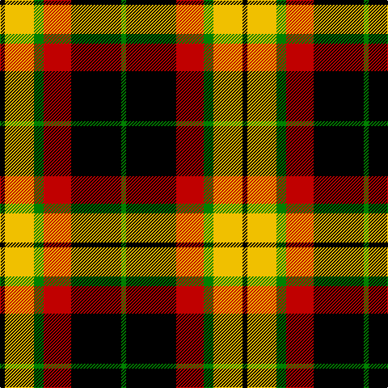

In pattern [GKRGYK](/stripes/gkrgyk/).

This was sourced from weddslist.  It is a [6 stripe tartan](/stripes/stripes6/).

Original link http://www.weddslist.com/cgi-bin/tartans/pg.pl?source=sts

## Also known as

This cloth is also recorded under:

- MacMillan Variant

## Thread count
K/6 Y36 G12 R34 K62 G/6

## Palette
Each colour and the base-6 reference it is a variant of.

| Colour | Shade | Base |
|---|---|---|
| G | <code style="background-color:#008000;">#008000</code> `oklch(52.0% 0.177 142.5)` <small>#008000</small> | G <code style="background-color:#006100;">#006100</code> |
| K | <code style="background-color:#000000;">#000000</code> `oklch(0.0% 0.000 0.0)` <small>#000000</small> | K <code style="background-color:#000000;">#000000</code> |
| R | <code style="background-color:#C00000;">#C00000</code> `oklch(50.7% 0.208 29.2)` <small>#C00000</small> | R <code style="background-color:#CC0000;">#CC0000</code> |
| Y | <code style="background-color:#F0C000;">#F0C000</code> `oklch(82.7% 0.169 90.5)` <small>#F0C000</small> | Y <code style="background-color:#F2BF00;">#F2BF00</code> |

# Sample pattern

## Nearest tartans

The nearest existing variants by ΔTartan distance.

1. [MacMillan Varient (Unidentified)](/setts/s6/k3ly18dg6r17k31dg3~x2/) — ΔT 0.73
1. [Logan, Dark](/setts/s7/k9r4k1r4g15r4k1~x2/) — ΔT 1.02
1. [Blackstock Red (Dress)](/setts/s7/ly2dg7k6r11k1r1ly2~x4/) — ΔT 1.04
1. [Blackstock, dress](/setts/s7/ly2g7k6r12k1r1ly2~x4/) — ΔT 1.04
1. [LP Cover (Dance)](/setts/s7/ly3k9b1k1r6k2ly3~x4/) — ΔT 1.11
1. [Unnamed No 5](/setts/s8/k10ly2g11r11w1r1w1k9~x2/) — ΔT 1.14
1. [Cornish National (District)](/setts/s6/w5k26lo26t7k3r3~x2/) — ΔT 1.19
1. [Dickie](/setts/s8/g8r2g12k6g3db6r24k4~x2/) — ΔT 1.21
1. [Burberry, Check](/setts/s5/k6w6k6o21r2~x4/) — ΔT 1.27
1. [Prince Edward Island](/setts/s7/w2k1g16k12r12k1w2~x2/) — ΔT 1.29

## Neighbour map

Every grey dot is one of 14299 variants placed by the first two principal components of the ΔTartan feature space (44% of its variance). Red is this tartan; blue dots are its nearest — click one to open its page.

<svg viewBox="0 0 640 380" role="img" style="max-width:100%;height:auto;border:1px solid #e0e0e0;border-radius:4px;display:block" xmlns="http://www.w3.org/2000/svg"><image href="/nn/cloud.v1.png" width="640" height="380"/><a href="/setts/s6/k3ly18dg6r17k31dg3~x2/"><circle cx="189.6" cy="190.8" r="4" fill="#3465a4"><title>MacMillan Varient (Unidentified)</title></circle></a><a href="/setts/s7/k9r4k1r4g15r4k1~x2/"><circle cx="189.7" cy="172.6" r="4" fill="#3465a4"><title>Logan, Dark</title></circle></a><a href="/setts/s7/ly2dg7k6r11k1r1ly2~x4/"><circle cx="188.5" cy="182.8" r="4" fill="#3465a4"><title>Blackstock Red (Dress)</title></circle></a><a href="/setts/s7/ly2g7k6r12k1r1ly2~x4/"><circle cx="190.5" cy="168.3" r="4" fill="#3465a4"><title>Blackstock, dress</title></circle></a><a href="/setts/s7/ly3k9b1k1r6k2ly3~x4/"><circle cx="210.4" cy="198.7" r="4" fill="#3465a4"><title>LP Cover (Dance)</title></circle></a><a href="/setts/s8/k10ly2g11r11w1r1w1k9~x2/"><circle cx="156.1" cy="165.6" r="4" fill="#3465a4"><title>Unnamed No 5</title></circle></a><a href="/setts/s6/w5k26lo26t7k3r3~x2/"><circle cx="162.4" cy="174.2" r="4" fill="#3465a4"><title>Cornish National (District)</title></circle></a><a href="/setts/s8/g8r2g12k6g3db6r24k4~x2/"><circle cx="200.7" cy="180.3" r="4" fill="#3465a4"><title>Dickie</title></circle></a><a href="/setts/s5/k6w6k6o21r2~x4/"><circle cx="239.9" cy="196.7" r="4" fill="#3465a4"><title>Burberry, Check</title></circle></a><a href="/setts/s7/w2k1g16k12r12k1w2~x2/"><circle cx="171.8" cy="161.6" r="4" fill="#3465a4"><title>Prince Edward Island</title></circle></a><circle cx="180.0" cy="190.4" r="5" fill="#c00000"/></svg>

ID: /setts/s6/k3ly18g6r17k31g3~x2/
