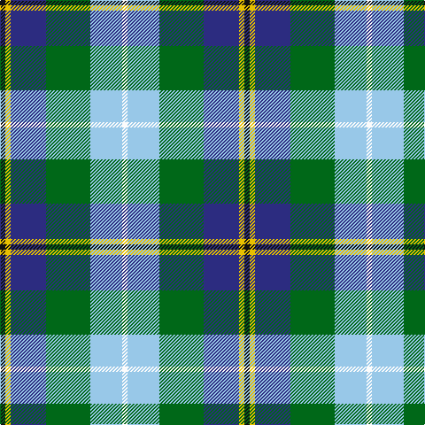

This page is one **sett** — a single exact thread-count. It belongs to the [tartan](/tartans/k3ly3db20g25lb18w3/)
(the same proportion at any scale), whose colour order is pattern [KYBGWW](/stripes/kybgww/).

Sourced from tartans-authority.  It is a [6 stripe tartan](/stripes/stripes6/).

Original link http://www.tartansauthority.com/tartan-ferret/display/1264/

2 attestations — the source records this cloth was collapsed from (oldest owns this page)

<ul>
<li>1977 — Porteous (Clan) (tartans-authority, <a href="http://www.tartansauthority.com/tartan-ferret/display/1264/">record</a>)</li>
<li>01/01/1978 — Porteous (register-of-tartans, <a href="https://www.tartanregister.gov.uk/tartanDetails.aspx?ref=3358">record</a>)</li>
</ul>

## Register references

External register numbers recorded for this tartan.

- Scottish Register of Tartans: [3358](https://www.tartanregister.gov.uk/tartanDetails.aspx?ref=3358)
- Scottish Tartans Authority (ITI): 1264
- Scottish Tartans World Register: 1264

## Thread count
K/6 Y6 DB40 G50 LB36 W/6

## Palette

Palette: <strong>Tartan Register</strong>
<table><thead><tr><th>Colour</th><th>Threads</th><th>Shade</th><th>Base</th><th>OKLCh</th></tr></thead><tbody><tr><td>K/</td><td style="text-align:right;font-variant-numeric:tabular-nums">6</td><td><code style="background-color:#101010;">#101010</code> <small style="color:#888">#101010</small></td><td>K <code style="background-color:#000000;">#000000</code></td><td><small style="color:#888">oklch(17.3% 0.000 89.9)</small></td></tr><tr><td>Y</td><td style="text-align:right;font-variant-numeric:tabular-nums">6</td><td><code style="background-color:#E8C000;">#E8C000</code> <small style="color:#888">#E8C000</small></td><td>Y <code style="background-color:#F2BF00;">#F2BF00</code></td><td><small style="color:#888">oklch(81.9% 0.168 93.7)</small></td></tr><tr><td>DB</td><td style="text-align:right;font-variant-numeric:tabular-nums">40</td><td><code style="background-color:#2C2C80;">#2C2C80</code> <small style="color:#888">#2C2C80</small></td><td>B <code style="background-color:#2A418A;">#2A418A</code></td><td><small style="color:#888">oklch(35.0% 0.138 276.6)</small></td></tr><tr><td>G</td><td style="text-align:right;font-variant-numeric:tabular-nums">50</td><td><code style="background-color:#006818;">#006818</code> <small style="color:#888">#006818</small></td><td>G <code style="background-color:#006100;">#006100</code></td><td><small style="color:#888">oklch(45.0% 0.142 145.0)</small></td></tr><tr><td>LB</td><td style="text-align:right;font-variant-numeric:tabular-nums">36</td><td><code style="background-color:#98C8E8;">#98C8E8</code> <small style="color:#888">#98C8E8</small></td><td>W <code style="background-color:#F7F7F7;">#F7F7F7</code></td><td><small style="color:#888">oklch(81.0% 0.068 237.9)</small></td></tr><tr><td>W/</td><td style="text-align:right;font-variant-numeric:tabular-nums">6</td><td><code style="background-color:#FCFCFC;">#FCFCFC</code> <small style="color:#888">#FCFCFC</small></td><td>W <code style="background-color:#F7F7F7;">#F7F7F7</code></td><td><small style="color:#888">oklch(99.1% 0.000 89.9)</small></td></tr></tbody></table>

# Sample pattern

## Nearest tartans

The nearest existing variants by ΔTartan distance, with this tartan at the top so the swatches line up against it.

ΔTartan

Tartan

Sett

—

<a href="/ttd/edit/#slug=k3ly3db20g25lb18w3~x2">Porteous (Clan)</a> <a class="nn-out" href="/setts/s6/k3ly3db20g25lb18w3~x2/" title="open its dictionary page">↗</a>

0.86

<a href="/ttd/edit/#slug=db20r2g9w6ly4k2g8~x2">Crofters (Personal)</a> <a class="nn-out" href="/setts/s7/db20r2g9w6ly4k2g8~x2/" title="open its dictionary page">↗</a>

0.98

<a href="/ttd/edit/#slug=g20g6w15dt5w2dt15o4dt10r2~x2">Copar a'Beannichte Dress (Personal)</a> <a class="nn-out" href="/setts/s9/g20g6w15dt5w2dt15o4dt10r2~x2/" title="open its dictionary page">↗</a>

1.04

<a href="/ttd/edit/#slug=dt36y20dg6w12k6r3~x2">Sirens &amp; Swords</a> <a class="nn-out" href="/setts/s6/dt36y20dg6w12k6r3~x2/" title="open its dictionary page">↗</a>

1.06

<a href="/ttd/edit/#slug=k6r3g30ly10db30w3~x2">Turnbull of Thornton (Personal)</a> <a class="nn-out" href="/setts/s6/k6r3g30ly10db30w3~x2/" title="open its dictionary page">↗</a>

1.08

<a href="/ttd/edit/#slug=k1ly1db8g10t7w1~x2">Porteous</a> <a class="nn-out" href="/setts/s6/k1ly1db8g10t7w1~x2/" title="open its dictionary page">↗</a>

1.08

<a href="/ttd/edit/#slug=dt2g2dt11o2w8t12ly2t2~x2">Elora (District)</a> <a class="nn-out" href="/setts/s8/dt2g2dt11o2w8t12ly2t2~x2/" title="open its dictionary page">↗</a>

1.11

<a href="/ttd/edit/#slug=b4ly2b16db15g16w3g3w4~x2">Business Air</a> <a class="nn-out" href="/setts/s8/b4ly2b16db15g16w3g3w4~x2/" title="open its dictionary page">↗</a>

1.20

<a href="/ttd/edit/#slug=g6g20g6w15dt5w2dt15o4dt10r2~x2">Copar a'Beannichte Dress (Personal)</a> <a class="nn-out" href="/setts/s10/g6g20g6w15dt5w2dt15o4dt10r2~x2/" title="open its dictionary page">↗</a>

1.23

<a href="/ttd/edit/#slug=db1t9w3ly3db9ly1g1r1~x4">Curd (2013)</a> <a class="nn-out" href="/setts/s8/db1t9w3ly3db9ly1g1r1~x4/" title="open its dictionary page">↗</a>

1.25

<a href="/ttd/edit/#slug=db2r1db10w1y4g8lo1g2~x4">Ayrshire (District)</a> <a class="nn-out" href="/setts/s8/db2r1db10w1y4g8lo1g2~x4/" title="open its dictionary page">↗</a>

## Neighbour map

Every grey dot is one of 14299 variants placed by the first two principal components of the ΔTartan feature space (44% of its variance). Red is this tartan; blue dots are its nearest — click one to open its page.

<svg viewBox="0 0 640 380" role="img" style="max-width:100%;height:auto;border:1px solid #e0e0e0;border-radius:4px;display:block" xmlns="http://www.w3.org/2000/svg"><image href="/nn/cloud.v1.png" width="640" height="380"/><a href="/setts/s7/db20r2g9w6ly4k2g8~x2/"><circle cx="130.5" cy="163.7" r="4" fill="#3465a4"><title>Crofters (Personal)</title></circle></a><a href="/setts/s9/g20g6w15dt5w2dt15o4dt10r2~x2/"><circle cx="107.8" cy="165.8" r="4" fill="#3465a4"><title>Copar a'Beannichte Dress (Personal)</title></circle></a><a href="/setts/s6/dt36y20dg6w12k6r3~x2/"><circle cx="154.2" cy="162.6" r="4" fill="#3465a4"><title>Sirens &amp; Swords</title></circle></a><a href="/setts/s6/k6r3g30ly10db30w3~x2/"><circle cx="143.9" cy="173.0" r="4" fill="#3465a4"><title>Turnbull of Thornton (Personal)</title></circle></a><a href="/setts/s6/k1ly1db8g10t7w1~x2/"><circle cx="142.5" cy="186.8" r="4" fill="#3465a4"><title>Porteous</title></circle></a><a href="/setts/s8/dt2g2dt11o2w8t12ly2t2~x2/"><circle cx="82.4" cy="170.1" r="4" fill="#3465a4"><title>Elora (District)</title></circle></a><a href="/setts/s8/b4ly2b16db15g16w3g3w4~x2/"><circle cx="95.4" cy="181.6" r="4" fill="#3465a4"><title>Business Air</title></circle></a><a href="/setts/s10/g6g20g6w15dt5w2dt15o4dt10r2~x2/"><circle cx="91.2" cy="163.5" r="4" fill="#3465a4"><title>Copar a'Beannichte Dress (Personal)</title></circle></a><a href="/setts/s8/db1t9w3ly3db9ly1g1r1~x4/"><circle cx="109.3" cy="143.5" r="4" fill="#3465a4"><title>Curd (2013)</title></circle></a><a href="/setts/s8/db2r1db10w1y4g8lo1g2~x4/"><circle cx="152.8" cy="153.2" r="4" fill="#3465a4"><title>Ayrshire (District)</title></circle></a><circle cx="99.1" cy="179.0" r="5" fill="#c00000"/></svg>

ID: /setts/s6/k3ly3db20g25lb18w3~x2/
