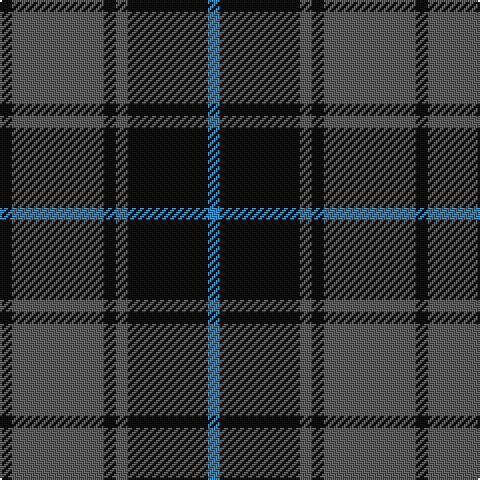

This page is one **sett** — a single exact thread-count. It belongs to the [tartan](/tartans/k3n23k3n3k20t3/)
(the same proportion at any scale), whose colour order is pattern [BKBKBK](/stripes/bkbkbk/).

Sourced from register-of-tartans.  It is a [6 stripe tartan](/stripes/stripes6/).

Original link https://www.tartanregister.gov.uk/tartanDetails.aspx?ref=11060

## Register references

External register numbers recorded for this tartan.

- Scottish Register of Tartans: [11060](https://www.tartanregister.gov.uk/tartanDetails.aspx?ref=11060)

## Thread count
K/6 N46 K6 N6 K40 B/6

## Palette

Palette: <strong>Tartan Register</strong> <small style="color:#888">(2 of 3 colours)</small>
<table><thead><tr><th>Colour</th><th>Threads</th><th>Shade</th><th>Base</th><th>OKLCh</th></tr></thead><tbody><tr><td>K/</td><td style="text-align:right;font-variant-numeric:tabular-nums">6</td><td><code style="background-color:#101010;">#101010</code> <small style="color:#888">#101010</small></td><td>K <code style="background-color:#000000;">#000000</code></td><td><small style="color:#888">oklch(17.3% 0.000 89.9)</small></td></tr><tr><td>N</td><td style="text-align:right;font-variant-numeric:tabular-nums">46</td><td><code style="background-color:#5C5C5C;">#5C5C5C</code> <small style="color:#888">#5C5C5C</small></td><td>B <code style="background-color:#2A418A;">#2A418A</code></td><td><small style="color:#888">oklch(47.5% 0.000 89.9)</small></td></tr><tr><td>K</td><td style="text-align:right;font-variant-numeric:tabular-nums">6</td><td><code style="background-color:#101010;">#101010</code> <small style="color:#888">#101010</small></td><td>K <code style="background-color:#000000;">#000000</code></td><td><small style="color:#888">oklch(17.3% 0.000 89.9)</small></td></tr><tr><td>N</td><td style="text-align:right;font-variant-numeric:tabular-nums">6</td><td><code style="background-color:#5C5C5C;">#5C5C5C</code> <small style="color:#888">#5C5C5C</small></td><td>B <code style="background-color:#2A418A;">#2A418A</code></td><td><small style="color:#888">oklch(47.5% 0.000 89.9)</small></td></tr><tr><td>K</td><td style="text-align:right;font-variant-numeric:tabular-nums">40</td><td><code style="background-color:#101010;">#101010</code> <small style="color:#888">#101010</small></td><td>K <code style="background-color:#000000;">#000000</code></td><td><small style="color:#888">oklch(17.3% 0.000 89.9)</small></td></tr><tr><td>B/</td><td style="text-align:right;font-variant-numeric:tabular-nums">6</td><td><code style="background-color:#3C82AF;">#3C82AF</code> <small style="color:#888">#3C82AF</small></td><td>B <code style="background-color:#2A418A;">#2A418A</code></td><td><small style="color:#888">oklch(58.1% 0.099 239.8)</small></td></tr></tbody></table>

# Sample pattern

## Nearest tartans

The nearest existing variants by ΔTartan distance, with this tartan at the top so the swatches line up against it.

ΔTartan

Tartan

Sett

—

<a href="/ttd/edit/#slug=k3n23k3n3k20t3~x2">Pride of the Forth</a> <a class="nn-out" href="/setts/s6/k3n23k3n3k20t3~x2/" title="open its dictionary page">↗</a>

0.27

<a href="/ttd/edit/#slug=k3n23k3n3k20lg3~x2">Pride of the Forth</a> <a class="nn-out" href="/setts/s6/k3n23k3n3k20lg3~x2/" title="open its dictionary page">↗</a>

0.86

<a href="/ttd/edit/#slug=k3n31k3n3k27ly3~x2">Scottish National Party (Corporate)</a> <a class="nn-out" href="/setts/s6/k3n31k3n3k27ly3~x2/" title="open its dictionary page">↗</a>

0.90

<a href="/ttd/edit/#slug=n34k7n12k39n3k4lg3~x2">Tartan Army Children's Charity (Corp</a> <a class="nn-out" href="/setts/s7/n34k7n12k39n3k4lg3~x2/" title="open its dictionary page">↗</a>

0.94

<a href="/ttd/edit/#slug=n34k7n12k40n3k4t3~x2">TACC (Corporate)</a> <a class="nn-out" href="/setts/s7/n34k7n12k40n3k4t3~x2/" title="open its dictionary page">↗</a>

1.12

<a href="/ttd/edit/#slug=r2db10g1db2g1db2g8r1g2~x4">Brown, Barnaby (Personal)</a> <a class="nn-out" href="/setts/s9/r2db10g1db2g1db2g8r1g2~x4/" title="open its dictionary page">↗</a>

1.13

<a href="/ttd/edit/#slug=k3n25k3n3k21n3~x2">Slanj, Grey (Corporate)</a> <a class="nn-out" href="/setts/s6/k3n25k3n3k21n3~x2/" title="open its dictionary page">↗</a>

1.13

<a href="/ttd/edit/#slug=n1k3n1k3n8r1~x8">Mackay (Blue)</a> <a class="nn-out" href="/setts/s6/n1k3n1k3n8r1~x8/" title="open its dictionary page">↗</a>

1.16

<a href="/ttd/edit/#slug=db51dg5r15dg37db17r6dg5~x2">Cadence</a> <a class="nn-out" href="/setts/s7/db51dg5r15dg37db17r6dg5~x2/" title="open its dictionary page">↗</a>

1.17

<a href="/ttd/edit/#slug=r3db1r1db11g10r2db2~x4">Robertson of Struan 1816</a> <a class="nn-out" href="/setts/s7/r3db1r1db11g10r2db2~x4/" title="open its dictionary page">↗</a>

1.23

<a href="/ttd/edit/#slug=db26r6g16db8g3r2~x2">Perthshire (New) District Tartan Tartan Number: 2188. Earliest known date: 1992 The New Perthshire District tartan has established itself through use and wont since 1992. It provides a useful alternative to the Drummond pattern which was always closely associated with Perthshire. See products available Copyright © Blair Urquhart, Comrie, 2015</a> <a class="nn-out" href="/setts/s6/db26r6g16db8g3r2~x2/" title="open its dictionary page">↗</a>

## Neighbour map

Every grey dot is one of 14299 variants placed by the first two principal components of the ΔTartan feature space (44% of its variance). Red is this tartan; blue dots are its nearest — click one to open its page.

<svg viewBox="0 0 640 380" role="img" style="max-width:100%;height:auto;border:1px solid #e0e0e0;border-radius:4px;display:block" xmlns="http://www.w3.org/2000/svg"><image href="/nn/cloud.v1.png" width="640" height="380"/><a href="/setts/s6/k3n23k3n3k20lg3~x2/"><circle cx="325.4" cy="245.6" r="4" fill="#3465a4"><title>Pride of the Forth</title></circle></a><a href="/setts/s6/k3n31k3n3k27ly3~x2/"><circle cx="341.9" cy="222.5" r="4" fill="#3465a4"><title>Scottish National Party (Corporate)</title></circle></a><a href="/setts/s7/n34k7n12k39n3k4lg3~x2/"><circle cx="363.1" cy="223.0" r="4" fill="#3465a4"><title>Tartan Army Children's Charity (Corp</title></circle></a><a href="/setts/s7/n34k7n12k40n3k4t3~x2/"><circle cx="369.9" cy="223.4" r="4" fill="#3465a4"><title>TACC (Corporate)</title></circle></a><a href="/setts/s9/r2db10g1db2g1db2g8r1g2~x4/"><circle cx="319.5" cy="219.3" r="4" fill="#3465a4"><title>Brown, Barnaby (Personal)</title></circle></a><a href="/setts/s6/k3n25k3n3k21n3~x2/"><circle cx="401.1" cy="264.1" r="4" fill="#3465a4"><title>Slanj, Grey (Corporate)</title></circle></a><a href="/setts/s6/n1k3n1k3n8r1~x8/"><circle cx="362.2" cy="246.5" r="4" fill="#3465a4"><title>Mackay (Blue)</title></circle></a><a href="/setts/s7/db51dg5r15dg37db17r6dg5~x2/"><circle cx="311.2" cy="239.5" r="4" fill="#3465a4"><title>Cadence</title></circle></a><a href="/setts/s7/r3db1r1db11g10r2db2~x4/"><circle cx="295.5" cy="219.2" r="4" fill="#3465a4"><title>Robertson of Struan 1816</title></circle></a><a href="/setts/s6/db26r6g16db8g3r2~x2/"><circle cx="353.1" cy="236.6" r="4" fill="#3465a4"><title>Perthshire (New) District Tartan Tartan Number: 2188. Earliest known date: 1992 The New Perthshire District tartan has established itself through use and wont since 1992. It provides a useful alternative to the Drummond pattern which was always closely associated with Perthshire. See products available Copyright © Blair Urquhart, Comrie, 2015</title></circle></a><circle cx="333.4" cy="249.8" r="5" fill="#c00000"/></svg>

ID: /setts/s6/k3n23k3n3k20t3~x2/
