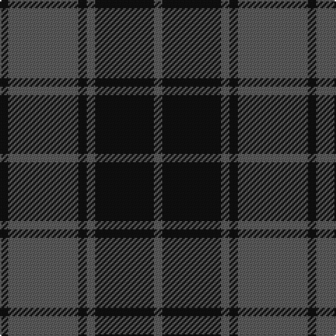

**Bands:** [KBKBKB](/stripes/kbkbkb/) · **Stripes:** [K N K N K N](/stripes/stripes6/) K N K N K N

This was sourced from tartans-authority.  It is a [6 band tartan](/bands/bands6/).

Original link http://www.tartansauthority.com/tartan-ferret/display/7840/

## Attestations

This cloth appears in 2 source records; the oldest owns this page.

- pre 2008 — Slanj, Grey (Corporate) (tartans-authority, [record](http://www.tartansauthority.com/tartan-ferret/display/7840/))
- undated — Slanj, Grey (register-of-tartans, [record](https://www.tartanregister.gov.uk/tartanDetails.aspx?ref=5792))

## Register references

External register numbers recorded for this tartan.

- Scottish Register of Tartans: [5792](https://www.tartanregister.gov.uk/tartanDetails.aspx?ref=5792)
- Scottish Tartans Authority (ITI): 7840

## Variants

Other setts woven to the same stripe pattern.

- [Freedom of Scotland](/setts/s6/k15n7k6n11k50n4~x2/)
- [Grey Spirit (Fashion)](/setts/s6/n6k17n6k17n45k4~x2/)
- [Grey Spirit Fashion Tartan Tartan Number: 6594. Earliest known date: 01/03/2005 A fashion tartan from ACS Clothing of Glasgow for use in their kilt hire business. Woven by Lochcarron. The grey is actually a grey/black marl (mixture) which can't be shown graphically. See products available Copyright © Blair Urquhart, Comrie, 2015](/setts/s6/n6k16n6k16n45k4~x2/)
- [Silver Mist (Corporate)](/setts/s6/k13n2k13n31k1n1~x4/)

## Thread count
K/6 N50 K6 N6 K42 N/6

## Palette
Each colour and its ΔE from the base-6 reference it is a variant of.

| Colour | Shade | Base | ΔE (OKLab) |
|---|---|---|---|
| K | <code style="background-color:#101010;">#101010</code> `#101010` | K <code style="background-color:#000000;">#000000</code> | 0.17 |
| N | <code style="background-color:#5C5C5C;">#5C5C5C</code> `#5C5C5C` | B <code style="background-color:#2A418A;">#2A418A</code> | 0.15 |

# Sample pattern

## Nearest tartans

The nearest existing variants by ΔTartan distance.

1. [Grey Spirit (Fashion)](/setts/s6/n6k17n6k17n45k4~x2/) — ΔT 0.78
1. [Pride of the Forth](/setts/s6/k3n23k3n3k20t3~x2/) — ΔT 1.13
1. [Pride of the Forth](/setts/s6/k3n23k3n3k20lg3~x2/) — ΔT 1.20
1. [Grey Spirit Fashion Tartan Tartan Number: 6594. Earliest known date: 01/03/2005 A fashion tartan from ACS Clothing of Glasgow for use in their kilt hire business. Woven by Lochcarron. The grey is actually a grey/black marl (mixture) which can't be shown graphically. See products available Copyright © Blair Urquhart, Comrie, 2015](/setts/s6/n6k16n6k16n45k4~x2/) — ΔT 1.21
1. [Grey Breton](/setts/s9/n14k19n14k6n14k6n14k47n6/) — ΔT 1.23
1. [TACC (Corporate)](/setts/s7/n34k7n12k40n3k4t3~x2/) — ΔT 1.23
1. [Tartan Army Children's Charity (Corp](/setts/s7/n34k7n12k39n3k4lg3~x2/) — ΔT 1.24
1. [Mackay (Blue)](/setts/s6/n1k3n1k3n8r1~x8/) — ΔT 1.28
1. [Scottish National Party (Corporate)](/setts/s6/k3n31k3n3k27ly3~x2/) — ΔT 1.35
1. [Grey Spirit](/setts/s10/n45k17n6k17n6k17n6k17n45k4~x2/) — ΔT 1.39

## Neighbour map

Every grey dot is one of 14299 variants placed by the first two principal components of the ΔTartan feature space (44% of its variance). Red is this tartan; blue dots are its nearest — click one to open its page.

<svg viewBox="0 0 640 380" role="img" style="max-width:100%;height:auto;border:1px solid #e0e0e0;border-radius:4px;display:block" xmlns="http://www.w3.org/2000/svg"><image href="/nn/cloud.v1.png" width="640" height="380"/><a href="/setts/s6/n6k17n6k17n45k4~x2/"><circle cx="433.7" cy="260.9" r="4" fill="#3465a4"><title>Grey Spirit (Fashion)</title></circle></a><a href="/setts/s6/k3n23k3n3k20t3~x2/"><circle cx="333.4" cy="249.8" r="4" fill="#3465a4"><title>Pride of the Forth</title></circle></a><a href="/setts/s6/k3n23k3n3k20lg3~x2/"><circle cx="325.4" cy="245.6" r="4" fill="#3465a4"><title>Pride of the Forth</title></circle></a><a href="/setts/s6/n6k16n6k16n45k4~x2/"><circle cx="460.5" cy="268.2" r="4" fill="#3465a4"><title>Grey Spirit Fashion Tartan Tartan Number: 6594. Earliest known date: 01/03/2005 A fashion tartan from ACS Clothing of Glasgow for use in their kilt hire business. Woven by Lochcarron. The grey is actually a grey/black marl (mixture) which can't be shown graphically. See products available Copyright © Blair Urquhart, Comrie, 2015</title></circle></a><a href="/setts/s9/n14k19n14k6n14k6n14k47n6/"><circle cx="367.5" cy="259.5" r="4" fill="#3465a4"><title>Grey Breton</title></circle></a><a href="/setts/s7/n34k7n12k40n3k4t3~x2/"><circle cx="369.9" cy="223.4" r="4" fill="#3465a4"><title>TACC (Corporate)</title></circle></a><a href="/setts/s7/n34k7n12k39n3k4lg3~x2/"><circle cx="363.1" cy="223.0" r="4" fill="#3465a4"><title>Tartan Army Children's Charity (Corp</title></circle></a><a href="/setts/s6/n1k3n1k3n8r1~x8/"><circle cx="362.2" cy="246.5" r="4" fill="#3465a4"><title>Mackay (Blue)</title></circle></a><a href="/setts/s6/k3n31k3n3k27ly3~x2/"><circle cx="341.9" cy="222.5" r="4" fill="#3465a4"><title>Scottish National Party (Corporate)</title></circle></a><a href="/setts/s10/n45k17n6k17n6k17n6k17n45k4~x2/"><circle cx="416.5" cy="246.7" r="4" fill="#3465a4"><title>Grey Spirit</title></circle></a><circle cx="401.1" cy="264.1" r="5" fill="#c00000"/></svg>

ID: /setts/s6/k3n25k3n3k21n3~x2/
