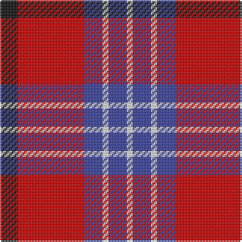

**Bands:** [KRBWBW](/stripes/krbwbw/) · **Stripes:** [K R DB W DB W](/stripes/stripes6/) K R DB W DB W

This was sourced from tartans-authority.  It is a [6 band tartan](/bands/bands6/).

Original link http://www.tartansauthority.com/tartan-ferret/display/8003/

## Thread count
K/12 R44 B12 LN4 B12 LN/4

## Palette
Each colour and its ΔE from the base-6 reference it is a variant of.

| Colour | Shade | Base | ΔE (OKLab) |
|---|---|---|---|
| B | <code style="background-color:#38409C;">#38409C</code> `#38409C` | B <code style="background-color:#2A418A;">#2A418A</code> | 0.04 |
| K | <code style="background-color:#101010;">#101010</code> `#101010` | K <code style="background-color:#000000;">#000000</code> | 0.17 |
| LN | <code style="background-color:#E0E0E0;">#E0E0E0</code> `#E0E0E0` | W <code style="background-color:#F7F7F7;">#F7F7F7</code> | 0.07 |
| R | <code style="background-color:#C80000;">#C80000</code> `#C80000` | R <code style="background-color:#CC0000;">#CC0000</code> | 0.01 |

# Sample pattern

## Nearest tartans

The nearest existing variants by ΔTartan distance.

1. [Superfast Ferries (Corporate)](/setts/s6/db1r16db6ly4db6w1~x4/) — ΔT 0.72
1. [Fazzolettone (Fashion?)](/setts/s7/w2db3r24db15w6db3ly2~x2/) — ΔT 0.80
1. [Fraser Red Clan Tartan Tartan Number: 1424. Earliest known date: 1842 Early references include Wilson's of Bannockburn, but Wilson did not name the sett. D W Stewart contends that this is in fact an early Grant tartan which he traced to a portrait of Robert Grant of Lurg (1678-1771), hanging at Troup House before it was closed around 1894. It is undoubtedly the most popular Fraser pattern today. See products available Copyright © Blair Urquhart, Comrie, 2015](/setts/s6/r1db6r1dg6r12w1~x2/) — ΔT 0.85
1. [Fraser VS](/setts/s6/r1db6r1dg6r12lb1/) — ΔT 0.89
1. [Galloway Red](/setts/s6/g3r2db22r22db2w3~x2/) — ΔT 0.90
1. [Graham of Menteith (Red)](/setts/s6/r36lb3r5k21db24k3~x2/) — ΔT 1.02
1. [Finnigan (Estimated threadcount)](/setts/s6/r3db15r3g8r20k2~x2/) — ΔT 1.07
1. [Nisbet Dress Rose (Dance)](/setts/s6/m3w1m20k8w8g2~x4/) — ΔT 1.12
1. [Thompson/Thomson/MacTavish](/setts/s6/t2r12db2t6k6t1~x4/) — ΔT 1.12
1. [Nesbit, Rose](/setts/s6/r6lb3r37k16lb16g4~x2/) — ΔT 1.16

## Neighbour map

Every grey dot is one of 14299 variants placed by the first two principal components of the ΔTartan feature space (44% of its variance). Red is this tartan; blue dots are its nearest — click one to open its page.

<svg viewBox="0 0 640 380" role="img" style="max-width:100%;height:auto;border:1px solid #e0e0e0;border-radius:4px;display:block" xmlns="http://www.w3.org/2000/svg"><image href="/nn/cloud.v1.png" width="640" height="380"/><a href="/setts/s6/db1r16db6ly4db6w1~x4/"><circle cx="279.6" cy="168.2" r="4" fill="#3465a4"><title>Superfast Ferries (Corporate)</title></circle></a><a href="/setts/s7/w2db3r24db15w6db3ly2~x2/"><circle cx="240.4" cy="158.3" r="4" fill="#3465a4"><title>Fazzolettone (Fashion?)</title></circle></a><a href="/setts/s6/r1db6r1dg6r12w1~x2/"><circle cx="293.5" cy="188.1" r="4" fill="#3465a4"><title>Fraser Red Clan Tartan Tartan Number: 1424. Earliest known date: 1842 Early references include Wilson's of Bannockburn, but Wilson did not name the sett. D W Stewart contends that this is in fact an early Grant tartan which he traced to a portrait of Robert Grant of Lurg (1678-1771), hanging at Troup House before it was closed around 1894. It is undoubtedly the most popular Fraser pattern today. See products available Copyright © Blair Urquhart, Comrie, 2015</title></circle></a><a href="/setts/s6/r1db6r1dg6r12lb1/"><circle cx="281.5" cy="184.5" r="4" fill="#3465a4"><title>Fraser VS</title></circle></a><a href="/setts/s6/g3r2db22r22db2w3~x2/"><circle cx="277.4" cy="178.6" r="4" fill="#3465a4"><title>Galloway Red</title></circle></a><a href="/setts/s6/r36lb3r5k21db24k3~x2/"><circle cx="249.2" cy="194.7" r="4" fill="#3465a4"><title>Graham of Menteith (Red)</title></circle></a><a href="/setts/s6/r3db15r3g8r20k2~x2/"><circle cx="286.5" cy="207.5" r="4" fill="#3465a4"><title>Finnigan (Estimated threadcount)</title></circle></a><a href="/setts/s6/m3w1m20k8w8g2~x4/"><circle cx="301.4" cy="152.0" r="4" fill="#3465a4"><title>Nisbet Dress Rose (Dance)</title></circle></a><a href="/setts/s6/t2r12db2t6k6t1~x4/"><circle cx="216.7" cy="192.1" r="4" fill="#3465a4"><title>Thompson/Thomson/MacTavish</title></circle></a><a href="/setts/s6/r6lb3r37k16lb16g4~x2/"><circle cx="266.8" cy="172.0" r="4" fill="#3465a4"><title>Nesbit, Rose</title></circle></a><circle cx="265.9" cy="177.9" r="5" fill="#c00000"/></svg>

ID: /setts/s6/k3r11db3w1db3w1~x4/
