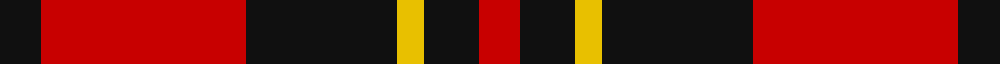
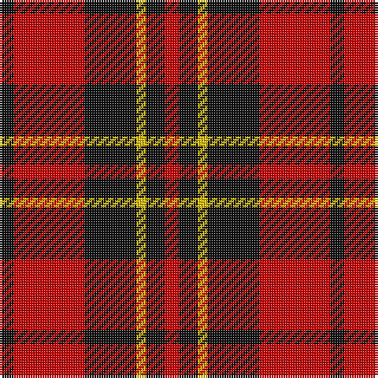

This page is one **sett** — a single exact thread-count. It belongs to the [tartan](/tartans/k3r15k11ly2k4r3/)
(the same proportion at any scale), whose colour order is pattern [KRKYKR](/stripes/krkykr/).

Sourced from register-of-tartans.  It is a [6 stripe tartan](/stripes/stripes6/).

Original link https://www.tartanregister.gov.uk/tartanDetails.aspx?ref=368

## Also known as

This cloth is also recorded under:

- Brodie Red

3 attestations — the source records this cloth was collapsed from (oldest owns this page)

<ul>
<li>01/01/1820 — Brodie (Clan) (register-of-tartans, <a href="https://www.tartanregister.gov.uk/tartanDetails.aspx?ref=368">record</a>)</li>
<li>undated — Brodie (weddslist, <a href="http://www.weddslist.com/cgi-bin/tartans/pg.pl?source=sts">record</a>)</li>
<li>undated — Brodie Red Clan Tartan Tartan Number: 1192. Earliest known date: 1850 The origins of the Brodie tartan are difficult to pin down. The earliest and most reliable source is the original manuscript for the Smiths' book, 'Authenticated Tartans of the Clans and Families of Scotland'(1850), although the sett was not included in the published work. The Smiths' sources included the findings of George Hunter, an army clothier, who toured the Highlands in search of old tartans prior to 1822. D.W. Stewart confirms this date but also mentions that the Brodies in Aberdeenshire wore the Huntly District tartan prior to 1820. There is also a different and more colourful sett recorded in the 'Baronage of Angus and Mearns' (1856) and a 'hunting' sett published in Johnston's 1st edition of 1891. See products available Copyright © Blair Urquhart, Comrie, 2015 (house-of-tartan, <a href="http://www.house-of-tartan.scotland.net/house/TartanViewjs.asp?colr=Def&tnam=1192">record</a>)</li>
</ul>

## Register references

External register numbers recorded for this tartan.

- Scottish Register of Tartans: [368](https://www.tartanregister.gov.uk/tartanDetails.aspx?ref=368)
- Scottish Tartans Authority (ITI): 1192
- Scottish Tartans World Register: 1192

## Thread count
K/6 R30 K22 Y4 K8 R/6

## Palette

Palette: <strong>Tartan Register</strong>
<table><thead><tr><th>Colour</th><th>Threads</th><th>Shade</th><th>Base</th><th>OKLCh</th></tr></thead><tbody><tr><td>K/</td><td style="text-align:right;font-variant-numeric:tabular-nums">6</td><td><code style="background-color:#101010;">#101010</code> <small style="color:#888">#101010</small></td><td>K <code style="background-color:#000000;">#000000</code></td><td><small style="color:#888">oklch(17.3% 0.000 89.9)</small></td></tr><tr><td>R</td><td style="text-align:right;font-variant-numeric:tabular-nums">30</td><td><code style="background-color:#C80000;">#C80000</code> <small style="color:#888">#C80000</small></td><td>R <code style="background-color:#CC0000;">#CC0000</code></td><td><small style="color:#888">oklch(52.3% 0.215 29.2)</small></td></tr><tr><td>K</td><td style="text-align:right;font-variant-numeric:tabular-nums">22</td><td><code style="background-color:#101010;">#101010</code> <small style="color:#888">#101010</small></td><td>K <code style="background-color:#000000;">#000000</code></td><td><small style="color:#888">oklch(17.3% 0.000 89.9)</small></td></tr><tr><td>Y</td><td style="text-align:right;font-variant-numeric:tabular-nums">4</td><td><code style="background-color:#E8C000;">#E8C000</code> <small style="color:#888">#E8C000</small></td><td>Y <code style="background-color:#F2BF00;">#F2BF00</code></td><td><small style="color:#888">oklch(81.9% 0.168 93.7)</small></td></tr><tr><td>K</td><td style="text-align:right;font-variant-numeric:tabular-nums">8</td><td><code style="background-color:#101010;">#101010</code> <small style="color:#888">#101010</small></td><td>K <code style="background-color:#000000;">#000000</code></td><td><small style="color:#888">oklch(17.3% 0.000 89.9)</small></td></tr><tr><td>R/</td><td style="text-align:right;font-variant-numeric:tabular-nums">6</td><td><code style="background-color:#C80000;">#C80000</code> <small style="color:#888">#C80000</small></td><td>R <code style="background-color:#CC0000;">#CC0000</code></td><td><small style="color:#888">oklch(52.3% 0.215 29.2)</small></td></tr></tbody></table>

# Sample pattern

## Nearest tartans

The nearest existing variants by ΔTartan distance, with this tartan at the top so the swatches line up against it.

ΔTartan

Tartan

Sett

—

<a href="/ttd/edit/#slug=k3r15k11ly2k4r3~x2">Brodie (Clan)</a> <a class="nn-out" href="/setts/s6/k3r15k11ly2k4r3~x2/" title="open its dictionary page">↗</a>

0.70

<a href="/setts/s8/r26k18r7k4ly4~x2/">Haig &amp; Haig Whisky</a>

0.72

<a href="/ttd/edit/#slug=k18r4k18r32w3~x2">Munro (Black and Red)</a> <a class="nn-out" href="/setts/s5/k18r4k18r32w3~x2/" title="open its dictionary page">↗</a>

0.73

<a href="/ttd/edit/#slug=r3k25r25k10lb3~x2">Bodog.com</a> <a class="nn-out" href="/setts/s5/r3k25r25k10lb3~x2/" title="open its dictionary page">↗</a>

0.86

<a href="/ttd/edit/#slug=k8r1k8r11ly1r1~x4">Swanstrom (Personal)</a> <a class="nn-out" href="/setts/s6/k8r1k8r11ly1r1~x4/" title="open its dictionary page">↗</a>

0.87

<a href="/ttd/edit/#slug=k1r8k8ly1~x6">Wallace</a> <a class="nn-out" href="/setts/s4/k1r8k8ly1~x6/" title="open its dictionary page">↗</a>

0.87

<a href="/ttd/edit/#slug=k1r8k8ly1~x4">Wallace (Clan)</a> <a class="nn-out" href="/setts/s4/k1r8k8ly1~x4/" title="open its dictionary page">↗</a>

0.96

<a href="/ttd/edit/#slug=r26k18r7k4ly4~x2">Haig &amp; Haig Whisky (Corporate)</a> <a class="nn-out" href="/setts/s5/r26k18r7k4ly4~x2/" title="open its dictionary page">↗</a>

0.98

<a href="/ttd/edit/#slug=r4k8r4k8r12k1ly2~x4">MacDonald of Ardnamurchan (Clan?)</a> <a class="nn-out" href="/setts/s7/r4k8r4k8r12k1ly2~x4/" title="open its dictionary page">↗</a>

0.99

<a href="/ttd/edit/#slug=r4k8r4k8r12k1ly1~x2">MacKeane (Clan?)</a> <a class="nn-out" href="/setts/s7/r4k8r4k8r12k1ly1~x2/" title="open its dictionary page">↗</a>

1.04

<a href="/ttd/edit/#slug=k4r33k24w3k4r3~x2">Monmouth College</a> <a class="nn-out" href="/setts/s6/k4r33k24w3k4r3~x2/" title="open its dictionary page">↗</a>

## Neighbour map

Every grey dot is one of 14359 variants placed by the first two principal components of the ΔTartan feature space (44% of its variance). Red is this tartan; blue dots are its nearest — click one to open its page.

<svg viewBox="0 0 640 380" role="img" style="max-width:100%;height:auto;border:1px solid #e0e0e0;border-radius:4px;display:block" xmlns="http://www.w3.org/2000/svg"><image href="/nn/cloud.v1.png" width="640" height="380"/><a href="/setts/s8/r26k18r7k4ly4~x2/"><circle cx="283.1" cy="228.7" r="4" fill="#3465a4"><title>Haig &amp; Haig Whisky</title></circle></a><a href="/setts/s5/k18r4k18r32w3~x2/"><circle cx="300.8" cy="228.4" r="4" fill="#3465a4"><title>Munro (Black and Red)</title></circle></a><a href="/setts/s5/r3k25r25k10lb3~x2/"><circle cx="316.6" cy="238.5" r="4" fill="#3465a4"><title>Bodog.com</title></circle></a><a href="/setts/s6/k8r1k8r11ly1r1~x4/"><circle cx="335.5" cy="215.8" r="4" fill="#3465a4"><title>Swanstrom (Personal)</title></circle></a><a href="/setts/s4/k1r8k8ly1~x6/"><circle cx="304.9" cy="243.9" r="4" fill="#3465a4"><title>Wallace</title></circle></a><a href="/setts/s4/k1r8k8ly1~x4/"><circle cx="304.9" cy="243.9" r="4" fill="#3465a4"><title>Wallace (Clan)</title></circle></a><a href="/setts/s5/r26k18r7k4ly4~x2/"><circle cx="313.1" cy="239.5" r="4" fill="#3465a4"><title>Haig &amp; Haig Whisky (Corporate)</title></circle></a><a href="/setts/s7/r4k8r4k8r12k1ly2~x4/"><circle cx="305.0" cy="216.5" r="4" fill="#3465a4"><title>MacDonald of Ardnamurchan (Clan?)</title></circle></a><a href="/setts/s7/r4k8r4k8r12k1ly1~x2/"><circle cx="326.8" cy="215.0" r="4" fill="#3465a4"><title>MacKeane (Clan?)</title></circle></a><a href="/setts/s6/k4r33k24w3k4r3~x2/"><circle cx="334.4" cy="194.5" r="4" fill="#3465a4"><title>Monmouth College</title></circle></a><circle cx="287.0" cy="229.0" r="5" fill="#c00000"/></svg>

ID: /setts/s6/k3r15k11ly2k4r3~x2/
