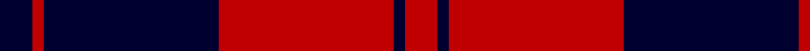
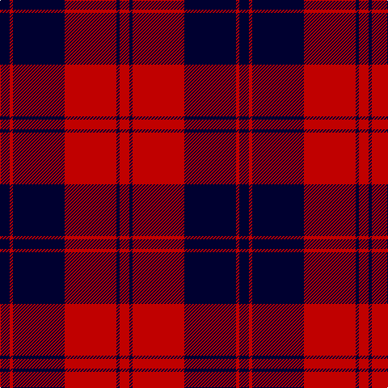

This page is one **sett** — a single exact thread-count. It belongs to the [tartan](/tartans/db3r1db16r16db1r3/)
(the same proportion at any scale), whose colour order is pattern [KRKRKR](/stripes/krkrkr/).

Sourced from weddslist.  It is a [6 stripe tartan](/stripes/stripes6/).

Original link http://www.weddslist.com/cgi-bin/tartans/pg.pl?source=sts

## Thread count
DB/12 R4 DB64 R64 DB4 R/12

## Palette
Each colour and the base-6 reference it is a variant of.

| Colour | Shade | Base |
|---|---|---|
| DB | <code style="background-color:#000030;">#000030</code> `oklch(14.0% 0.097 264.1)` <small>#000030</small> | K <code style="background-color:#000000;">#000000</code> |
| R | <code style="background-color:#C00000;">#C00000</code> `oklch(50.7% 0.208 29.2)` <small>#C00000</small> | R <code style="background-color:#CC0000;">#CC0000</code> |

# Sample pattern

## Nearest tartans

The nearest existing variants by ΔTartan distance, with this tartan at the top so the swatches line up against it.

ΔTartan

Tartan

Sett

—

<a href="/ttd/edit/#slug=k3r1k16r16k1r3~x4">The Mary Erskine</a> <a class="nn-out" href="/setts/s6/k3r1k16r16k1r3~x4/" title="open its dictionary page">↗</a>

1.29

<a href="/setts/s6/k23r3k1r12~x4/">Ewing</a>

1.39

<a href="/ttd/edit/#slug=r19k3r19k32g3k8~x2">Tartan TV</a> <a class="nn-out" href="/setts/s6/r19k3r19k32g3k8~x2/" title="open its dictionary page">↗</a>

1.41

<a href="/ttd/edit/#slug=k6r3k28r28k3r6~x2">Erskine, Black &amp; Red (Clan)</a> <a class="nn-out" href="/setts/s6/k6r3k28r28k3r6~x2/" title="open its dictionary page">↗</a>

1.42

<a href="/ttd/edit/#slug=k16r2k2r12w1~x2">MacIver</a> <a class="nn-out" href="/setts/s5/k16r2k2r12w1~x2/" title="open its dictionary page">↗</a>

1.43

<a href="/ttd/edit/#slug=db3o3db24o30db3o2~x2">Auburn University (Alabama) (Corp)</a> <a class="nn-out" href="/setts/s6/db3o3db24o30db3o2~x2/" title="open its dictionary page">↗</a>

1.45

<a href="/ttd/edit/#slug=k6r1k24r28k1r4~x2">Aragon (Erskine)</a> <a class="nn-out" href="/setts/s6/k6r1k24r28k1r4~x2/" title="open its dictionary page">↗</a>

1.47

<a href="/ttd/edit/#slug=r6w3r17k3r3k25r3~x2">Bon Accord</a> <a class="nn-out" href="/setts/s7/r6w3r17k3r3k25r3~x2/" title="open its dictionary page">↗</a>

1.49

<a href="/ttd/edit/#slug=k3r2k30r28k2r2w3~x2">Cunningham #2</a> <a class="nn-out" href="/setts/s7/k3r2k30r28k2r2w3~x2/" title="open its dictionary page">↗</a>

1.52

<a href="/ttd/edit/#slug=k2r16k8ly1k8r2~x4">Brodie (Clan)</a> <a class="nn-out" href="/setts/s6/k2r16k8ly1k8r2~x4/" title="open its dictionary page">↗</a>

1.58

<a href="/ttd/edit/#slug=k30r3k2r3k2r27k30r4~x2">Murray of Ochtertyre #2</a> <a class="nn-out" href="/setts/s8/k30r3k2r3k2r27k30r4~x2/" title="open its dictionary page">↗</a>

## Neighbour map

Every grey dot is one of 14299 variants placed by the first two principal components of the ΔTartan feature space (44% of its variance). Red is this tartan; blue dots are its nearest — click one to open its page.

<svg viewBox="0 0 640 380" role="img" style="max-width:100%;height:auto;border:1px solid #e0e0e0;border-radius:4px;display:block" xmlns="http://www.w3.org/2000/svg"><image href="/nn/cloud.v1.png" width="640" height="380"/><a href="/setts/s6/k23r3k1r12~x4/"><circle cx="431.0" cy="183.7" r="4" fill="#3465a4"><title>Ewing</title></circle></a><a href="/setts/s6/r19k3r19k32g3k8~x2/"><circle cx="311.4" cy="223.1" r="4" fill="#3465a4"><title>Tartan TV</title></circle></a><a href="/setts/s6/k6r3k28r28k3r6~x2/"><circle cx="361.6" cy="231.6" r="4" fill="#3465a4"><title>Erskine, Black &amp; Red (Clan)</title></circle></a><a href="/setts/s5/k16r2k2r12w1~x2/"><circle cx="360.3" cy="195.2" r="4" fill="#3465a4"><title>MacIver</title></circle></a><a href="/setts/s6/db3o3db24o30db3o2~x2/"><circle cx="411.9" cy="211.4" r="4" fill="#3465a4"><title>Auburn University (Alabama) (Corp)</title></circle></a><a href="/setts/s6/k6r1k24r28k1r4~x2/"><circle cx="416.7" cy="183.0" r="4" fill="#3465a4"><title>Aragon (Erskine)</title></circle></a><a href="/setts/s7/r6w3r17k3r3k25r3~x2/"><circle cx="296.0" cy="201.5" r="4" fill="#3465a4"><title>Bon Accord</title></circle></a><a href="/setts/s7/k3r2k30r28k2r2w3~x2/"><circle cx="350.9" cy="166.8" r="4" fill="#3465a4"><title>Cunningham #2</title></circle></a><a href="/setts/s6/k2r16k8ly1k8r2~x4/"><circle cx="341.2" cy="198.6" r="4" fill="#3465a4"><title>Brodie (Clan)</title></circle></a><a href="/setts/s8/k30r3k2r3k2r27k30r4~x2/"><circle cx="438.1" cy="204.6" r="4" fill="#3465a4"><title>Murray of Ochtertyre #2</title></circle></a><circle cx="376.1" cy="205.0" r="5" fill="#c00000"/></svg>

ID: /setts/s6/k3r1k16r16k1r3~x4/
