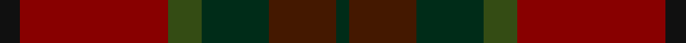
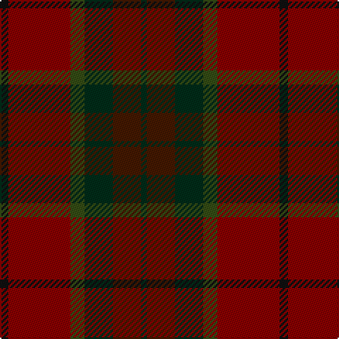

This page is one **sett** — a single exact thread-count. It belongs to the [tartan](/tartans/k3r22dgi5dg10do10dg2/)
(the same proportion at any scale), whose colour order is pattern [GBGGRK](/stripes/gbggrk/).

Sourced from register-of-tartans.  It is a [6 stripe tartan](/stripes/stripes6/).

Original link https://www.tartanregister.gov.uk/tartanDetails.aspx?ref=3581

2 attestations — the source records this cloth was collapsed from (oldest owns this page)

<ul>
<li>01/01/1978 — Rowardennan (register-of-tartans, <a href="https://www.tartanregister.gov.uk/tartanDetails.aspx?ref=3581">record</a>)</li>
<li>pre 1978 — Rowardennan (Fashion) (tartans-authority, <a href="http://www.tartansauthority.com/tartan-ferret/display/5409/">record</a>)</li>
</ul>

## Register references

External register numbers recorded for this tartan.

- Scottish Register of Tartans: [3581](https://www.tartanregister.gov.uk/tartanDetails.aspx?ref=3581)
- Scottish Tartans Authority (ITI): 5409

## Thread count
K/6 DRa44 G10 DG20 DR20 DG/4

## Palette

Palette: <strong>Tartan Register</strong> <small style="color:#888">(3 of 5 colours)</small>
<table><thead><tr><th>Colour</th><th>Threads</th><th>Shade</th><th>Base</th><th>OKLCh</th></tr></thead><tbody><tr><td>K/</td><td style="text-align:right;font-variant-numeric:tabular-nums">6</td><td><code style="background-color:#101010;">#101010</code> <small style="color:#888">#101010</small></td><td>K <code style="background-color:#000000;">#000000</code></td><td><small style="color:#888">oklch(17.3% 0.000 89.9)</small></td></tr><tr><td>DRa</td><td style="text-align:right;font-variant-numeric:tabular-nums">44</td><td><code style="background-color:#880000;">#880000</code> <small style="color:#888">#880000</small></td><td>R <code style="background-color:#CC0000;">#CC0000</code></td><td><small style="color:#888">oklch(39.4% 0.162 29.2)</small></td></tr><tr><td>G</td><td style="text-align:right;font-variant-numeric:tabular-nums">10</td><td><code style="background-color:#344C14;">#344C14</code> <small style="color:#888">#344C14</small></td><td>G <code style="background-color:#006100;">#006100</code></td><td><small style="color:#888">oklch(38.4% 0.086 129.7)</small></td></tr><tr><td>DG</td><td style="text-align:right;font-variant-numeric:tabular-nums">20</td><td><code style="background-color:#002C18;">#002C18</code> <small style="color:#888">#002C18</small></td><td>G <code style="background-color:#006100;">#006100</code></td><td><small style="color:#888">oklch(25.8% 0.060 158.1)</small></td></tr><tr><td>DR</td><td style="text-align:right;font-variant-numeric:tabular-nums">20</td><td><code style="background-color:#441800;">#441800</code> <small style="color:#888">#441800</small></td><td>B <code style="background-color:#2A418A;">#2A418A</code></td><td><small style="color:#888">oklch(27.3% 0.076 46.3)</small></td></tr><tr><td>DG/</td><td style="text-align:right;font-variant-numeric:tabular-nums">4</td><td><code style="background-color:#002C18;">#002C18</code> <small style="color:#888">#002C18</small></td><td>G <code style="background-color:#006100;">#006100</code></td><td><small style="color:#888">oklch(25.8% 0.060 158.1)</small></td></tr></tbody></table>

# Sample pattern

## Nearest tartans

The nearest existing variants by ΔTartan distance, with this tartan at the top so the swatches line up against it.

ΔTartan

Tartan

Sett

—

<a href="/ttd/edit/#slug=k3r22dgi5dg10do10dg2~x2">Rowardennan</a> <a class="nn-out" href="/setts/s6/k3r22dgi5dg10do10dg2~x2/" title="open its dictionary page">↗</a>

1.31

<a href="/ttd/edit/#slug=r11dg1r3y7dg7dy5o3~x4">Caledonian Maple (Fashion)</a> <a class="nn-out" href="/setts/s7/r11dg1r3y7dg7dy5o3~x4/" title="open its dictionary page">↗</a>

1.35

<a href="/ttd/edit/#slug=dr9o9n9r1db1o9db1r1~x4">Jardine, of Castlemilk</a> <a class="nn-out" href="/setts/s8/dr9o9n9r1db1o9db1r1~x4/" title="open its dictionary page">↗</a>

1.43

<a href="/ttd/edit/#slug=g3dy4g2dy22n5r16ly3~x2">Pubcrawlers (Corporate)</a> <a class="nn-out" href="/setts/s7/g3dy4g2dy22n5r16ly3~x2/" title="open its dictionary page">↗</a>

1.66

<a href="/ttd/edit/#slug=dr12dy1dg12dy12ly2dy12dg12dy1dr12t2~x2">United Distillers Corporate Tartan Tartan Number: 2098. Earliest known date: 1989 An expression of evocative Scottish colours to reflect the corporate image of quality and style. (weft) lb4 b24 lb2 dg24 g24 r4 See products available Copyright © Blair Urquhart, Comrie, 2015</a> <a class="nn-out" href="/setts/s10/dr12dy1dg12dy12ly2dy12dg12dy1dr12t2~x2/" title="open its dictionary page">↗</a>

1.69

<a href="/ttd/edit/#slug=dy35dg19r3g8r3dg8r3db3~x2">John Muir Way</a> <a class="nn-out" href="/setts/s8/dy35dg19r3g8r3dg8r3db3~x2/" title="open its dictionary page">↗</a>

1.79

<a href="/ttd/edit/#slug=dy35dg19r3y8r3dg8r3t3~x2">John Muir Way</a> <a class="nn-out" href="/setts/s8/dy35dg19r3y8r3dg8r3t3~x2/" title="open its dictionary page">↗</a>

1.80

<a href="/ttd/edit/#slug=do10y24r3y3r24dg3y6do6~x2">Earle's Flame (Fashion)</a> <a class="nn-out" href="/setts/s8/do10y24r3y3r24dg3y6do6~x2/" title="open its dictionary page">↗</a>

1.84

<a href="/ttd/edit/#slug=db2o22dy11ly2dy11db2~x2">Cetoloni Family Tartan Tartan Number: 2049. Earliest known date: November 1991 The Cetoloni tartan was designed with the colours of the Border Hills, 'the sky at its best, the rooftop skyline of Siena and the golden sun of Tuscany'. Franco Cetoloni of Liddlevale was born in Badia Roti Bucine in Arezzo, Italy. Jayne was a designer at Pringle's knitwear in Hawick. Red is Sienna red. See products available Copyright © Blair Urquhart, Comrie, 2015</a> <a class="nn-out" href="/setts/s6/db2o22dy11ly2dy11db2~x2/" title="open its dictionary page">↗</a>

1.85

<a href="/ttd/edit/#slug=do6o4n22r4k22do22k2r5k2do6~x2">Lochaber (Ingles Buchan)</a> <a class="nn-out" href="/setts/s10/do6o4n22r4k22do22k2r5k2do6~x2/" title="open its dictionary page">↗</a>

1.86

<a href="/ttd/edit/#slug=do6lg3do18dy2do2dy10y28r2y4~x2">Scottish Crofting Foundation</a> <a class="nn-out" href="/setts/s9/do6lg3do18dy2do2dy10y28r2y4~x2/" title="open its dictionary page">↗</a>

## Neighbour map

Every grey dot is one of 14359 variants placed by the first two principal components of the ΔTartan feature space (44% of its variance). Red is this tartan; blue dots are its nearest — click one to open its page.

<svg viewBox="0 0 640 380" role="img" style="max-width:100%;height:auto;border:1px solid #e0e0e0;border-radius:4px;display:block" xmlns="http://www.w3.org/2000/svg"><image href="/nn/cloud.v1.png" width="640" height="380"/><a href="/setts/s7/r11dg1r3y7dg7dy5o3~x4/"><circle cx="241.5" cy="251.2" r="4" fill="#3465a4"><title>Caledonian Maple (Fashion)</title></circle></a><a href="/setts/s8/dr9o9n9r1db1o9db1r1~x4/"><circle cx="291.7" cy="234.3" r="4" fill="#3465a4"><title>Jardine, of Castlemilk</title></circle></a><a href="/setts/s7/g3dy4g2dy22n5r16ly3~x2/"><circle cx="316.9" cy="215.9" r="4" fill="#3465a4"><title>Pubcrawlers (Corporate)</title></circle></a><a href="/setts/s10/dr12dy1dg12dy12ly2dy12dg12dy1dr12t2~x2/"><circle cx="234.1" cy="227.0" r="4" fill="#3465a4"><title>United Distillers Corporate Tartan Tartan Number: 2098. Earliest known date: 1989 An expression of evocative Scottish colours to reflect the corporate image of quality and style. (weft) lb4 b24 lb2 dg24 g24 r4 See products available Copyright © Blair Urquhart, Comrie, 2015</title></circle></a><a href="/setts/s8/dy35dg19r3g8r3dg8r3db3~x2/"><circle cx="300.3" cy="205.9" r="4" fill="#3465a4"><title>John Muir Way</title></circle></a><a href="/setts/s8/dy35dg19r3y8r3dg8r3t3~x2/"><circle cx="301.9" cy="206.4" r="4" fill="#3465a4"><title>John Muir Way</title></circle></a><a href="/setts/s8/do10y24r3y3r24dg3y6do6~x2/"><circle cx="341.5" cy="262.0" r="4" fill="#3465a4"><title>Earle's Flame (Fashion)</title></circle></a><a href="/setts/s6/db2o22dy11ly2dy11db2~x2/"><circle cx="357.3" cy="243.3" r="4" fill="#3465a4"><title>Cetoloni Family Tartan Tartan Number: 2049. Earliest known date: November 1991 The Cetoloni tartan was designed with the colours of the Border Hills, 'the sky at its best, the rooftop skyline of Siena and the golden sun of Tuscany'. Franco Cetoloni of Liddlevale was born in Badia Roti Bucine in Arezzo, Italy. Jayne was a designer at Pringle's knitwear in Hawick. Red is Sienna red. See products available Copyright © Blair Urquhart, Comrie, 2015</title></circle></a><a href="/setts/s10/do6o4n22r4k22do22k2r5k2do6~x2/"><circle cx="236.2" cy="206.8" r="4" fill="#3465a4"><title>Lochaber (Ingles Buchan)</title></circle></a><a href="/setts/s9/do6lg3do18dy2do2dy10y28r2y4~x2/"><circle cx="309.7" cy="194.6" r="4" fill="#3465a4"><title>Scottish Crofting Foundation</title></circle></a><circle cx="297.1" cy="247.7" r="5" fill="#c00000"/></svg>

ID: /setts/s6/k3r22dgi5dg10do10dg2~x2/
