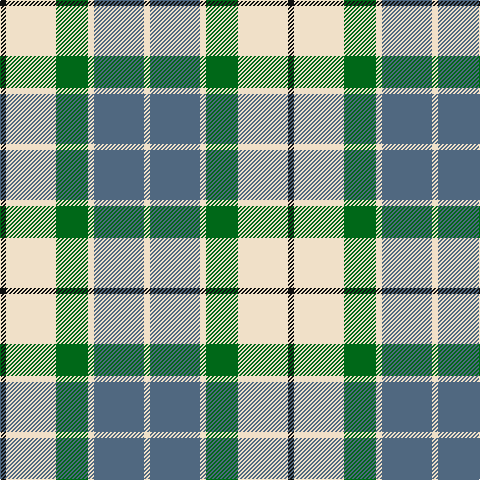

In pattern [KWGWBW](/patterns/kwgwbw/).

This was sourced from tartans-authority.  It is a [6 stripes tartan](/stripes/stripes6/).

Original link http://www.tartansauthority.com/tartan-ferret/display/7599/

## Attestations

This cloth appears in 2 source records; the oldest owns this page.

- March 2008 — Birnham, Blue (Dance) (tartans-authority, [record](http://www.tartansauthority.com/tartan-ferret/display/7599/))
- undated — Birnham Blue (register-of-tartans, [record](https://www.tartanregister.gov.uk/tartanDetails.aspx?ref=5623))

## Register references

External register numbers recorded for this tartan.

- Scottish Register of Tartans: [5623](https://www.tartanregister.gov.uk/tartanDetails.aspx?ref=5623)
- Scottish Tartans Authority (ITI): 7599

## Thread count
K/6 W50 G32 W6 B50 W/6

## Palette
Each colour and its ΔE from the base-6 reference it is a variant of.

| Colour | Shade | Base | ΔE (OKLab) |
|---|---|---|---|
| B | <code style="background-color:#506880;">#506880</code> `#506880` | B <code style="background-color:#2A418A;">#2A418A</code> | 0.13 |
| G | <code style="background-color:#006818;">#006818</code> `#006818` | G <code style="background-color:#006100;">#006100</code> | 0.02 |
| K | <code style="background-color:#101010;">#101010</code> `#101010` | K <code style="background-color:#000000;">#000000</code> | 0.17 |
| W | <code style="background-color:#F0E0C8;">#F0E0C8</code> `#F0E0C8` | W <code style="background-color:#F7F7F7;">#F7F7F7</code> | 0.07 |

# Sample pattern

## Nearest tartans

The nearest existing variants by ΔTartan distance.

1. [Cercle de Fermières de Saint-Élie d'Orford](/setts/s7/r2y1b8r1ya7y1r2~b1464f4-rff0000-yffec8b-ya00c957~x6/) — ΔT 0.90
1. [MacIntosh, dress](/setts/s6/r3w8b4g14r4b2~b304080-g008000-rc00000-we0e0e0~x2/) — ΔT 1.03
1. [Supporter.com](/setts/s7/b60g9r7y12g33y33b26~b2888c4-g006818-rc80000-yfccc00/) — ΔT 1.09
1. [Thomson, Camel (Fashion)](/setts/s6/r4y30k6w13k13w3~k101010-rc80000-we0e0e0-yb8a47c~x2/) — ΔT 1.15
1. [MacIntosh Dress Clan Tartan Tartan Number: 538. Earliest known date: pre 2003 From an old pattern book in possesion of Messrs Scott Adie of London. See products available Copyright © Blair Urquhart, Comrie, 2015](/setts/s6/r3w8b4g14r4b2~b2c2c80-g006818-rc80000-we0e0e0~x2/) — ΔT 1.17
1. [Un-named (D C Dalgliesh) #3](/setts/s6/g3y24k15r3g25k3~g408060-k101010-ra888b4-ye09894~x2/) — ΔT 1.21
1. [MacTavish of Dunardry (Clan)](/setts/s7/b8w28y3g3b8k9b4~b5c8ca8-g408060-k101010-we0e0e0-ya08858~x2/) — ΔT 1.24
1. [Beck-McSorley](/setts/s8/r1g1w1wa7g7w1g1w1~g285800-re87878-wc49cd8-wac0c0c0~x6/) — ΔT 1.25
1. [Thompson Camel Clan Tartan Tartan Number: 2421. Earliest known date: 1967 Designed by Scotty Thompson. It it a simple colour variation on the usual blue Thompson, but is often confused with the Burberry Check. See products available Copyright © Blair Urquhart, Comrie, 2015](/setts/s6/r2y20k5w10k10w2~k101010-rc80000-we0e0e0-ya08858~x2/) — ΔT 1.30
1. [Thomson Camel](/setts/s6/r4y30k6w13k13w3~k101010-rc80000-we0e0e0-ya08858~x2/) — ΔT 1.31

## Neighbour map

Every grey dot is one of 15726 variants placed by the first two principal components of the ΔTartan feature space (44% of its variance). Red is this tartan; blue dots are its nearest — click one to open its page.

<svg viewBox="0 0 640 380" role="img" style="max-width:100%;height:auto;border:1px solid #e0e0e0;border-radius:4px;display:block" xmlns="http://www.w3.org/2000/svg"><image href="/nn/cloud.v1.png" width="640" height="380"/><a href="/setts/s7/r2y1b8r1ya7y1r2~b1464f4-rff0000-yffec8b-ya00c957~x6/"><circle cx="147.8" cy="184.3" r="4" fill="#3465a4"><title>Cercle de Fermières de Saint-Élie d'Orford</title></circle></a><a href="/setts/s6/r3w8b4g14r4b2~b304080-g008000-rc00000-we0e0e0~x2/"><circle cx="148.8" cy="217.6" r="4" fill="#3465a4"><title>MacIntosh, dress</title></circle></a><a href="/setts/s7/b60g9r7y12g33y33b26~b2888c4-g006818-rc80000-yfccc00/"><circle cx="206.2" cy="216.7" r="4" fill="#3465a4"><title>Supporter.com</title></circle></a><a href="/setts/s6/r4y30k6w13k13w3~k101010-rc80000-we0e0e0-yb8a47c~x2/"><circle cx="183.9" cy="187.9" r="4" fill="#3465a4"><title>Thomson, Camel (Fashion)</title></circle></a><a href="/setts/s6/r3w8b4g14r4b2~b2c2c80-g006818-rc80000-we0e0e0~x2/"><circle cx="146.8" cy="216.7" r="4" fill="#3465a4"><title>MacIntosh Dress Clan Tartan Tartan Number: 538. Earliest known date: pre 2003 From an old pattern book in possesion of Messrs Scott Adie of London. See products available Copyright © Blair Urquhart, Comrie, 2015</title></circle></a><a href="/setts/s6/g3y24k15r3g25k3~g408060-k101010-ra888b4-ye09894~x2/"><circle cx="177.6" cy="207.2" r="4" fill="#3465a4"><title>Un-named (D C Dalgliesh) #3</title></circle></a><a href="/setts/s7/b8w28y3g3b8k9b4~b5c8ca8-g408060-k101010-we0e0e0-ya08858~x2/"><circle cx="174.4" cy="163.1" r="4" fill="#3465a4"><title>MacTavish of Dunardry (Clan)</title></circle></a><a href="/setts/s8/r1g1w1wa7g7w1g1w1~g285800-re87878-wc49cd8-wac0c0c0~x6/"><circle cx="222.0" cy="185.3" r="4" fill="#3465a4"><title>Beck-McSorley</title></circle></a><a href="/setts/s6/r2y20k5w10k10w2~k101010-rc80000-we0e0e0-ya08858~x2/"><circle cx="174.2" cy="194.0" r="4" fill="#3465a4"><title>Thompson Camel Clan Tartan Tartan Number: 2421. Earliest known date: 1967 Designed by Scotty Thompson. It it a simple colour variation on the usual blue Thompson, but is often confused with the Burberry Check. See products available Copyright © Blair Urquhart, Comrie, 2015</title></circle></a><a href="/setts/s6/r4y30k6w13k13w3~k101010-rc80000-we0e0e0-ya08858~x2/"><circle cx="188.6" cy="191.0" r="4" fill="#3465a4"><title>Thomson Camel</title></circle></a><circle cx="178.1" cy="201.5" r="5" fill="#c00000"/></svg>

ID: /setts/s6/k3w25g16w3b25w3~b506880-g006818-k101010-wf0e0c8~x2/
