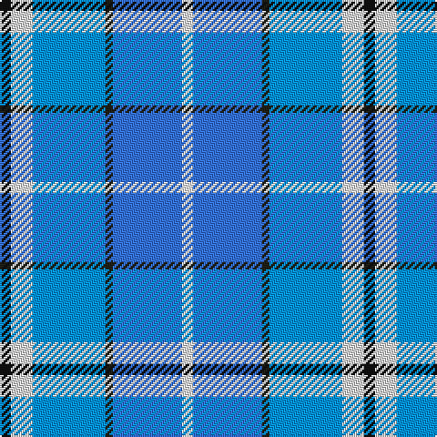

In pattern [KWBBBW](/patterns/kwbbbw/).

This was sourced from register-of-tartans.  It is a [6 stripes tartan](/stripes/stripes6/).

Original link https://www.tartanregister.gov.uk/tartanDetails.aspx?ref=11464

## Thread count
K/6 LN12 B40 Ka4 Ba38 W/6

## Palette
Each colour and its ΔE from the base-6 reference it is a variant of.

| Colour | Shade | Base | ΔE (OKLab) |
|---|---|---|---|
| B | <code style="background-color:#0596FA;">#0596FA</code> `#0596FA` | B <code style="background-color:#2A418A;">#2A418A</code> | 0.27 |
| Ba | <code style="background-color:#3474FC;">#3474FC</code> `#3474FC` | B <code style="background-color:#2A418A;">#2A418A</code> | 0.22 |
| K | <code style="background-color:#101010;">#101010</code> `#101010` | K <code style="background-color:#000000;">#000000</code> | 0.17 |
| Ka | <code style="background-color:#202016;">#202016</code> `#202016` | B <code style="background-color:#2A418A;">#2A418A</code> | 0.21 |
| LN | <code style="background-color:#E0E0E0;">#E0E0E0</code> `#E0E0E0` | W <code style="background-color:#F7F7F7;">#F7F7F7</code> | 0.07 |
| W | <code style="background-color:#FFFFFF;">#FFFFFF</code> `#FFFFFF` | W <code style="background-color:#F7F7F7;">#F7F7F7</code> | 0.02 |

# Sample pattern

## Nearest tartans

The nearest existing variants by ΔTartan distance.

1. [Isle of Barra (District)](/setts/s6/b2w12ba11bb12k1g2x4~b780078-ba1474b4-bb2888c4-g289c18-k101010-we0e0e0/) — ΔT 1.76
1. [Lopatinsky](/setts/s8/b4r1w1r1b4k2ba6y1x6~b0000ff-ba2888c4-k101010-rdc0000-wffffff-yffff00/) — ΔT 1.87
1. [SABA](/setts/s5/w3b2ba15bb15r2x4~b003c64-ba2c2c80-bb2888c4-rc80000-we0e0e0/) — ΔT 1.92
1. [Queensferry High School: Ferry Fling](/setts/s9/w5wa3wb7w5wb27b8ba43wc3wb3~b4169e1-ba000080-wd3d3d3-wafffafa-wb7ec0ee-wcffffff/) — ΔT 1.94
1. [Ancient Gathering](/setts/s8/b1w12ba6wa1y3b14bb18wa1x2~b202060-ba9058d8-bb1870a4-w98c8e8-wafcfcfc-ye8c000/) — ΔT 1.99
1. [Dignan School of Dancing](/setts/s7/y4r2b32k10ba4w21ba2x2~b2474e8-ba6c0070-k101010-r880000-wc0c0c0-yd09800/) — ΔT 2.01
1. [Earl of St. Andrews Dress (Dance)](/setts/s7/w20b14ba14w4bb2bc2ba7x2~b2c2c80-ba1870a4-bb003c64-bc5c8ca8-we0e0e0/) — ΔT 2.02
1. [Georgian Bay, Waters of](/setts/s6/b35w3b8ba36g9r3x2~b1b3f8b-ba009acd-g002618-rbb7168-wffffff/) — ΔT 2.04
1. [Afternoon Tea / Mint Tea](/setts/s6/w15y98b72ba25b8ya15~b003c64-ba1474b4-wffffff-y48a4c0-yaf8e38c/) — ΔT 2.04
1. [Queensferry High (School)](/setts/s9/y5w3wa7y5wa27b8ba43wb3wa3~b4444bc-ba003c64-wc8c8c8-waa8ace8-wbe0e0e0-y949494/) — ΔT 2.07

## Neighbour map

Every grey dot is one of 15726 variants placed by the first two principal components of the ΔTartan feature space (44% of its variance). Red is this tartan; blue dots are its nearest — click one to open its page.

<svg viewBox="0 0 640 380" role="img" style="max-width:100%;height:auto;border:1px solid #e0e0e0;border-radius:4px;display:block" xmlns="http://www.w3.org/2000/svg"><image href="/nn/cloud.v1.png" width="640" height="380"/><a href="/setts/s6/b2w12ba11bb12k1g2x4~b780078-ba1474b4-bb2888c4-g289c18-k101010-we0e0e0/"><circle cx="111.7" cy="169.8" r="4" fill="#3465a4"><title>Isle of Barra (District)</title></circle></a><a href="/setts/s8/b4r1w1r1b4k2ba6y1x6~b0000ff-ba2888c4-k101010-rdc0000-wffffff-yffff00/"><circle cx="88.0" cy="180.0" r="4" fill="#3465a4"><title>Lopatinsky</title></circle></a><a href="/setts/s5/w3b2ba15bb15r2x4~b003c64-ba2c2c80-bb2888c4-rc80000-we0e0e0/"><circle cx="199.8" cy="215.5" r="4" fill="#3465a4"><title>SABA</title></circle></a><a href="/setts/s9/w5wa3wb7w5wb27b8ba43wc3wb3~b4169e1-ba000080-wd3d3d3-wafffafa-wb7ec0ee-wcffffff/"><circle cx="162.0" cy="111.2" r="4" fill="#3465a4"><title>Queensferry High School: Ferry Fling</title></circle></a><a href="/setts/s8/b1w12ba6wa1y3b14bb18wa1x2~b202060-ba9058d8-bb1870a4-w98c8e8-wafcfcfc-ye8c000/"><circle cx="121.7" cy="127.1" r="4" fill="#3465a4"><title>Ancient Gathering</title></circle></a><a href="/setts/s7/y4r2b32k10ba4w21ba2x2~b2474e8-ba6c0070-k101010-r880000-wc0c0c0-yd09800/"><circle cx="175.0" cy="127.8" r="4" fill="#3465a4"><title>Dignan School of Dancing</title></circle></a><a href="/setts/s7/w20b14ba14w4bb2bc2ba7x2~b2c2c80-ba1870a4-bb003c64-bc5c8ca8-we0e0e0/"><circle cx="140.6" cy="181.3" r="4" fill="#3465a4"><title>Earl of St. Andrews Dress (Dance)</title></circle></a><a href="/setts/s6/b35w3b8ba36g9r3x2~b1b3f8b-ba009acd-g002618-rbb7168-wffffff/"><circle cx="244.3" cy="192.1" r="4" fill="#3465a4"><title>Georgian Bay, Waters of</title></circle></a><a href="/setts/s6/w15y98b72ba25b8ya15~b003c64-ba1474b4-wffffff-y48a4c0-yaf8e38c/"><circle cx="189.5" cy="179.5" r="4" fill="#3465a4"><title>Afternoon Tea / Mint Tea</title></circle></a><a href="/setts/s9/y5w3wa7y5wa27b8ba43wb3wa3~b4444bc-ba003c64-wc8c8c8-waa8ace8-wbe0e0e0-y949494/"><circle cx="193.6" cy="119.5" r="4" fill="#3465a4"><title>Queensferry High (School)</title></circle></a><circle cx="146.5" cy="170.9" r="5" fill="#c00000"/></svg>

ID: /setts/s6/k3w6b20ba2bb19wa3x2~b0596fa-ba202016-bb3474fc-k101010-we0e0e0-waffffff/
