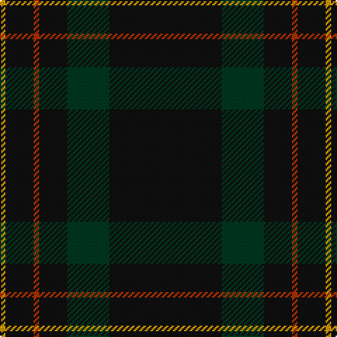

**Bands:** [KGKRKY](/stripes/kgkrky/) · **Stripes:** [K DG K R K LO](/stripes/stripes6/) K DG K R K LO

This was sourced from tartans-authority.  It is a [6 band tartan](/bands/bands6/).

Original link http://www.tartansauthority.com/tartan-ferret/display/3816/

## Thread count
DY/4 K20 R4 K20 DG30 K/80

## Palette
Each colour and its ΔE from the base-6 reference it is a variant of.

| Colour | Shade | Base | ΔE (OKLab) |
|---|---|---|---|
| DG | <code style="background-color:#003820;">#003820</code> `#003820` | G <code style="background-color:#006100;">#006100</code> | 0.15 |
| DY | <code style="background-color:#D09800;">#D09800</code> `#D09800` | Y <code style="background-color:#F2BF00;">#F2BF00</code> | 0.12 |
| K | <code style="background-color:#101010;">#101010</code> `#101010` | K <code style="background-color:#000000;">#000000</code> | 0.17 |
| R | <code style="background-color:#B03000;">#B03000</code> `#B03000` | R <code style="background-color:#CC0000;">#CC0000</code> | 0.06 |

# Sample pattern

## Nearest tartans

The nearest existing variants by ΔTartan distance.

1. [Langhein Family Tartan Tartan Number: 3235. Earliest known date: April 2002 Based on Black Watch Sett See products available Copyright © Blair Urquhart, Comrie, 2015](/setts/s7/k40dg15k10r2k10ly2k10~x2/) — ΔT 0.72
1. [Langhein, Alex (Personal)](/setts/s8/k40dg15k10r2k10lo2k10lo2~x2/) — ΔT 1.13
1. [Burnetts & Struth](/setts/s5/dt68t7dt16k16lo4~x2/) — ΔT 1.24
1. [Kalkofen](/setts/s10/k40dg15k10r2k10lo2k10r2k10dg15~x2/) — ΔT 1.45
1. [Langhein, Alex (Personal)](/setts/s7/k40dg15k10r2k10lo2k10~x2/) — ΔT 1.56
1. [Miramichi](/setts/s5/dg31lo1dg18db18r1~x2/) — ΔT 1.56
1. [CI (Corporate)](/setts/s9/k100dp8o4k4o4dp8k25db10o4/) — ΔT 1.89
1. [Witches' Blood, The](/setts/s10/k22n17k2n4k2n2k37n4k2r3~x2/) — ΔT 1.98
1. [Silver Thistle (Fashion)](/setts/s7/g4db3k6db20k46o2k4~x2/) — ΔT 2.01
1. [Burnett's & Struth (Corporate)](/setts/s5/dt68b7dt16k16lo4~x2/) — ΔT 2.04

## Neighbour map

Every grey dot is one of 14313 variants placed by the first two principal components of the ΔTartan feature space (44% of its variance). Red is this tartan; blue dots are its nearest — click one to open its page.

<svg viewBox="0 0 640 380" role="img" style="max-width:100%;height:auto;border:1px solid #e0e0e0;border-radius:4px;display:block" xmlns="http://www.w3.org/2000/svg"><image href="/nn/cloud.v1.png" width="640" height="380"/><a href="/setts/s7/k40dg15k10r2k10ly2k10~x2/"><circle cx="568.7" cy="233.4" r="4" fill="#3465a4"><title>Langhein Family Tartan Tartan Number: 3235. Earliest known date: April 2002 Based on Black Watch Sett See products available Copyright © Blair Urquhart, Comrie, 2015</title></circle></a><a href="/setts/s8/k40dg15k10r2k10lo2k10lo2~x2/"><circle cx="544.6" cy="213.1" r="4" fill="#3465a4"><title>Langhein, Alex (Personal)</title></circle></a><a href="/setts/s5/dt68t7dt16k16lo4~x2/"><circle cx="551.3" cy="244.9" r="4" fill="#3465a4"><title>Burnetts &amp; Struth</title></circle></a><a href="/setts/s10/k40dg15k10r2k10lo2k10r2k10dg15~x2/"><circle cx="511.1" cy="230.3" r="4" fill="#3465a4"><title>Kalkofen</title></circle></a><a href="/setts/s7/k40dg15k10r2k10lo2k10~x2/"><circle cx="548.3" cy="220.5" r="4" fill="#3465a4"><title>Langhein, Alex (Personal)</title></circle></a><a href="/setts/s5/dg31lo1dg18db18r1~x2/"><circle cx="537.5" cy="245.0" r="4" fill="#3465a4"><title>Miramichi</title></circle></a><a href="/setts/s9/k100dp8o4k4o4dp8k25db10o4/"><circle cx="587.6" cy="173.1" r="4" fill="#3465a4"><title>CI (Corporate)</title></circle></a><a href="/setts/s10/k22n17k2n4k2n2k37n4k2r3~x2/"><circle cx="514.8" cy="206.6" r="4" fill="#3465a4"><title>Witches' Blood, The</title></circle></a><a href="/setts/s7/g4db3k6db20k46o2k4~x2/"><circle cx="474.9" cy="187.4" r="4" fill="#3465a4"><title>Silver Thistle (Fashion)</title></circle></a><a href="/setts/s5/dt68b7dt16k16lo4~x2/"><circle cx="548.2" cy="240.7" r="4" fill="#3465a4"><title>Burnett's &amp; Struth (Corporate)</title></circle></a><circle cx="566.4" cy="243.3" r="5" fill="#c00000"/></svg>

ID: /setts/s6/k40dg15k10r2k10lo2~x2/
