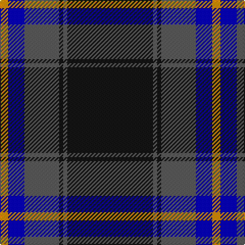

In pattern [KBKBBY](/patterns/kbkbby/).

This was sourced from register-of-tartans.  It is a [6 stripes tartan](/stripes/stripes6/).

Original link https://www.tartanregister.gov.uk/tartanDetails.aspx?ref=743

## Register references

External register numbers recorded for this tartan.

- Scottish Register of Tartans: [743](https://www.tartanregister.gov.uk/tartanDetails.aspx?ref=743)
- Scottish Tartans Authority (ITI): 4143

## Thread count
DY/8 DB16 N34 K4 N4 K/84

## Palette
Each colour and its ΔE from the base-6 reference it is a variant of.

| Colour | Shade | Base | ΔE (OKLab) |
|---|---|---|---|
| DB | <code style="background-color:#00008C;">#00008C</code> `#00008C` | B <code style="background-color:#2A418A;">#2A418A</code> | 0.13 |
| DY | <code style="background-color:#C88C00;">#C88C00</code> `#C88C00` | Y <code style="background-color:#F2BF00;">#F2BF00</code> | 0.15 |
| K | <code style="background-color:#141414;">#141414</code> `#141414` | K <code style="background-color:#000000;">#000000</code> | 0.19 |
| N | <code style="background-color:#5C5C5C;">#5C5C5C</code> `#5C5C5C` | B <code style="background-color:#2A418A;">#2A418A</code> | 0.15 |

# Sample pattern

## Nearest tartans

The nearest existing variants by ΔTartan distance.

1. [Mountain Rescue Association Honor Guard](/setts/s7/k32b2k6b2k13ba30w2~b0000ff-ba2f4f4f-k101010-wffffff~x2/) — ΔT 0.83
1. [Mountain Rescue Assoc. (Corporate)](/setts/s7/k32b2k6b2k13ba30w2~b1474b4-ba5c5c5c-k101010-wfcfcfc~x2/) — ΔT 0.95
1. [Kelley Oliphint](/setts/s5/b3k31ba27w2k3~b871f78-ba555555-k101010-wffffff~x2/) — ΔT 1.07
1. [Edinburgh, The University of](/setts/s7/k8r26k22b110w4k5w4~b145064-k101010-r781c38-we0e0e0/) — ΔT 1.17
1. [City of Rome Pipe Band (Corporate)](/setts/s7/r12y6k88b45k6b6ya6~b2c2c80-k101010-r901c38-yd87c00-yae8c000/) — ΔT 1.26
1. [Tern House](/setts/s7/g23b3k8b4g4b56y8~b2c2c80-g006818-k101010-yd8b000/) — ΔT 1.26
1. [Patriot, The (Fashion)](/setts/s7/k10b4k34ba2k2ba30w3~b1c0070-ba2c3c44-k101010-we0e0e0~x2/) — ΔT 1.30
1. [University of Edinburgh](/setts/s7/k8r26k22b110w4k5w4~b484c68-k101010-r780028-we0e0e0/) — ΔT 1.31
1. [Unnamed C20th - USA](/setts/s7/b2y1b18g7r7b1g1~b2c2c80-g006818-rc80000-ye8c000~x2/) — ΔT 1.31
1. [Monarchs](/setts/s6/b19k4ba1k4g9ba1~b304080-ba600030-g006030-k000000~x4/) — ΔT 1.32

## Neighbour map

Every grey dot is one of 15726 variants placed by the first two principal components of the ΔTartan feature space (44% of its variance). Red is this tartan; blue dots are its nearest — click one to open its page.

<svg viewBox="0 0 640 380" role="img" style="max-width:100%;height:auto;border:1px solid #e0e0e0;border-radius:4px;display:block" xmlns="http://www.w3.org/2000/svg"><image href="/nn/cloud.v1.png" width="640" height="380"/><a href="/setts/s7/k32b2k6b2k13ba30w2~b0000ff-ba2f4f4f-k101010-wffffff~x2/"><circle cx="374.6" cy="200.7" r="4" fill="#3465a4"><title>Mountain Rescue Association Honor Guard</title></circle></a><a href="/setts/s7/k32b2k6b2k13ba30w2~b1474b4-ba5c5c5c-k101010-wfcfcfc~x2/"><circle cx="364.2" cy="192.6" r="4" fill="#3465a4"><title>Mountain Rescue Assoc. (Corporate)</title></circle></a><a href="/setts/s5/b3k31ba27w2k3~b871f78-ba555555-k101010-wffffff~x2/"><circle cx="338.8" cy="206.5" r="4" fill="#3465a4"><title>Kelley Oliphint</title></circle></a><a href="/setts/s7/k8r26k22b110w4k5w4~b145064-k101010-r781c38-we0e0e0/"><circle cx="425.2" cy="156.6" r="4" fill="#3465a4"><title>Edinburgh, The University of</title></circle></a><a href="/setts/s7/r12y6k88b45k6b6ya6~b2c2c80-k101010-r901c38-yd87c00-yae8c000/"><circle cx="334.2" cy="165.3" r="4" fill="#3465a4"><title>City of Rome Pipe Band (Corporate)</title></circle></a><a href="/setts/s7/g23b3k8b4g4b56y8~b2c2c80-g006818-k101010-yd8b000/"><circle cx="368.4" cy="173.5" r="4" fill="#3465a4"><title>Tern House</title></circle></a><a href="/setts/s7/k10b4k34ba2k2ba30w3~b1c0070-ba2c3c44-k101010-we0e0e0~x2/"><circle cx="386.5" cy="204.8" r="4" fill="#3465a4"><title>Patriot, The (Fashion)</title></circle></a><a href="/setts/s7/k8r26k22b110w4k5w4~b484c68-k101010-r780028-we0e0e0/"><circle cx="431.1" cy="152.6" r="4" fill="#3465a4"><title>University of Edinburgh</title></circle></a><a href="/setts/s7/b2y1b18g7r7b1g1~b2c2c80-g006818-rc80000-ye8c000~x2/"><circle cx="348.4" cy="172.5" r="4" fill="#3465a4"><title>Unnamed C20th - USA</title></circle></a><a href="/setts/s6/b19k4ba1k4g9ba1~b304080-ba600030-g006030-k000000~x4/"><circle cx="301.9" cy="191.0" r="4" fill="#3465a4"><title>Monarchs</title></circle></a><circle cx="386.0" cy="185.0" r="5" fill="#c00000"/></svg>

ID: /setts/s6/k42b2k2b17ba8y4~b5c5c5c-ba00008c-k141414-yc88c00~x2/
