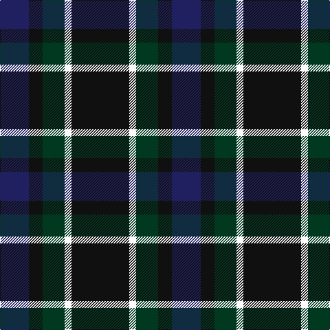

**Bands:** [KWGKKB](/stripes/kwgkkb/) · **Stripes:** [K W DG K K DB](/stripes/stripes6/) K W DG K K DB

This was sourced from tartans-authority.  It is a [6 band tartan](/bands/bands6/).

Original link http://www.tartansauthority.com/tartan-ferret/display/10918/

## Thread count
K/84 W10 DG32 K10 K10 DB/42

## Palette
Each colour and its ΔE from the base-6 reference it is a variant of.

| Colour | Shade | Base | ΔE (OKLab) |
|---|---|---|---|
| DB | <code style="background-color:#202060;">#202060</code> `#202060` | B <code style="background-color:#2A418A;">#2A418A</code> | 0.11 |
| DG | <code style="background-color:#003820;">#003820</code> `#003820` | G <code style="background-color:#006100;">#006100</code> | 0.15 |
| K | <code style="background-color:#101010;">#101010</code> `#101010` | K <code style="background-color:#000000;">#000000</code> | 0.17 |
| W | <code style="background-color:#FCFCFC;">#FCFCFC</code> `#FCFCFC` | W <code style="background-color:#F7F7F7;">#F7F7F7</code> | 0.01 |

# Sample pattern

## Nearest tartans

The nearest existing variants by ΔTartan distance.

1. [Givens (Arizona)](/setts/s6/k42w5k5dg16k5db21~x2/) — ΔT 0.29
1. [Robert Gordon University](/setts/s6/k4r2k12db12k1lo2~x2/) — ΔT 1.12
1. [Nairn](/setts/s5/r1k8g2db4r1~x8/) — ΔT 1.12
1. [Britannia](/setts/s5/k14r4k25db30w4~x2/) — ΔT 1.12
1. [Glen Nevis #1](/setts/s8/dg8r2dg2r3dg8db12dg2lo2~x2/) — ΔT 1.14
1. [Glen Nevis #1 (Fashion)](/setts/s8/dg8r2dg2r3dg8db12dg2ly2~x2/) — ΔT 1.19
1. [Cameron Hunting](/setts/s7/r3dg10r3dg14db16dg3ly2~x2/) — ΔT 1.27
1. [MacIntyre LC](/setts/s6/dg4db12r3db12dg32lr4~x2/) — ΔT 1.29
1. [MacIntyre LC](/setts/s6/dg4db12r3db12dg32lr4/) — ΔT 1.29
1. [Black Raven (Fashion)](/setts/s7/k62db15b15dy20ly5db5k15~x2/) — ΔT 1.30

## Neighbour map

Every grey dot is one of 14299 variants placed by the first two principal components of the ΔTartan feature space (44% of its variance). Red is this tartan; blue dots are its nearest — click one to open its page.

<svg viewBox="0 0 640 380" role="img" style="max-width:100%;height:auto;border:1px solid #e0e0e0;border-radius:4px;display:block" xmlns="http://www.w3.org/2000/svg"><image href="/nn/cloud.v1.png" width="640" height="380"/><a href="/setts/s6/k42w5k5dg16k5db21~x2/"><circle cx="309.3" cy="244.8" r="4" fill="#3465a4"><title>Givens (Arizona)</title></circle></a><a href="/setts/s6/k4r2k12db12k1lo2~x2/"><circle cx="338.7" cy="237.6" r="4" fill="#3465a4"><title>Robert Gordon University</title></circle></a><a href="/setts/s5/r1k8g2db4r1~x8/"><circle cx="274.4" cy="244.0" r="4" fill="#3465a4"><title>Nairn</title></circle></a><a href="/setts/s5/k14r4k25db30w4~x2/"><circle cx="285.5" cy="262.5" r="4" fill="#3465a4"><title>Britannia</title></circle></a><a href="/setts/s8/dg8r2dg2r3dg8db12dg2lo2~x2/"><circle cx="276.0" cy="255.2" r="4" fill="#3465a4"><title>Glen Nevis #1</title></circle></a><a href="/setts/s8/dg8r2dg2r3dg8db12dg2ly2~x2/"><circle cx="264.0" cy="246.1" r="4" fill="#3465a4"><title>Glen Nevis #1 (Fashion)</title></circle></a><a href="/setts/s7/r3dg10r3dg14db16dg3ly2~x2/"><circle cx="285.4" cy="241.4" r="4" fill="#3465a4"><title>Cameron Hunting</title></circle></a><a href="/setts/s6/dg4db12r3db12dg32lr4~x2/"><circle cx="322.2" cy="228.7" r="4" fill="#3465a4"><title>MacIntyre LC</title></circle></a><a href="/setts/s6/dg4db12r3db12dg32lr4/"><circle cx="322.2" cy="228.7" r="4" fill="#3465a4"><title>MacIntyre LC</title></circle></a><a href="/setts/s7/k62db15b15dy20ly5db5k15~x2/"><circle cx="304.8" cy="196.0" r="4" fill="#3465a4"><title>Black Raven (Fashion)</title></circle></a><circle cx="306.3" cy="242.0" r="5" fill="#c00000"/></svg>

ID: /setts/s6/k42w5dg16k5k5db21~x2/
