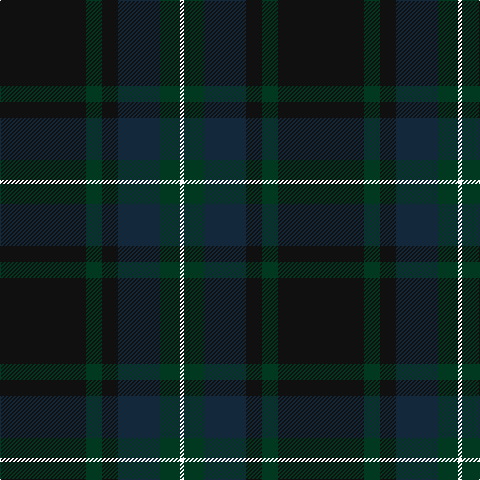

This page is one **sett** — a single exact thread-count. It belongs to the [tartan](/tartans/k43dg8k8dt21dg10w2/)
(the same proportion at any scale), whose colour order is pattern [KGKBGW](/stripes/kgkbgw/).

Sourced from tartans-authority.  It is a [6 stripe tartan](/stripes/stripes6/).

Original link http://www.tartansauthority.com/tartan-ferret/display/11146/

## Register references

External register numbers recorded for this tartan.

- Scottish Register of Tartans: [11146](https://www.tartanregister.gov.uk/tartanDetails?ref=11146)
- Scottish Tartans Authority (ITI): 11146

## Thread count
K/86 DG16 K16 DN42 DG20 W/4

## Palette

Palette: <strong>Tartan Register</strong>
<table><thead><tr><th>Colour</th><th>Threads</th><th>Shade</th><th>Base</th><th>OKLCh</th></tr></thead><tbody><tr><td>K/</td><td style="text-align:right;font-variant-numeric:tabular-nums">86</td><td><code style="background-color:#101010;">#101010</code> <small style="color:#888">#101010</small></td><td>K <code style="background-color:#000000;">#000000</code></td><td><small style="color:#888">oklch(17.3% 0.000 89.9)</small></td></tr><tr><td>DG</td><td style="text-align:right;font-variant-numeric:tabular-nums">16</td><td><code style="background-color:#003820;">#003820</code> <small style="color:#888">#003820</small></td><td>G <code style="background-color:#006100;">#006100</code></td><td><small style="color:#888">oklch(30.0% 0.070 158.3)</small></td></tr><tr><td>K</td><td style="text-align:right;font-variant-numeric:tabular-nums">16</td><td><code style="background-color:#101010;">#101010</code> <small style="color:#888">#101010</small></td><td>K <code style="background-color:#000000;">#000000</code></td><td><small style="color:#888">oklch(17.3% 0.000 89.9)</small></td></tr><tr><td>DN</td><td style="text-align:right;font-variant-numeric:tabular-nums">42</td><td><code style="background-color:#14283C;">#14283C</code> <small style="color:#888">#14283C</small></td><td>B <code style="background-color:#2A418A;">#2A418A</code></td><td><small style="color:#888">oklch(27.1% 0.046 249.9)</small></td></tr><tr><td>DG</td><td style="text-align:right;font-variant-numeric:tabular-nums">20</td><td><code style="background-color:#003820;">#003820</code> <small style="color:#888">#003820</small></td><td>G <code style="background-color:#006100;">#006100</code></td><td><small style="color:#888">oklch(30.0% 0.070 158.3)</small></td></tr><tr><td>W/</td><td style="text-align:right;font-variant-numeric:tabular-nums">4</td><td><code style="background-color:#FCFCFC;">#FCFCFC</code> <small style="color:#888">#FCFCFC</small></td><td>W <code style="background-color:#F7F7F7;">#F7F7F7</code></td><td><small style="color:#888">oklch(99.1% 0.000 89.9)</small></td></tr></tbody></table>

# Sample pattern

## Nearest tartans

The nearest existing variants by ΔTartan distance, with this tartan at the top so the swatches line up against it.

ΔTartan

Tartan

Sett

—

<a href="/ttd/edit/#slug=k43dg8k8dt21dg10w2~x2">Longmuir (2014)</a> <a class="nn-out" href="/setts/s6/k43dg8k8dt21dg10w2~x2/" title="open its dictionary page">↗</a>

0.51

<a href="/ttd/edit/#slug=dti43dg8dti8dt21dg10w2~x2">Longmuir (2014)</a> <a class="nn-out" href="/setts/s6/dti43dg8dti8dt21dg10w2~x2/" title="open its dictionary page">↗</a>

1.53

<a href="/ttd/edit/#slug=dt4r1dt18dti18w1dti4~x4">Ewell Castle School</a> <a class="nn-out" href="/setts/s6/dt4r1dt18dti18w1dti4~x4/" title="open its dictionary page">↗</a>

1.55

<a href="/ttd/edit/#slug=dt5db4dr1db14dt14dr1dt5lo3~x2">Edinburgh Monarchs</a> <a class="nn-out" href="/setts/s8/dt5db4dr1db14dt14dr1dt5lo3~x2/" title="open its dictionary page">↗</a>

1.69

<a href="/ttd/edit/#slug=dt4dg2dr16dr10dg10dt32n3~x2">Dempster Family Tartan Tartan Number: 2219. Earliest known date: 2001 Designed by Claire Donaldson of the House of Edgar. See products available Copyright © Blair Urquhart, Comrie, 2015</a> <a class="nn-out" href="/setts/s7/dt4dg2dr16dr10dg10dt32n3~x2/" title="open its dictionary page">↗</a>

1.74

<a href="/setts/s4/dg43k14ki14r2~x2/">Feddinch Club, St Andrews Limited, The</a>

1.76

<a href="/ttd/edit/#slug=db50dg26k9dg4w2r2dg10~x2">Java St Andrew Society hunting</a> <a class="nn-out" href="/setts/s7/db50dg26k9dg4w2r2dg10~x2/" title="open its dictionary page">↗</a>

1.80

<a href="/ttd/edit/#slug=k4y1dp5y1k20db37y4db4~x2">Finnie (Personal)</a> <a class="nn-out" href="/setts/s8/k4y1dp5y1k20db37y4db4~x2/" title="open its dictionary page">↗</a>

1.85

<a href="/ttd/edit/#slug=db1k8db2dg16dr6dg16db2k8w1~x2">Basel Tattoo (Official)</a> <a class="nn-out" href="/setts/s9/db1k8db2dg16dr6dg16db2k8w1~x2/" title="open its dictionary page">↗</a>

1.87

<a href="/ttd/edit/#slug=dy6w1do18k6do4k4do8k1do8k2dy5~x2">Bute Heather, Weathered</a> <a class="nn-out" href="/setts/s11/dy6w1do18k6do4k4do8k1do8k2dy5~x2/" title="open its dictionary page">↗</a>

1.88

<a href="/setts/s5/dt62o4dy10dyi3dg21~x2/">McGovern (2016)</a>

## Neighbour map

Every grey dot is one of 14359 variants placed by the first two principal components of the ΔTartan feature space (44% of its variance). Red is this tartan; blue dots are its nearest — click one to open its page.

<svg viewBox="0 0 640 380" role="img" style="max-width:100%;height:auto;border:1px solid #e0e0e0;border-radius:4px;display:block" xmlns="http://www.w3.org/2000/svg"><image href="/nn/cloud.v1.png" width="640" height="380"/><a href="/setts/s6/dti43dg8dti8dt21dg10w2~x2/"><circle cx="426.4" cy="252.7" r="4" fill="#3465a4"><title>Longmuir (2014)</title></circle></a><a href="/setts/s6/dt4r1dt18dti18w1dti4~x4/"><circle cx="415.0" cy="250.9" r="4" fill="#3465a4"><title>Ewell Castle School</title></circle></a><a href="/setts/s8/dt5db4dr1db14dt14dr1dt5lo3~x2/"><circle cx="387.1" cy="254.6" r="4" fill="#3465a4"><title>Edinburgh Monarchs</title></circle></a><a href="/setts/s7/dt4dg2dr16dr10dg10dt32n3~x2/"><circle cx="384.1" cy="251.5" r="4" fill="#3465a4"><title>Dempster Family Tartan Tartan Number: 2219. Earliest known date: 2001 Designed by Claire Donaldson of the House of Edgar. See products available Copyright © Blair Urquhart, Comrie, 2015</title></circle></a><a href="/setts/s4/dg43k14ki14r2~x2/"><circle cx="480.6" cy="289.0" r="4" fill="#3465a4"><title>Feddinch Club, St Andrews Limited, The</title></circle></a><a href="/setts/s7/db50dg26k9dg4w2r2dg10~x2/"><circle cx="381.8" cy="196.5" r="4" fill="#3465a4"><title>Java St Andrew Society hunting</title></circle></a><a href="/setts/s8/k4y1dp5y1k20db37y4db4~x2/"><circle cx="466.7" cy="197.6" r="4" fill="#3465a4"><title>Finnie (Personal)</title></circle></a><a href="/setts/s9/db1k8db2dg16dr6dg16db2k8w1~x2/"><circle cx="401.4" cy="251.4" r="4" fill="#3465a4"><title>Basel Tattoo (Official)</title></circle></a><a href="/setts/s11/dy6w1do18k6do4k4do8k1do8k2dy5~x2/"><circle cx="447.6" cy="243.7" r="4" fill="#3465a4"><title>Bute Heather, Weathered</title></circle></a><a href="/setts/s5/dt62o4dy10dyi3dg21~x2/"><circle cx="472.0" cy="233.5" r="4" fill="#3465a4"><title>McGovern (2016)</title></circle></a><circle cx="422.8" cy="252.3" r="5" fill="#c00000"/></svg>

ID: /setts/s6/k43dg8k8dt21dg10w2~x2/
