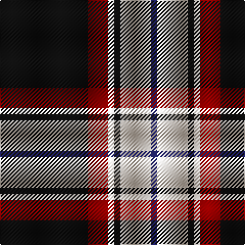

In pattern [BWKWRK](/stripes/bwkwrk/).

This was sourced from register-of-tartans.  It is a [6 stripe tartan](/stripes/stripes6/).

Original link https://www.tartanregister.gov.uk/tartanDetails.aspx?ref=390

## Attestations

This cloth appears in 2 source records; the oldest owns this page.

- 01/05/2005 — Bro-Wened (register-of-tartans, [record](https://www.tartanregister.gov.uk/tartanDetails.aspx?ref=390))
- 2005 May — Bro-Wened (Corporate) (tartans-authority, [record](http://www.tartansauthority.com/tartan-ferret/display/6651/))

## Register references

External register numbers recorded for this tartan.

- Scottish Register of Tartans: [390](https://www.tartanregister.gov.uk/tartanDetails.aspx?ref=390)
- Scottish Tartans Authority (ITI): 6651

## Thread count
K/86 DR20 LY6 K6 LY30 DB/6

## Palette
Each colour and the base-6 reference it is a variant of.

| Colour | Shade | Base |
|---|---|---|
| DB | <code style="background-color:#202060;">#202060</code> `oklch(28.9% 0.111 276.9)` <small>#202060</small> | B <code style="background-color:#2A418A;">#2A418A</code> |
| DR | <code style="background-color:#880000;">#880000</code> `oklch(39.4% 0.162 29.2)` <small>#880000</small> | R <code style="background-color:#CC0000;">#CC0000</code> |
| K | <code style="background-color:#101010;">#101010</code> `oklch(17.3% 0.000 89.9)` <small>#101010</small> | K <code style="background-color:#000000;">#000000</code> |
| LY | <code style="background-color:#F8E8D8;">#F8E8D8</code> `oklch(93.9% 0.028 67.5)` <small>#F8E8D8</small> | W <code style="background-color:#F7F7F7;">#F7F7F7</code> |

# Sample pattern

## Nearest tartans

The nearest existing variants by ΔTartan distance, with this tartan at the top so the swatches line up against it.

ΔTartan

Tartan

Sett

—

<a href="/ttd/edit/#slug=k43r10w3k3w15db3~x2">Bro-Wened</a> <a class="nn-out" href="/setts/s6/k43r10w3k3w15db3~x2/" title="open its dictionary page">↗</a>

0.85

<a href="/ttd/edit/#slug=k11w1k1w1k4o8r1~x8">Dunfermline Athletic (2008) (Corp)</a> <a class="nn-out" href="/setts/s7/k11w1k1w1k4o8r1~x8/" title="open its dictionary page">↗</a>

0.93

<a href="/ttd/edit/#slug=w3o10k38w11o6k2w3~x2">Phantom</a> <a class="nn-out" href="/setts/s7/w3o10k38w11o6k2w3~x2/" title="open its dictionary page">↗</a>

1.05

<a href="/ttd/edit/#slug=r10k15g2k2w1k1w1~x4">Ikelman No 4</a> <a class="nn-out" href="/setts/s7/r10k15g2k2w1k1w1~x4/" title="open its dictionary page">↗</a>

1.06

<a href="/ttd/edit/#slug=r10k3w1k15ly1w3k3ly1~x4">Cunard o' the Clyde</a> <a class="nn-out" href="/setts/s8/r10k3w1k15ly1w3k3ly1~x4/" title="open its dictionary page">↗</a>

1.19

<a href="/ttd/edit/#slug=o4k48o16r12db3~x2">Calgary Firefighters (Corporate)</a> <a class="nn-out" href="/setts/s5/o4k48o16r12db3~x2/" title="open its dictionary page">↗</a>

1.21

<a href="/ttd/edit/#slug=w3dr10k38o11dr6k2w3~x2">Phantom (Corporate)</a> <a class="nn-out" href="/setts/s7/w3dr10k38o11dr6k2w3~x2/" title="open its dictionary page">↗</a>

1.23

<a href="/ttd/edit/#slug=k62w10ly10k4w18k4lo3w4">Colbert Check (Fashion)</a> <a class="nn-out" href="/setts/s8/k62w10ly10k4w18k4lo3w4/" title="open its dictionary page">↗</a>

1.24

<a href="/ttd/edit/#slug=lo4k3w3k44lo4k22lb22w3k3lo4">Ashers of Nairn</a> <a class="nn-out" href="/setts/s10/lo4k3w3k44lo4k22lb22w3k3lo4/" title="open its dictionary page">↗</a>

1.25

<a href="/ttd/edit/#slug=o72k16w9k4w5k16~x2">Machair (warp)</a> <a class="nn-out" href="/setts/s6/o72k16w9k4w5k16~x2/" title="open its dictionary page">↗</a>

1.27

<a href="/ttd/edit/#slug=k2r1ly1y8k15y2dp1~x4">Coalfields Regeneration Trust, The</a> <a class="nn-out" href="/setts/s7/k2r1ly1y8k15y2dp1~x4/" title="open its dictionary page">↗</a>

## Neighbour map

Every grey dot is one of 14299 variants placed by the first two principal components of the ΔTartan feature space (44% of its variance). Red is this tartan; blue dots are its nearest — click one to open its page.

<svg viewBox="0 0 640 380" role="img" style="max-width:100%;height:auto;border:1px solid #e0e0e0;border-radius:4px;display:block" xmlns="http://www.w3.org/2000/svg"><image href="/nn/cloud.v1.png" width="640" height="380"/><a href="/setts/s7/k11w1k1w1k4o8r1~x8/"><circle cx="311.8" cy="182.6" r="4" fill="#3465a4"><title>Dunfermline Athletic (2008) (Corp)</title></circle></a><a href="/setts/s7/w3o10k38w11o6k2w3~x2/"><circle cx="286.7" cy="140.2" r="4" fill="#3465a4"><title>Phantom</title></circle></a><a href="/setts/s7/r10k15g2k2w1k1w1~x4/"><circle cx="318.1" cy="158.8" r="4" fill="#3465a4"><title>Ikelman No 4</title></circle></a><a href="/setts/s8/r10k3w1k15ly1w3k3ly1~x4/"><circle cx="303.3" cy="152.0" r="4" fill="#3465a4"><title>Cunard o' the Clyde</title></circle></a><a href="/setts/s5/o4k48o16r12db3~x2/"><circle cx="336.1" cy="188.8" r="4" fill="#3465a4"><title>Calgary Firefighters (Corporate)</title></circle></a><a href="/setts/s7/w3dr10k38o11dr6k2w3~x2/"><circle cx="314.8" cy="156.8" r="4" fill="#3465a4"><title>Phantom (Corporate)</title></circle></a><a href="/setts/s8/k62w10ly10k4w18k4lo3w4/"><circle cx="339.6" cy="123.5" r="4" fill="#3465a4"><title>Colbert Check (Fashion)</title></circle></a><a href="/setts/s10/lo4k3w3k44lo4k22lb22w3k3lo4/"><circle cx="335.9" cy="137.5" r="4" fill="#3465a4"><title>Ashers of Nairn</title></circle></a><a href="/setts/s6/o72k16w9k4w5k16~x2/"><circle cx="362.1" cy="168.9" r="4" fill="#3465a4"><title>Machair (warp)</title></circle></a><a href="/setts/s7/k2r1ly1y8k15y2dp1~x4/"><circle cx="310.7" cy="149.4" r="4" fill="#3465a4"><title>Coalfields Regeneration Trust, The</title></circle></a><circle cx="317.2" cy="162.1" r="5" fill="#c00000"/></svg>

ID: /setts/s6/k43r10w3k3w15db3~x2/
