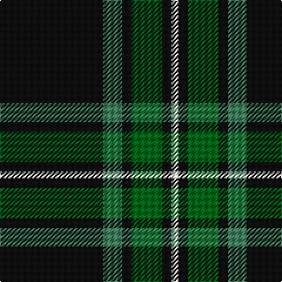

In pattern [KGKGKW](/patterns/kgkgkw/).

This was sourced from tartans-authority.  It is a [6 stripes tartan](/stripes/stripes6/).

Original link http://www.tartansauthority.com/tartan-ferret/display/3861/

## Thread count
K/88 G16 K8 Ga26 K8 LN/6

## Palette
Each colour and its ΔE from the base-6 reference it is a variant of.

| Colour | Shade | Base | ΔE (OKLab) |
|---|---|---|---|
| G | <code style="background-color:#408060;">#408060</code> `#408060` | G <code style="background-color:#006100;">#006100</code> | 0.14 |
| Ga | <code style="background-color:#006818;">#006818</code> `#006818` | G <code style="background-color:#006100;">#006100</code> | 0.02 |
| K | <code style="background-color:#101010;">#101010</code> `#101010` | K <code style="background-color:#000000;">#000000</code> | 0.17 |
| LN | <code style="background-color:#E0E0E0;">#E0E0E0</code> `#E0E0E0` | W <code style="background-color:#F7F7F7;">#F7F7F7</code> | 0.07 |

# Sample pattern

## Nearest tartans

The nearest existing variants by ΔTartan distance.

1. [Childers Regimental Tartan Tartan Number: 1090. Earliest known date: 1907 1s Battalion, 1st Gurkha Rifles is recorded as using this tartan for plaids, ribbons and bag-covers. See products available Copyright © Blair Urquhart, Comrie, 2015](/setts/s6/k88g17k8ga28k8r6~g289c18-ga006818-k101010-rc80000~x2/) — ΔT 0.42
1. [Mountain Rescue Assoc. (Corporate)](/setts/s7/k32b2k6b2k13ba30w2~b1474b4-ba5c5c5c-k101010-wfcfcfc~x2/) — ΔT 1.30
1. [Perry (Calgary), Alex (Personal)](/setts/s4/k62b24y5w3~b3f4441-k120a01-wf7f1e8-yef8f06~x2/) — ΔT 1.31
1. [Forbes VS](/setts/s6/r1g16k8g3k4y1~g11450d-k000000-raa0000-yaaaa00~x2/) — ΔT 1.33
1. [Forbes VS](/setts/s6/r1g16k8g3k4y1~g11450d-k000000-raa0000-yaaaa00/) — ΔT 1.33
1. [Childers (Gurkha Rifles) (Military)](/setts/s6/k88g17k8ga28k8r6~g004c00-ga5c6428-k000000-rc80000/) — ΔT 1.36
1. [Wild Highlanders (Corporate)](/setts/s7/k36w3k10w3g28r6k18~g00643c-k101010-r901c38-wfcfcfc~x2/) — ΔT 1.36
1. [Wesley Owen 2010 (Personal)](/setts/s4/k61g10ga20w4~g006818-ga289c18-k101010-we0e0e0~x2/) — ΔT 1.37
1. [Rogues (United States), The](/setts/s4/r3b12k50y3~b506987-k101010-rff2400-yffc125~x2/) — ΔT 1.41
1. [Westgate Fashion Tartan Tartan Number: 6019. Earliest known date: pre 2003 A fashion tartan See products available Copyright © Blair Urquhart, Comrie, 2015](/setts/s4/g14k80g14y5~g5c6428-k101010-ye8c000~x2/) — ΔT 1.42

## Neighbour map

Every grey dot is one of 15726 variants placed by the first two principal components of the ΔTartan feature space (44% of its variance). Red is this tartan; blue dots are its nearest — click one to open its page.

<svg viewBox="0 0 640 380" role="img" style="max-width:100%;height:auto;border:1px solid #e0e0e0;border-radius:4px;display:block" xmlns="http://www.w3.org/2000/svg"><image href="/nn/cloud.v1.png" width="640" height="380"/><a href="/setts/s6/k88g17k8ga28k8r6~g289c18-ga006818-k101010-rc80000~x2/"><circle cx="407.2" cy="198.0" r="4" fill="#3465a4"><title>Childers Regimental Tartan Tartan Number: 1090. Earliest known date: 1907 1s Battalion, 1st Gurkha Rifles is recorded as using this tartan for plaids, ribbons and bag-covers. See products available Copyright © Blair Urquhart, Comrie, 2015</title></circle></a><a href="/setts/s7/k32b2k6b2k13ba30w2~b1474b4-ba5c5c5c-k101010-wfcfcfc~x2/"><circle cx="364.2" cy="192.6" r="4" fill="#3465a4"><title>Mountain Rescue Assoc. (Corporate)</title></circle></a><a href="/setts/s4/k62b24y5w3~b3f4441-k120a01-wf7f1e8-yef8f06~x2/"><circle cx="419.8" cy="206.3" r="4" fill="#3465a4"><title>Perry (Calgary), Alex (Personal)</title></circle></a><a href="/setts/s6/r1g16k8g3k4y1~g11450d-k000000-raa0000-yaaaa00~x2/"><circle cx="350.4" cy="204.9" r="4" fill="#3465a4"><title>Forbes VS</title></circle></a><a href="/setts/s6/r1g16k8g3k4y1~g11450d-k000000-raa0000-yaaaa00/"><circle cx="350.4" cy="204.9" r="4" fill="#3465a4"><title>Forbes VS</title></circle></a><a href="/setts/s6/k88g17k8ga28k8r6~g004c00-ga5c6428-k000000-rc80000/"><circle cx="395.6" cy="196.6" r="4" fill="#3465a4"><title>Childers (Gurkha Rifles) (Military)</title></circle></a><a href="/setts/s7/k36w3k10w3g28r6k18~g00643c-k101010-r901c38-wfcfcfc~x2/"><circle cx="326.6" cy="210.9" r="4" fill="#3465a4"><title>Wild Highlanders (Corporate)</title></circle></a><a href="/setts/s4/k61g10ga20w4~g006818-ga289c18-k101010-we0e0e0~x2/"><circle cx="358.3" cy="214.8" r="4" fill="#3465a4"><title>Wesley Owen 2010 (Personal)</title></circle></a><a href="/setts/s4/r3b12k50y3~b506987-k101010-rff2400-yffc125~x2/"><circle cx="464.0" cy="205.1" r="4" fill="#3465a4"><title>Rogues (United States), The</title></circle></a><a href="/setts/s4/g14k80g14y5~g5c6428-k101010-ye8c000~x2/"><circle cx="473.9" cy="233.2" r="4" fill="#3465a4"><title>Westgate Fashion Tartan Tartan Number: 6019. Earliest known date: pre 2003 A fashion tartan See products available Copyright © Blair Urquhart, Comrie, 2015</title></circle></a><circle cx="411.0" cy="194.7" r="5" fill="#c00000"/></svg>

ID: /setts/s6/k44g8k4ga13k4w3~g408060-ga006818-k101010-we0e0e0~x2/
